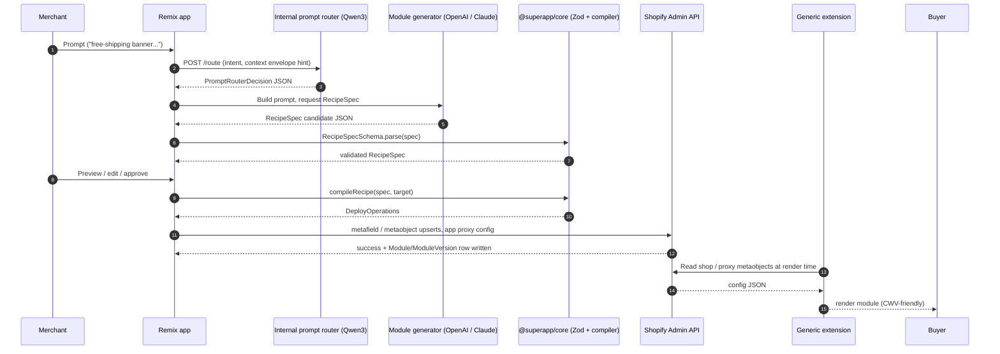

# AI Shopify SuperApp

A single Shopify embedded app that lets non-developers generate safe **modules** (storefront UI, Shopify Functions, app proxy widgets, integrations, automations, customer account UI) from natural-language prompts — **without ever shipping arbitrary code to merchant stores**.

The AI never deploys raw Liquid, JavaScript, or WASM. Instead it produces a **validated RecipeSpec JSON** which is compiled into a fixed set of known-safe deploy operations (metafields, metaobjects, extension config, app proxy config). This gives predictable output, clear plan gating, CWV-friendly storefronts, and a single audit surface.

---

## Table of contents

- [Overview](#overview)
- [Architecture](#architecture)
- [Project structure](#project-structure)
- [Tech stack](#tech-stack)
- [Prerequisites](#prerequisites)
- [Getting started](#getting-started)
- [Environment variables](#environment-variables)
- [Development](#development)
- [Testing](#testing)
- [Key concepts and features](#key-concepts-and-features)
- [Extensions](#extensions)
- [Agent API](#agent-api)
- [AI providers](#ai-providers)
- [Internal admin](#internal-admin)
- [Internal prompt router](#internal-prompt-router)
- [Idempotency and flow engine](#idempotency-and-flow-engine)
- [Security](#security)
- [Data model](#data-model)
- [Operations](#operations)
- [CI/CD](#cicd)
- [Roadmap and status](#roadmap-and-status)
- [Deployment](#deployment)
- [Troubleshooting and FAQ](#troubleshooting-and-faq)
- [Glossary](#glossary)
- [Security hard rules](#security-hard-rules)
- [Contributing](#contributing)
- [Documentation](#documentation)
- [License](#license)

---

## Overview

### The problem space

Most "no-code Shopify customization" tools fall into one of two camps:

1. **App-per-feature stores.** Merchants install dozens of small apps, each with its own dashboard, billing line, theme injection, and performance cost. Theme files get edited; uninstalls leave orphan code; Core Web Vitals suffer.
2. **AI code generators.** A prompt becomes raw Liquid / JavaScript that is pushed into the merchant's theme or app proxy. This is unsafe (theme corruption, XSS, exfiltration, supply-chain risk) and unreviewable for Shopify app review.

This repository takes a third approach. A single Shopify embedded app exposes a small, well-typed set of module surfaces. Merchants describe what they want; an AI returns a **RecipeSpec** — a strict JSON document. The app validates it with Zod, compiles it into deploy operations (metafields, metaobject entries, app proxy config), and renders the result via **generic, config-driven Shopify extensions**. No per-store code is ever generated, compiled, or deployed.

### Who this is for

- **Shopify merchants** on Basic, Shopify, Advanced, or Plus plans who want to add banners, popups, upsells, discount rules, automations, customer account widgets, integrations, etc. without hiring a developer.
- **App operators** (the team running this codebase) who need a single dashboard to manage AI providers, plan tiers, per-store overrides, usage and cost, logs, jobs, traces, webhooks, audit trail, retention, and the internal prompt router.
- **AI / MCP agents** acting on a merchant's behalf — every merchant capability is also exposed under a stable JSON Agent API surface at `/api/agent/*`.

### Why "recipes" and not raw code

Generating raw Liquid/JS/WASM and pushing it into merchant stores is a security and stability nightmare (theme breakage, XSS, exfiltration, supply-chain risk). Shopify app review also requires deterministic, reviewable behavior. So:

1. Prompt → AI returns **RecipeSpec** JSON.
2. RecipeSpec is validated with **Zod** (strict, closed schema).
3. Compiler turns the RecipeSpec into a small, finite set of **deploy operations**:
   - shop metafield / metaobject set / delete (config)
   - app proxy config
   - extension-driven rendering (no direct theme file writes)
4. Merchant previews, publishes, and can roll back. Every publish creates an immutable version row.

This yields **predictable output**, **clear plan gating** (Basic vs Plus), **safer storefront performance**, and a **single audit surface** for compliance and incident response.

### What "superapp" means here

A merchant installs **one** app and gets:

- Storefront UI (banners, popups, notification bars, floating widgets, contact forms, theme-safe effects, proxy widgets)
- Shopify Functions (discount rules, delivery / payment customization, cart and checkout validation, cart transform — Plus-gated where required)
- Customer account UI (Preact + Polaris, 64 KB script budget)
- Admin blocks and admin actions on product, order, and customer detail pages
- Integrations (5 built-in connectors plus a connector SDK and Postman-style tester)
- Automation (visual DAG flow builder, cron schedules, Shopify Flow triggers and actions, app-owned data stores)
- 100+ pre-built module templates across all 14 RecipeSpec types
- A stable Agent API surface so the same operations can be driven by an LLM agent or MCP client

App operators get an **Internal Admin** dashboard for AI provider config, plan tiers, recipe edit, usage / cost, logs, jobs, traces, webhooks, audit log, and an internal Qwen3-based AI assistant.

---

## Architecture

### High-level flow

```
Prompt
  └─> Prompt Router (Qwen3 ~4B)        # decides how much context to attach
        └─> Module Generator (OpenAI / Claude)
              └─> RecipeSpec JSON (strict)
                    └─> Zod validation
                          └─> Compiler  ──> DeployOperations
                                └─> Publish (Shopify Admin API)
                                      └─> Versioned + rollbackable
```

### Recipe lifecycle (sequence)



### Trust boundary

```
Untrusted ───────────────────────────────────► Trusted
merchant prompt   ─►   LLM output (strict JSON)   ─►   Zod-validated RecipeSpec   ─►   Compiler   ─►   DeployOperations   ─►   Generic extension
        ▲                       ▲                              ▲                       ▲
        │                       │                              │                       │
   Treated as text         Schema-bounded                Pure function              Finite set of
   only; never              (closed enums,              (no Shopify calls          known-safe ops
   executed.                 finite types).              inside; pure data).        (no eval/code).
```

The trust boundary is enforced by `packages/core/src/recipe.ts` (Zod schema) and the compiler in `apps/web/app/services/recipes/compiler/`. Nothing crosses the boundary unless it parses cleanly. Anything outside the closed set of `RECIPE_SPEC_TYPES` (in `packages/core/src/allowed-values.ts`) is rejected.

### Two AI layers

| Layer | Models | Where it runs |
|-------|--------|---------------|
| **Merchant module generation** (RecipeSpec output, merchant-facing flows) | OpenAI Responses API + Anthropic Messages API | Provider clients in `apps/web/app/services/ai/clients/`, configured via Internal Admin → AI Providers |
| **Internal + first-layer routing** (prompt router, internal AI assistant, operator tooling) | Qwen3 ~4B class via Ollama or vLLM | `INTERNAL_AI_ROUTER_*` env vars; `/internal/model-setup` dual targets (`localMachine` / `modalRemote`) |

The split exists because routing decisions and operator tooling do not need frontier models, and shipping merchant data to a small self-hostable router (Qwen3) is much easier to reason about for privacy and cost.

### Storefront rendering

No theme files are ever written. All storefront output comes from:

- **Theme app extensions** (universal slot blocks, product slot, cart slot, app embeds) reading config from app-owned metaobjects (`app.superapp_module`, `app.superapp_checkout_upsell`, etc.).
- **App proxy widgets** rendering server-side HTML at `/proxy/...` (signed by Shopify).
- **Customer account UI extension** (Preact + Polaris, 64 KB script limit).
- **Checkout UI**, **post-purchase**, **admin blocks/actions**, and **Shopify Functions** — all generic and config-driven, with no per-store compiled code.

---

## Project structure

```
ai-shopify-superapp/
├── apps/
│   └── web/                       # Remix embedded app (merchant UI + internal admin + APIs)
│       ├── app/
│       │   ├── routes/            # Remix routes (merchant pages, /api/*, /internal/*, /api/agent/*)
│       │   ├── services/          # Domain services (ai, recipes, publish, connectors, flows, ...)
│       │   ├── schemas/           # Zod schemas (RecipeSpec hydration, prompt router, runtime config)
│       │   ├── __tests__/         # Vitest unit + integration tests
│       │   └── components/        # Polaris-based UI components
│       ├── prisma/                # Prisma schema + migrations
│       ├── scripts/               # CLI scripts (internal-ai-router, retention, seed, evals, smoke)
│       └── Dockerfile.internal-router
├── packages/
│   ├── core/                      # RecipeSpec schema, capability matrix, module catalog, templates,
│   │                              # workflow engine spec, connector SDK, flow catalog
│   └── rate-limit/                # Shared rate-limiting utilities
├── extensions/                    # Generic Shopify extensions (config-driven, no per-store code)
│   ├── theme-app-extension/       # Universal Slot / Product Slot / Cart Slot / App Embed (Liquid)
│   ├── checkout-ui/               # Checkout UI extension
│   ├── customer-account-ui/       # Preact + Polaris (64 KB limit)
│   ├── admin-ui/                  # Admin blocks/actions
│   ├── functions/                 # Shopify Functions (discount rules; scaffolds for delivery,
│   │                              # payment, validation, cart transform)
│   └── superapp-flow-*/           # 5 Flow triggers + 4 Flow actions
├── deploy/
│   ├── internal-ai-router/        # Kubernetes manifests for the Node reference router
│   └── modal-qwen-router/         # Modal HTTPS edge proxy (optional)
├── docs/                          # Technical docs, merchant docs, internal docs, phase plan, runbooks
├── shopify.app.toml               # Shopify app config (webhooks, scopes, app proxy, metaobjects)
├── pnpm-workspace.yaml
├── DESIGN.md                      # Design system source of truth
├── .cursorrules                   # AI-assistant hard rules
└── README.md
```

### What lives where (with a representative file)

| Path | What it contains | Representative file |
|------|-------------------|---------------------|
| `apps/web/app/routes/` | 115+ Remix routes: merchant UI, `/api/*`, `/api/agent/*`, `/internal/*`, `/webhooks/*` | `api.agent.tsx` (Agent API discovery index) |
| `apps/web/app/services/ai/` | AI clients, prompt router, classifier, internal AI assistant, eval harness | `clients/openai.client.ts`, `prompt-router/*` |
| `apps/web/app/services/recipes/compiler/` | Per-type compilers from `RecipeSpec` → `DeployOperations` | `index.ts` (dispatch by `spec.type`) |
| `apps/web/app/services/shopify/` | Shopify Admin API wrappers: metafield, metaobject, theme, capability | `capability.service.ts` |
| `apps/web/app/services/flows/` | Webhook idempotency, flow execution, retry semantics | `idempotency.server.ts` |
| `apps/web/app/services/security/` | Crypto (AES-256-GCM), bearer rate limit, allowlists | `crypto.server.ts` |
| `apps/web/app/services/observability/` | OpenTelemetry init, log redaction, correlation IDs | `redact.server.ts` |
| `apps/web/app/services/connectors/` | SSRF enforcement, connector SDK, allowlist validation | `connector.service.ts` |
| `apps/web/app/services/billing/` | App subscription, plan-config, quotas | `quota.service.ts` |
| `apps/web/app/internal-admin/` | Internal admin cookie session + `requireInternalAdmin` guard | `session.server.ts` |
| `apps/web/app/schemas/` | Cross-cutting Zod schemas | `prompt-router.server.ts`, `hydrate-envelope.server.ts` |
| `apps/web/prisma/schema.prisma` | Postgres / SQLite data model (40+ models) | `schema.prisma` |
| `apps/web/scripts/` | Standalone CLI scripts | `internal-ai-router.ts`, `retention.ts`, `run-evals.ts`, `seed-ai-pricing.ts`, `smoke-create-module-lifecycle.ts` |
| `packages/core/src/recipe.ts` | The `RecipeSpec` Zod schema (the trust boundary) | `recipe.ts` |
| `packages/core/src/allowed-values.ts` | Single source of truth for closed enums (module types, surfaces, targets) | `allowed-values.ts` |
| `packages/core/src/capabilities.ts` | Capability list and plan-tier gating logic | `capabilities.ts` |
| `extensions/theme-app-extension/blocks/` | Liquid slot blocks that read `shop.metafields['superapp.theme']['module_refs']` | `universal-slot.liquid` |
| `deploy/internal-ai-router/` | K8s `Deployment`, `Service`, `ConfigMap`, secret template, kustomization | `deployment.yaml`, `configmap.yaml` |
| `deploy/modal-qwen-router/` | Optional Modal HTTPS proxy (and mock upstream) | `modal_app.py` |

---

## Tech stack

| Area | Stack |
|------|-------|
| App framework | **Remix 2** (Vite 6, React Router v7 future flags) |
| UI | **React 18**, **Shopify Polaris 12** + Polaris web components, `@xyflow/react` for the flow builder |
| Language | **TypeScript 5** |
| Validation | **Zod 3** (at every trust boundary) |
| Database | **Prisma 5** — SQLite for local dev, **Postgres** for production |
| Sessions | `@shopify/shopify-app-session-storage-prisma` |
| Shopify SDKs | `@shopify/shopify-app-remix`, `@shopify/shopify-api`, Shopify CLI |
| AI providers | OpenAI Responses API, Anthropic Messages API, custom OpenAI-compatible, Qwen3 (Ollama / vLLM) |
| Observability | OpenTelemetry SDK, Sentry, structured logs with redaction, request-correlation IDs |
| Testing | **Vitest 3** |
| Tooling | pnpm 9 workspaces, ESLint, Husky + lint-staged, Prisma CLI |
| Deploy targets | Docker (`Dockerfile.internal-router`), Kubernetes (`deploy/internal-ai-router/`), Modal (`deploy/modal-qwen-router/`) |

The Shopify Admin API version is pinned to `2026-01` (see `shopify.app.toml` and `apps/web/app/shopify.server.ts`). App distribution is `AppDistribution.AppStore`.

---

## Prerequisites

- **Node** 20+
- **pnpm** 9.12.2+ (this repo pins `packageManager` in root `package.json`)
- **Shopify CLI** (`npm i -g @shopify/cli`)
- A **Shopify Partner account** and a **dev store**
- For local AI router (optional): **Ollama** (`qwen3:4b-instruct`) or a vLLM/OpenAI-compatible endpoint
- For production: **Postgres** and **Redis**

---

## Getting started

```bash
# 1. Clone
git clone <repo-url>
cd ai-shopify-superapp

# 2. Install workspace dependencies
pnpm install

# 3. Configure environment
cp apps/web/.env.example apps/web/.env
# then fill in real values (see "Environment variables" below)

# 4. Generate Prisma client and apply schema for local SQLite
pnpm --filter web prisma:migrate

# 5. (Optional) Seed default AI model pricing rows
pnpm --filter web seed:ai-pricing

# 6. Start the merchant app (port 3000)
pnpm shopify:dev
# or, without the Shopify CLI tunnel:
pnpm --filter web dev
```

For the full Shopify CLI / Partner Dashboard / dev store walkthrough see [`docs/shopify-dev-setup.md`](docs/shopify-dev-setup.md).

### Port topology

| Port | Purpose | Command |
|------|---------|---------|
| **3000** | Merchant-facing embedded app (matches Shopify CLI tunnel) | `pnpm shopify:dev` or `pnpm --filter web dev` |
| **4000** | Internal admin only (separate Remix instance) | `pnpm --filter web dev:internal` |
| **8787** | Reference internal AI router (when run locally) | `pnpm --filter web router:internal` |
| **11434** | Ollama (if you use it as the router backend) | external (`ollama serve`) |

The Internal Admin lives under `/internal/*` on the merchant app, but `dev:internal` lets operators run a separate process on port 4000 if they want to keep merchant traffic isolated. Both processes share the same database and code; only the host and port differ.

### Local Shopify session

`apps/web/app/shopify.server.ts` boots `shopifyApp({...})` from `@shopify/shopify-app-remix`. Sessions are stored in the Prisma `Session` table via `@shopify/shopify-app-session-storage-prisma`. Cookies are issued by `/auth/*` after install / reauth. Because embedded apps run inside Shopify's iframe, you usually need to run `pnpm shopify:dev` (which provides a proper tunnel and Partner Dashboard wiring) — running `pnpm --filter web dev` directly works for non-embedded routes only (`/api/*`, `/internal/*`, `/proxy/*`).

---

## Environment variables

The canonical reference is [`apps/web/.env.example`](apps/web/.env.example). The boot-time Zod check in `apps/web/app/env.server.ts` will fail fast if required vars are missing or malformed (for example, if `ENCRYPTION_KEY` is not a 32-byte base64 string).

### Core (required)

| Variable | Required | Default | Description |
|----------|----------|---------|-------------|
| `DATABASE_URL` | Yes | `file:./dev.db` (in `.env.example`) | Prisma database URL. SQLite for local; Postgres URL in production |
| `SHOPIFY_API_KEY` | Yes | — | Partner Dashboard → App → API credentials |
| `SHOPIFY_API_SECRET` | Yes | — | Partner Dashboard → App → API credentials |
| `SHOPIFY_APP_URL` | Yes | `http://localhost:3000` (dev) | Tunnel URL during dev; your production domain otherwise |
| `SCOPES` | Yes | see `.env.example` | Comma-separated scopes; **must match `shopify.app.toml [access_scopes]`** even when running `dev:internal` |
| `ENCRYPTION_KEY` | Yes | — | 32-byte base64 key. Generate with `node -e "console.log(require('crypto').randomBytes(32).toString('base64'))"` |

### AI providers (merchant generation)

| Variable | Required | Default | Description |
|----------|----------|---------|-------------|
| `LLM_PROVIDER` | No | `openai` | Default provider when none is configured in the Internal Admin |
| `OPENAI_API_KEY` | No | — | OpenAI Responses API key |
| `OPENAI_DEFAULT_MODEL` | No | `gpt-5-mini` (in `.env.example`) | Default OpenAI model |
| `ANTHROPIC_API_KEY` | No | — | Anthropic Messages API key |
| `ANTHROPIC_DEFAULT_MODEL` | No | `claude-sonnet-4-6` (in `.env.example`) | Default Anthropic model |
| `ANTHROPIC_SKILLS` | No | empty | Optional Claude Agent Skills config |
| `ANTHROPIC_CODE_EXECUTION` | No | `false` | Toggle Claude code execution tool |

Provider config is **credentials-first**: once a key is supplied in the Internal Admin, the catalog and pricing are auto-synced for OpenAI and Anthropic.

### Internal admin

| Variable | Required | Default | Description |
|----------|----------|---------|-------------|
| `INTERNAL_ADMIN_PASSWORD` | Yes | — | Password for the `/internal/login` flow |
| `INTERNAL_ADMIN_SESSION_SECRET` | Yes (≥ 16 chars) | — | Cookie signing secret for the internal session (`__superapp_internal`) |
| `INTERNAL_SSO_ISSUER` | No | — | OIDC issuer (e.g. `https://accounts.google.com`) |
| `INTERNAL_SSO_CLIENT_ID` | No | — | OIDC client id |
| `INTERNAL_SSO_CLIENT_SECRET` | No | — | OIDC client secret |
| `INTERNAL_SSO_REDIRECT_URI` | No | — | OIDC redirect URI, e.g. `https://your-app.example.com/internal/sso/callback` |

### Internal AI router (Remix client)

| Variable | Required | Default | Description |
|----------|----------|---------|-------------|
| `INTERNAL_AI_ROUTER_URL` | No | — | Base URL for the prompt-router service |
| `INTERNAL_AI_ROUTER_TOKEN` | No | — | Bearer token sent to `/route` |
| `INTERNAL_AI_ROUTER_SHADOW` | No | `false` | If `true`, call `/route` for metrics but use deterministic decisions |
| `INTERNAL_AI_ROUTER_TIMEOUT_MS` | No | `3000` | Client timeout for `/route` |
| `ROUTER_CONFIDENCE_MAX_DELTA` | No | `0.15` | Max allowed deviation from the deterministic baseline confidence |
| `INTERNAL_AI_ROUTER_CANARY_SHOPS` | No | — | Comma-separated `*.myshopify.com` allowlist — only these shops use the router |
| `INTERNAL_AI_ROUTER_CIRCUIT_FAILURE_THRESHOLD` | No | `5` | Consecutive failures before opening the circuit |
| `INTERNAL_AI_ROUTER_CIRCUIT_COOLDOWN_MS` | No | `30000` | Cooldown while the circuit stays open |
| `INTERNAL_AI_ROUTER_DEBUG_LOG` | No | `0` | If `1`, emit sparse JSON debug lines (avoid in prod) |
| `INTERNAL_AI_ROUTER_DUAL_TARGET_ENABLED` | No | `false` | Enables DB-driven dual-target resolution from `/internal/model-setup` |
| `INTERNAL_AI_ALLOW_HOSTS` | No | — | Comma-separated hostnames (exact, case-insensitive) that bypass the SSRF / private-host checks in `assertSafeTargetUrl` for assistant target URLs. Use for trusted internal HTTPS hosts like `internal.svc.cluster.local`. Allowlisted hosts are accepted for both `http:` and `https:`. |
| `INTERNAL_AI_TOOL_AUDIT_RETENTION_DAYS` | No | `90` | Retention window for `InternalAiToolAudit` rows. The daily cron in `/api/cron` (guarded by a 24h in-memory marker) deletes audit rows older than this many days. Non-positive / non-finite values fall back to the default. |

### Internal AI router (service-side tunables)

These are read by `apps/web/scripts/internal-ai-router.ts` (the reference router) and the K8s `ConfigMap` in `deploy/internal-ai-router/configmap.yaml`.

| Variable | Default | Description |
|----------|---------|-------------|
| `ROUTER_HOST` | `0.0.0.0` | Bind host |
| `ROUTER_PORT` | `8787` | Bind port |
| `ROUTER_BACKEND` | `ollama` | `ollama` or `openai` |
| `ROUTER_OLLAMA_BASE_URL` | `http://127.0.0.1:11434` | Ollama endpoint |
| `ROUTER_OLLAMA_MODEL` | `qwen3:4b-instruct` | Ollama model tag |
| `ROUTER_OPENAI_BASE_URL` | — | vLLM / OpenAI-compatible base URL |
| `ROUTER_OPENAI_MODEL` | — | Model name on that backend |
| `ROUTER_OPENAI_API_KEY` | — | Bearer key for OpenAI-compatible backend |
| `ROUTER_REQUIRE_AUTH` | auto-on in prod | Force bearer auth on `/route`. In production (`NODE_ENV=production`), an explicit `0`/`false`/`no` is **ignored** and the router logs `[internal-ai-router] WARN: ROUTER_REQUIRE_AUTH=0 ignored in production`. There is no supported way to disable auth in prod. |
| `ROUTER_TENANT_MAX_ACTIVE_REQUESTS` | `1` | Per-`shopDomain` in-flight cap |
| `ROUTER_TENANT_RATE_MAX_REQUESTS` | `30` | Per-tenant requests per window |
| `ROUTER_TENANT_RATE_WINDOW_MS` | `60000` | Tenant rate window |
| `REQUEST_TIMEOUT_MS` | — | Upstream backend timeout |
| `RATE_LIMIT_WINDOW_MS` | — | Global rate window |

### Operations

| Variable | Required | Default | Description |
|----------|----------|---------|-------------|
| `DEFAULT_RETENTION_DAYS` | No | `30` | Default retention window for AI usage / API logs / error logs / jobs |
| `CRON_SECRET` | Yes if cron is exposed | — | Shared secret required by `/api/cron` |
| `SENTRY_DSN` | No | — | Sentry project DSN |
| `OTEL_EXPORTER_OTLP_ENDPOINT` | No | — | OpenTelemetry collector endpoint |
| `SHOP_CUSTOM_DOMAIN` | No | — | Override for a custom shop domain in dev |

> Never commit `.env` files. `.gitignore` already excludes them; secrets/PII must also never appear in logs (enforced by `apps/web/app/services/observability/redact.server.ts`).

---

## Development

The repo uses pnpm workspaces. Most commands are scoped per-package via `pnpm --filter <name>`.

### Root scripts

| Command | What it does | When to use it |
|---------|--------------|----------------|
| `pnpm dev` | Run `dev` in every workspace package | Rarely — usually you want `dev:web` |
| `pnpm dev:web` | Run only the Remix app | Local UI work without the Shopify tunnel |
| `pnpm shopify:dev` | `shopify app dev` (tunnel + Partner Dashboard wiring) | Anything that needs embedded auth or extensions |
| `pnpm build` | Build every workspace package | Pre-deploy / pre-Docker |
| `pnpm test` | Run tests in every workspace package | CI parity |
| `pnpm lint` | Lint every workspace package | CI parity |
| `pnpm prepare` | Husky install | One-time setup |

### `apps/web` scripts

| Command | What it does | When to use it |
|---------|--------------|----------------|
| `pnpm --filter web dev` | Prisma push + generate, then start Remix on port 3000 | Local Remix-only dev |
| `pnpm --filter web dev:internal` | Same as `dev` but on port 4000 | Operator-only sessions or running admin in parallel |
| `pnpm --filter web build` | Production Remix build | Pre-deploy |
| `pnpm --filter web start` | Run the production build | Production runtime |
| `pnpm --filter web typecheck` | `tsc --noEmit` | Pre-commit (also enforced by lint-staged) |
| `pnpm --filter web lint` | ESLint (max 250 warnings) | Pre-commit / CI |
| `pnpm --filter web test` | Vitest run | Unit tests |
| `pnpm --filter web prisma:migrate` | `prisma migrate dev` | After editing `schema.prisma` |
| `pnpm --filter web seed:ai-pricing` | Seed default AI model pricing rows | First boot, or after pricing schema changes |
| `pnpm --filter web retention:run` | Run the retention purge script (`scripts/retention.ts`) | Cron / manual purge |
| `pnpm --filter web router:internal` | Start the reference internal AI router (`/route`, `/healthz`, Ollama / OpenAI passthrough) | Local router dev |
| `pnpm --filter web evals` | Run the deterministic evals harness with `StubLlmClient` | CI parity / local dev |
| `pnpm --filter web evals:live` | Run live evals (`EVAL_PROVIDER_ID=<id>` required) | Nightly or manual quality check |

### Testing extensions locally

`pnpm shopify:dev` runs `shopify app dev` which starts the Remix app plus a tunnel and registers every extension in `extensions/` with the Partner Dashboard for the configured dev store. Theme app extension blocks need to be added inside the Theme Editor of the dev store; checkout, customer account, and admin UI extensions appear in their respective surfaces once enabled. Shopify Functions need to be associated with the merchant store via the Shopify CLI flow.

---

## Testing

All tests run via **Vitest 3**. Tests live next to the code they exercise; cross-cutting suites live in `apps/web/app/__tests__/`. Vitest config (`apps/web/vitest.config.ts`) sets `environment: 'node'`, aliases `~` to `app/`, and seeds `INTERNAL_ADMIN_SESSION_SECRET` so cookie session code can be exercised.

### Test categories

| Category | Where | What it covers |
|----------|-------|----------------|
| **Unit** | `app/**/*.test.ts` next to the code | Pure logic in services, schemas, compilers, redaction, SSRF, idempotency |
| **Integration** | `app/__tests__/**/*.ts` | Cross-service flows: classify → spec → preview → publish, agent API end-to-end |
| **Core package** | `packages/core/**` | Recipe schema, capability gating, allowed-values, module catalog |
| **AI eval harness (stub)** | `apps/web/scripts/run-evals.ts` with `StubLlmClient` | Schema-valid rate, compiler-success rate, non-destructive rate against golden fixtures |
| **AI eval harness (live)** | same script with `EVAL_PROVIDER_ID` set | Real provider call against the same fixtures |
| **Smoke** | `apps/web/scripts/smoke-create-module-lifecycle.ts` | End-to-end happy-path lifecycle check |

### Running

```bash
# Everything
pnpm test

# Just the web app
pnpm --filter web test

# Just the core package
pnpm --filter @superapp/core test

# A single Vitest file (any of these patterns)
pnpm --filter web exec vitest run app/services/security/crypto.server.test.ts
pnpm --filter web exec vitest -t "redacts shopify tokens"

# AI evals (deterministic, no network)
pnpm --filter web evals

# Live AI evals (uses real provider credentials)
EVAL_PROVIDER_ID=<provider-id> pnpm --filter web evals:live
```

### Eval-harness gates

Live and stub evals share the same three gates (defaults; overridable via env in CI):

| Gate | Default threshold | Env override | What it measures |
|------|-------------------|--------------|-------------------|
| Schema-valid rate | ≥ 0.9 | `EVAL_THRESHOLD_SCHEMA` | How often LLM output parses as a valid `RecipeSpec` |
| Compiler-success rate | ≥ 0.9 | `EVAL_THRESHOLD_COMPILER` | How often a parsed spec compiles to deploy operations |
| Non-destructive rate | = 1.0 (hard) | `EVAL_THRESHOLD_ND` | How often the result avoids destructive operations |

Per project rules, every phase must ship:

- Unit tests for new logic
- Happy-path and edge-case tests
- No secrets / PII in logs

See [`codechange-behave.md`](codechange-behave.md) for the change-propagation checklist and [`global-audit.md`](global-audit.md) for the audit checklist.

---

## Key concepts and features

### RecipeSpec

The single trust boundary for AI output. A strict Zod schema in `packages/core/src/recipe.ts` enumerates every supported module type and its capabilities. The top-level shape is roughly:

```ts
// Conceptual (see packages/core/src/recipe.ts for the authoritative definition)
type RecipeSpec = {
  type: RecipeSpecType;                 // closed enum from allowed-values.ts
  name: string;
  description?: string;
  category: ModuleCategory;             // STOREFRONT_UI | ADMIN_UI | FUNCTION | INTEGRATION | FLOW | CUSTOMER_ACCOUNT
  capabilities: Capability[];           // declared up front; gated against plan tier
  surfaces?: ShopifySurface[];          // where it appears
  config: object;                       // per-type schema, also Zod-validated
  style?: object;                       // optional, compiles to --sa-* CSS vars
  data?: object;                        // required-data flags (PRODUCT_DATA, CART_DATA, ...)
  // ...
};
```

Anything outside this closed set is rejected. See [`docs/ai-module-main-doc.md`](docs/ai-module-main-doc.md) for the full canonical reference.

### Module catalog (RecipeSpec types)

The catalog is enumerated in `packages/core/src/allowed-values.ts` under `RECIPE_SPEC_TYPES`. Categories and representative members:

| Category | Type | Description |
|----------|------|-------------|
| Storefront UI | `theme.banner` | Theme banner with placement options and scheduling |
| Storefront UI | `theme.popup` | Modal popup (entry, exit-intent, scroll, time triggers) |
| Storefront UI | `theme.notificationBar` | Sticky announcement bar |
| Storefront UI | `theme.contactForm` | Themed contact form posting to a connector |
| Storefront UI | `theme.effect` | Theme-safe visual / interaction effect |
| Storefront UI | `theme.floatingWidget` | Floating element (chat bubble, mini cart, etc.) |
| Storefront UI | `proxy.widget` | Server-rendered widget served via signed app proxy |
| Shopify Functions | `functions.discountRules` | Discount function (rule-based) |
| Shopify Functions | `functions.deliveryCustomization` | Reorder / rename / hide delivery options |
| Shopify Functions | `functions.paymentCustomization` | Reorder / rename / hide payment options |
| Shopify Functions | `functions.cartAndCheckoutValidation` | Block or warn on cart / checkout state |
| Shopify Functions | `functions.cartTransform` | Bundle / merge / expand cart line items (Plus-gated for updates) |
| Checkout | `checkout.upsell` | Upsell block at a configurable checkout target |
| Customer account | `customerAccount.blocks` | Block(s) on order-index / order-status / profile |
| Admin | `admin.block` | Admin block on product / order / customer detail |
| Admin | `admin.action` | Admin action button on product / order / customer detail |
| Integration | `integration.httpSync` | Outbound HTTP sync via a connector |
| Automation | `flow.automation` | DAG flow with triggers, actions, branches |
| Analytics | `analytics.pixel` | Generic pixel module |

Each type has its own compiler in `apps/web/app/services/recipes/compiler/` (e.g. `theme.banner.ts`, `proxy.widget.ts`, `functions.discountRules.ts`, `checkout.upsell.ts`, `customerAccount.blocks.ts`, `admin.block.ts`, `admin.action.ts`). The dispatcher is `compileRecipe(spec, target)` in `compiler/index.ts`.

### Capability matrix

Modules declare required capabilities (e.g. `THEME_ASSETS`, `DISCOUNT_FUNCTION`, `APP_PROXY`, `CHECKOUT_UI`, `CART_TRANSFORM_FUNCTION_UPDATE`). `packages/core/src/capabilities.ts` maps each to the **minimum plan tier** required:

```ts
// Example: only Plus shops can attach cart-transform updates or checkout-UI ship/pay blocks.
MIN_PLAN_FOR_CAPABILITY = {
  CHECKOUT_UI_INFO_SHIP_PAY: 'PLUS',
  CART_TRANSFORM_FUNCTION_UPDATE: 'PLUS',
  // ... other capabilities default to ANY plan
};

isCapabilityAllowed(capability, planTier): boolean;
```

The `PlanGateService` uses this map to produce structured `planGate: { blocked, reasons[], allowed }` responses on `/api/agent/validate-spec` and at publish time, so plan gating is uniform and explainable.

### Compiler

Compilers are **pure functions**: `RecipeSpec → DeployOperations`. Each `DeployOperation` is one of a finite set: `metafield.set`, `metafield.delete`, `metaobject.upsert`, `metaobject.delete`, `appProxy.config`, etc. The dispatcher checks `target.kind` (`THEME` / `SHOP` / `APP_PROXY`) and routes to the type-specific compiler.

Concretely:

- `theme.banner` / `theme.popup` / `theme.notificationBar` / `theme.floatingWidget` → `metaobject.upsert` on `app.superapp_module` (id, type, config_json, style_json) keyed by `module_id`.
- `proxy.widget` → `metaobject.upsert` on `app.superapp_proxy_widget` (id, name, config_json, style_css).
- `checkout.upsell` → `metaobject.upsert` on `app.superapp_checkout_upsell`.
- `customerAccount.blocks` → `metaobject.upsert` on `app.superapp_customer_account_block`.
- `admin.block` / `admin.action` → `metaobject.upsert` on `app.superapp_admin_block` / `app.superapp_admin_action` with the chosen `target` (e.g. `admin.order-details.block.render`).
- `functions.*` → `metaobject.upsert` on `app.superapp_function_config` plus association of the appropriate Shopify Function on publish.

Style fields compile to scoped `--sa-*` CSS variables so storefront output stays CWV-friendly. Required-data flags (`PRODUCT_DATA`, `COLLECTION_DATA`, `CART_DATA`, `CHECKOUT_DATA`, `CUSTOMER_DATA`, `ORDER_DATA`, `METAFIELD_DATA`, `METAOBJECT_DATA`, `FUNCTION_DATA`) are evaluated against the shop's data surfaces; missing surfaces become precise install blockers, not silent failures.

### Versioning and rollback

Every publish creates an immutable `ModuleVersion` row containing the validated spec snapshot. The `Module.activeVersion` pointer flips on publish. Rollback flips it back — no recompilation required. Each version is identified by `(moduleId, version)` and persists `spec` (JSON), `status`, `publishedAt`, and `targetThemeId` if applicable. Idempotency is enforced for webhook-driven events by `apps/web/app/services/flows/idempotency.server.ts`.

### Theme placement via universal slots

The Theme Editor cannot enumerate dynamic module lists, so theme app extensions expose **generic "slot" blocks**. Merchants drop slots into the Theme Editor; module assignment happens inside the app. The shared Liquid snippet (`extensions/theme-app-extension/blocks/universal-slot.liquid`) reads `shop.metafields['superapp.theme']['module_refs']` and renders whichever modules are bound to that slot. The same model powers Product slot, Cart slot, and App Embed surfaces.

### Module templates

100+ pre-built templates covering all 14 RecipeSpec types live in `packages/core` and are listed in [`docs/catalog.md`](docs/catalog.md). Template readiness enforces required Shopify data-surface flags (`CUSTOMER_DATA`, `PRODUCT_DATA`, `COLLECTION_DATA`, `METAFIELD_DATA`, `METAOBJECT_DATA`, `ORDER_DATA`, `CART_DATA`, `CHECKOUT_DATA`, `FUNCTION_DATA`) and reports precise install blockers.

### Connectors and workflow engine

- **5 built-in connectors** (Shopify, HTTP, Slack, Email, Storage) plus a connector SDK for custom integrations.
- **Graph-based DAG workflow engine** with typed expressions, dual-mode execution (local + Shopify Flow delegation), workflow templates, and approval steps.
- **Shopify Flow integration**: 5 trigger extensions + 4 action extensions, plus a comprehensive Flow catalog (50+ triggers, 40+ actions, 15 operators, 18+ connectors).

### Data stores

Predefined stores (Product, Inventory, Order, Analytics, Marketing, Customer) plus custom databases for app-owned data. Records are CRUD-able from the UI, flows, and the Agent API. Data lives in `DataStore` + `DataStoreRecord` Prisma models.

---

## Extensions

`extensions/` contains **14 generic Shopify extensions**. None of them generate per-store code — each reads config from app-owned metaobjects or metafields at render time.

| Extension | Surface | Reads from | CWV notes |
|-----------|---------|------------|-----------|
| `theme-app-extension` | Theme app extension (Liquid). Universal slot, product slot, cart slot, app embed. | `shop.metafields['superapp.theme']['module_refs']` and the `app.superapp_module` metaobjects | Liquid only, scoped `--sa-*` CSS vars, no JS shipped unless module type requires it |
| `checkout-ui` | Checkout UI targets `purchase.checkout.block.render` and `purchase.thank-you.block.render` | `app.superapp_checkout_upsell` metaobjects | Honors checkout extension budget; no large bundles |
| `customer-account-ui` | Customer account targets `customer-account.order-index.block.render`, `customer-account.order-status.block.render`, `customer-account.profile.block.render` | `app.superapp_customer_account_block` metaobjects | Preact + Polaris, 64 KB script budget |
| `admin-ui` | Admin extension targets `admin.order-details.block.render`, `admin.customer-details.action.render`, `admin.product-details.block.render` | `app.superapp_admin_block` and `app.superapp_admin_action` metaobjects | Admin-only; not on storefront |
| `functions/discount-rules` | Shopify Function — discount rules | `app.superapp_function_config` keyed by `function_key` | Function runtime; configuration only, no per-store WASM |
| `superapp-flow-action-send-http` | Shopify Flow action — send HTTP request | Action config (URL / Method / Body fields); runtime URL `/api/flow/action` | Delegates to app, SSRF-validated |
| `superapp-flow-action-send-notification` | Shopify Flow action — send notification | Action config | Delegates to app |
| `superapp-flow-action-tag-order` | Shopify Flow action — add tags to an order | Action config | Delegates to app |
| `superapp-flow-action-write-store` | Shopify Flow action — write a record to a Data Store | Action config | Delegates to app |
| `superapp-flow-trigger-connector-synced` | Shopify Flow trigger — fired when a connector finishes a sync | App-emitted trigger payload | Async; rate-limit aware |
| `superapp-flow-trigger-data-record-created` | Shopify Flow trigger — fired when a Data Store record is created | App-emitted trigger payload | Async |
| `superapp-flow-trigger-module-published` | Shopify Flow trigger — fired when a module is published | App-emitted trigger payload | Async |
| `superapp-flow-trigger-workflow-completed` | Shopify Flow trigger — fired when a workflow finishes successfully | App-emitted trigger payload | Async |
| `superapp-flow-trigger-workflow-failed` | Shopify Flow trigger — fired when a workflow fails | App-emitted trigger payload | Async |

App-owned metaobjects (see `shopify.app.toml`):

- `app.superapp_module` — storefront-readable; per-module config and style JSON
- `app.superapp_admin_block` / `app.superapp_admin_action` — admin-only
- `app.superapp_function_config` — admin-only, keyed by function key
- `app.superapp_checkout_upsell` — storefront-readable
- `app.superapp_customer_account_block` — storefront-readable
- `app.superapp_proxy_widget` — admin-only; CSS field is a multi-line text

Note: `extensions/functions/` currently contains the `discount-rules` scaffold; cart transform / delivery / payment / validation function code lives under the per-type compilers and is associated via the standard Shopify Function flow.

---

## Agent API

The full `/api/agent/*` surface mirrors what the merchant UI can do. Discovery index lives at `GET /api/agent` (returns JSON describing every endpoint), and routing config introspection lives at `GET /api/agent/config`. Every mutating action is logged to `ActivityLog` with `actor: SYSTEM, source: agent_api`.

**Auth:** every request requires Shopify admin authentication (session cookie or token). Bodies are `application/json`. Errors return `{ error: string }` with appropriate HTTP status codes.

| Method | Path | Purpose |
|--------|------|---------|
| GET | `/api/agent` | Discovery index (lists every endpoint and its schema) |
| GET | `/api/agent/config` | Introspect classification + routing config (CLEAN_INTENTS, ROUTING_TABLE, MODULE_TYPE_TO_INTENT, CONFIDENCE_THRESHOLDS) |
| GET | `/api/agent/modules` | List all modules for the shop |
| POST | `/api/agent/modules` | Create a draft module from a full RecipeSpec |
| GET | `/api/agent/modules/:moduleId` | Read a module + all versions |
| GET | `/api/agent/modules/:moduleId/spec` | Read the active or latest draft spec (read-only) |
| POST | `/api/agent/modules/:moduleId/spec` | Update spec; creates a new DRAFT version |
| POST | `/api/agent/modules/:moduleId/publish` | Publish a module version (theme types require `themeId`) |
| POST | `/api/agent/modules/:moduleId/rollback` | Roll back to a previous version |
| POST | `/api/agent/modules/:moduleId/delete` | Permanently delete a module and its versions |
| POST | `/api/agent/modules/:moduleId/modify` | Propose 3 AI modification options (does **not** persist) |
| POST | `/api/agent/modules/:moduleId/modify-confirm` | Save a chosen modification option as a new DRAFT |
| POST | `/api/agent/modules/:moduleId/hydrate` | Generate the full config envelope (admin schema, defaults, theme editor settings, validation report) |
| POST | `/api/agent/classify` | Classify a prompt into an intent (read-only) |
| POST | `/api/agent/generate-options` | Generate 3 RecipeSpec options without saving |
| POST | `/api/agent/validate-spec` | Validate a RecipeSpec without saving (schema + plan gate + pre-publish) |
| GET | `/api/agent/connectors` | List connectors |
| POST | `/api/agent/connectors` | Create a connector |
| GET | `/api/agent/connectors/:connectorId` | Read a connector + endpoint list |
| POST | `/api/agent/connectors/:connectorId` | Update (`intent:"update"`) or delete (`intent:"delete"`) a connector |
| GET | `/api/agent/connectors/:connectorId/endpoints` | List saved endpoints |
| POST | `/api/agent/connectors/:connectorId/endpoints` | Create / update / delete a saved endpoint |
| POST | `/api/agent/connectors/:connectorId/test` | Test a connector by calling a path |
| GET | `/api/agent/data-stores` | List data stores with record counts |
| POST | `/api/agent/data-stores` | Enable / disable / create-custom / delete / add-record / update-record / delete-record |
| GET | `/api/agent/data-stores/:storeKey/records` | Paginated record listing (`limit` max 200, default 50) |
| GET | `/api/agent/schedules` | List flow schedules |
| POST | `/api/agent/schedules` | Create / update / toggle / delete a schedule |
| GET | `/api/agent/flows` | List `flow.automation` modules |
| POST | `/api/agent/flows` | `intent:"run"` — fire flows for a trigger event |

`POST /api/agent/classify` and `POST /api/agent/validate-spec` are read-only primitives and don't write to `ActivityLog`. Confidence bands returned by `classify` are `direct`, `with_alternatives`, or `low`.

---

## AI providers

The system uses **two distinct AI layers** with different model families:

| Layer | Models | Configuration |
|-------|--------|---------------|
| Merchant module generation | OpenAI Responses API, Anthropic Messages API, Custom OpenAI-compatible | Internal Admin → AI Providers; env fallbacks via `OPENAI_*`, `ANTHROPIC_*` |
| Internal prompt routing + AI assistant | Qwen3 ~4B class via Ollama or vLLM / OpenAI-compatible | `INTERNAL_AI_ROUTER_*`, `/internal/model-setup` dual targets |

Highlights:

- OpenAI uses `text.format: { type: 'json_object' }` for strict JSON-only output.
- Anthropic supports **Claude Agent Skills** and **code execution** (configured per provider in `AiProvider.extraConfig`).
- Model catalog + pricing for OpenAI and Anthropic are auto-synced (no manual per-model price entry).
- Provider config is credentials-first; merchants and operators can override per-store.
- The fallback chain is: configured provider → `LLM_PROVIDER` env default → stub client (in tests / evals). If a provider is unhealthy and a fallback is configured in the Internal Admin, the next provider is tried.

Full reference: [`docs/ai-providers.md`](docs/ai-providers.md).

---

## Internal admin

The internal admin dashboard at `/internal/*` is for **app operators**, not merchants. It is protected by `INTERNAL_ADMIN_PASSWORD` and optional OIDC SSO. In production, fronting it with an IP allowlist + MFA is recommended.

### Auth flow

- Cookie session storage: `apps/web/app/internal-admin/session.server.ts` defines the `__superapp_internal` HTTP-only cookie, signed with `INTERNAL_ADMIN_SESSION_SECRET`, with `secure: true` in production and `sameSite: 'lax'`.
- Guard: `requireInternalAdmin(request)` redirects unauthenticated requests to `/internal/login?to=<encoded path>` (302). The `to` param preserves deep-link intent across login.
- SSO (optional): the `/internal/sso/*` routes implement OIDC against `INTERNAL_SSO_ISSUER`.

### Page-by-page

| Route | What it does |
|-------|--------------|
| `/internal` (index) | Dashboard: stores count, AI calls in last 24h, API cost 24h, providers, error / job / activity feeds |
| `/internal/login`, `/internal/logout`, `/internal/sso/*` | Password + optional OIDC SSO |
| `/internal/ai-providers` | Manage OpenAI / Anthropic / custom providers (credentials, default model, feature toggles) |
| `/internal/ai-accounts` | AI accounts and per-account limits |
| `/internal/ai-assistant`, `/internal/ai-assistant.$sessionId` | Personal Qwen3 console for operators (sessions, messages, memory, tool audit) |
| `/internal/stores`, `/internal/stores.$shopId` | Per-store overrides (provider, retention, plan override) |
| `/internal/plan-tiers` | Plan tier configuration |
| `/internal/categories` | Module category management |
| `/internal/recipe-edit` | Inspect / edit RecipeSpecs |
| `/internal/templates`, `/internal/templates.$templateId` | Module template catalog management |
| `/internal/usage` | Usage and cost analytics |
| `/internal/activity`, `/internal/activity.$logId` | Activity log entries |
| `/internal/api-logs`, `/internal/api-logs.$logId` | API call logs (with SSE live tail) |
| `/internal/audit` | Audit log |
| `/internal/webhooks` | Webhook event browser |
| `/internal/jobs` | Job queue (queued / running / success / failed; replay) |
| `/internal/logs`, `/internal/logs.$logId` | Error logs |
| `/internal/trace.$correlationId` | Joins API logs, jobs, errors, AI usage, flow steps, activity into one timeline |
| `/internal/model-setup` | Dual-target runtime config for the prompt router (shadow mode, canary shops, circuit settings, one-click rollback) |
| `/internal/metaobject-backfill` | Backfill metaobject definitions for an existing store |
| `/internal/advanced` | Operator-only advanced tools |
| `/internal/settings` | App settings (retention, redaction, etc.) |

Full route list and behavior: [`docs/internal-admin.md`](docs/internal-admin.md).

---

## Internal prompt router

The first-layer **prompt router** decides how much structured context (catalog slices, full schema, intent packet, etc.) to attach before the main RecipeSpec compiler runs. Its output is strictly bounded by `PromptRouterDecision` JSON (see `apps/web/app/schemas/prompt-router.server.ts`). The router is intentionally small (Qwen3 ~4B class) so it can be self-hosted next to the app for privacy and latency.

### Service shape

The reference router (`apps/web/scripts/internal-ai-router.ts`) is a small Node HTTP service that:

- Validates a bearer token against `INTERNAL_AI_ROUTER_TOKEN`.
- Enforces per-tenant rate limits (`ROUTER_TENANT_RATE_*`, `ROUTER_TENANT_MAX_ACTIVE_REQUESTS`).
- Calls a Qwen3 backend (Ollama by default, or any OpenAI-compatible endpoint).
- Returns a strict `PromptRouterDecision` JSON.

Same image, two flavors: deployed via the Kubernetes manifests in `deploy/internal-ai-router/` (recommended) or run locally with `pnpm --filter web router:internal`.

### Run it locally

```bash
# Defaults to Ollama at 127.0.0.1:11434 with qwen3:4b-instruct
pnpm --filter web router:internal

# Configure the Remix app to call it
# apps/web/.env
INTERNAL_AI_ROUTER_URL=http://127.0.0.1:8787
INTERNAL_AI_ROUTER_TOKEN=<long-random-token>
```

### Endpoints

| Method | Path | Purpose |
|--------|------|---------|
| POST | `/route` | Prompt routing decision (strict `PromptRouterDecision` JSON) |
| GET | `/healthz` | `{ ok, service, backend }` — used by Kubernetes readiness / liveness / startup probes |
| GET | `/api/tags` | Ollama passthrough (when `ROUTER_BACKEND=ollama`) |
| POST | `/api/chat` | Ollama passthrough |
| POST | `/v1/chat/completions` | OpenAI-compatible passthrough |
| POST | `/chat/completions` | OpenAI-compatible passthrough |

### Fallback chain and error handling

1. **Canary gate.** If `INTERNAL_AI_ROUTER_CANARY_SHOPS` is set, non-canary shops bypass the router and use deterministic decisions.
2. **Shadow mode.** With `INTERNAL_AI_ROUTER_SHADOW=true`, `/route` is still called for metrics, but the final decision is the deterministic one. This is the safe-switch default while validating a new router build.
3. **Confidence delta.** If the model decision deviates from the deterministic baseline by more than `ROUTER_CONFIDENCE_MAX_DELTA` (default `0.15`), the deterministic decision wins and the discrepancy is recorded.
4. **Timeout.** `/route` calls are bounded by `INTERNAL_AI_ROUTER_TIMEOUT_MS` (default `3000`). Timeouts count as failures.
5. **Circuit breaker.** After `INTERNAL_AI_ROUTER_CIRCUIT_FAILURE_THRESHOLD` consecutive failures (default `5`), the circuit opens for `INTERNAL_AI_ROUTER_CIRCUIT_COOLDOWN_MS` (default `30000`), during which all calls fall back to deterministic.
6. **Final fallback.** If the router can't be reached at all, the deterministic baseline is used and the response is logged with `modelDecision: null`.

### Production SLO starter targets

- `/route` success rate: ≥ 99.5% over 30 days
- p95 latency: < 1.5s
- Fallback rate (`modelDecision == null`): < 5% sustained
- Alert on repeated circuit-open events within 10 minutes
- Monitor 401 / 429 for abuse spikes

---

## Idempotency and flow engine

Webhooks and flow events are deduplicated by `apps/web/app/services/flows/idempotency.server.ts`. The guard:

1. Reads `X-Shopify-Webhook-Id` from the inbound request (falls back to a `randomUUID()` if missing — i.e. local replay).
2. Inserts a `WebhookEvent` row with that id as the unique key.
3. Returns `true` if the insert succeeded (first time seeing this event) or `false` if Prisma raised `P2002` (unique constraint violation — duplicate).

Callers use the boolean to decide whether to execute downstream side-effects. This guarantees **at-most-once** processing per webhook id, even under retries from Shopify. Failed handlers can be replayed from `/internal/jobs` by deleting the corresponding `WebhookEvent` row first (operator action only).

Flow execution is graph-based (`WorkflowDef` → `WorkflowRun` → `WorkflowRunStep`). Each step is retried up to its configured policy; failures emit a `superapp-flow-trigger-workflow-failed` Shopify Flow trigger and create an `ErrorLog` row tagged with the `correlationId`.

---

## Security

### Trust-boundary enforcement

- **Strict Zod schemas at every boundary.** `apps/web/app/env.server.ts::validateEnv` runs at boot; `RecipeSpecSchema` (Zod) gates all AI output; `apps/web/app/schemas/*` validates router payloads, hydrated envelopes, and runtime config.
- **No code generation.** The AI returns RecipeSpec JSON; the compiler emits deploy operations from a finite, pre-defined set.

### SSRF protections and allowlists

`apps/web/app/services/connectors/connector.service.ts` exposes:

- `validateAllowlist(domains)` — rejects empty / malformed domains and blocks `localhost` / `.local`.
- `enforceSsrf(targetUrl, allowlist)` — enforces HTTPS, requires the host to be present in the per-connector allowlist, and blocks private network IP ranges (`10.0.0.0/8`, `127.0.0.0/8`, `192.168.0.0/16`, `172.16.0.0/12`).

All outbound connector calls and `Send HTTP` Flow actions route through these helpers. Misconfigured connectors fail closed.

### Secret redaction in logs

`apps/web/app/services/observability/redact.server.ts` defines a `SENSITIVE_KEYS` set (`accessToken`, `apiKey`, `password`, `token`, `Authorization`, `ENCRYPTION_KEY`, …) and a set of regexes for **Shopify access tokens** (`shpat_`, `shpca_`, `shpua_`), email addresses, credit card numbers, and bearer tokens. The redactor is applied to structured logs before they leave the process — log handlers therefore never see raw secrets.

### Encryption-at-rest for sensitive merchant secrets

`apps/web/app/services/security/crypto.server.ts` implements JSON encryption using `aes-256-gcm`:

- The key comes from `ENCRYPTION_KEY` (must be 32-byte base64; validated at boot).
- A fresh random 12-byte IV is generated per encryption.
- Used to wrap sensitive fields such as connector tokens, provider API keys, and SSO secrets before persisting them via Prisma.

### Correlation IDs and unified tracing

Every inbound request gets a `correlationId` early in the middleware chain. The id is propagated through API logs, AI usage rows, jobs, flow step logs, errors, and activity entries. The Internal Admin trace view at `/internal/trace/:correlationId` joins all of these into a single timeline — the primary tool for production incident triage.

### Internal admin route protection

- `requireInternalAdmin` (see `apps/web/app/internal-admin/session.server.ts`) is the single guard for `/internal/*`. It reads the signed `__superapp_internal` cookie, checks `internal_admin === true`, and otherwise issues a `302` redirect to `/internal/login?to=...`.
- Production cookies are `HttpOnly`, `Secure`, `SameSite=Lax`, signed with `INTERNAL_ADMIN_SESSION_SECRET`.
- OIDC SSO (`/internal/sso/*`) is optional and additive.

### Rate limiting

- The internal router enforces per-tenant rate limits (see `ROUTER_TENANT_RATE_*`).
- The shared `@superapp/rate-limit` package powers per-route limiting in the Remix app for AI-heavy endpoints.

---

## Data model

Prisma schema lives in `apps/web/prisma/schema.prisma`. SQLite is used for local development; Postgres is required in production. The main models, grouped:

| Group | Models | Key relationships |
|-------|--------|---------------------|
| Shop and access | `Shop`, `Session`, `AppSubscription`, `AppSettings`, `RetentionPolicy`, `PlanTierConfig`, `ThemeProfile` | `Shop` is the root tenant; most rows have `shopId` |
| Recipes / modules | `Recipe`, `Module`, `ModuleVersion`, `ModuleInstance`, `ModuleSettingsValues`, `ModuleAsset`, `ModuleEvent`, `ModuleMetricsDaily`, `AttributionLink`, `FunctionRuleSet` | `Module 1—N ModuleVersion`; active version pointer enables rollback |
| Connectors | `Connector`, `ConnectorEndpoint`, `ConnectorToken` | `Connector 1—N ConnectorEndpoint`; tokens encrypted at rest |
| Flows / workflows | `WorkflowDef`, `WorkflowRun`, `WorkflowRunStep`, `FlowSchedule`, `FlowStepLog`, `FlowAsset`, `DataCapture` | DAG runs with per-step logs |
| Data stores | `DataStore`, `DataStoreRecord` | Predefined + custom stores; records keyed by store |
| AI | `AiProvider`, `AiUsage`, `AiModelPrice` | Provider config (credentials-first); usage & cost ledger |
| Internal AI assistant | `InternalAiSession`, `InternalAiMessage`, `InternalAiMemory`, `InternalAiToolAudit` | Per-operator Qwen3 console state |
| Observability | `ApiLog`, `ErrorLog`, `Job`, `WebhookEvent`, `AuditLog`, `ActivityLog` | All carry `correlationId` for tracing |
| Image ingestion | `ImageIngestionJob` | Background image processing for modules |

Retention windows apply per shop to `AiUsage`, `ApiLog`, `ErrorLog`, and `Job` (see `apps/web/scripts/retention.ts`). Sessions are managed by `@shopify/shopify-app-session-storage-prisma` and live in `Session`.

---

## Operations

### Retention purge

`apps/web/scripts/retention.ts` removes rows older than each shop's configured retention window (falling back to `DEFAULT_RETENTION_DAYS`, default `30`) from `AiUsage`, `ApiLog`, `ErrorLog`, and `Job`. Run via:

```bash
pnpm --filter web retention:run
```

Schedule it under your platform's cron facility (Kubernetes CronJob, systemd timer, or a managed cron service).

### Cron endpoint

`/api/cron` is a single HTTP endpoint protected by `CRON_SECRET`. It dispatches scheduled flows (see `FlowSchedule`) and operational tasks. Treat the secret like any other production credential — short-lived rotation is supported via Internal Admin → Settings.

### Job queue

Background work (image ingestion, AI calls, publish operations, retry orchestration) lives in `Job` rows and is surfaced at `/internal/jobs` with replay and details by `correlationId`.

### Webhooks

`shopify.app.toml` subscribes to:

- Compliance topics (`customers/data_request`, `customers/redact`, `shop/redact`)
- App lifecycle (`app/uninstalled`, `app/scopes_update`)
- Domain events (`orders/create`, `products/update`)

Each handler lives under `apps/web/app/routes/webhooks.*.tsx` and uses the idempotency guard described above.

---

## CI/CD

The repository ships a single GitHub Actions workflow at [`.github/workflows/ci.yml`](.github/workflows/ci.yml).

**Triggers:** `push` to `main` / `develop`; `pull_request` targeting `main` / `develop`.

**Shared env (safe for forks and PRs):**

- `NODE_ENV=test`
- `DATABASE_URL=file:./dev.db`
- Placeholder values for Shopify creds, encryption key, internal admin password / session secret, `CRON_SECRET`.

**Jobs:**

| Job | Depends on | What it does |
|-----|------------|--------------|
| `quality` | — | Install with `pnpm install --frozen-lockfile`, run `pnpm --filter web lint`, `typecheck` on `web` + `@superapp/core` + `@superapp/rate-limit`, and `pnpm exec prisma validate` |
| `test` | `quality` | `prisma generate` then `pnpm test` (Vitest across all packages) |
| `evals` | `quality` | Run the **AI regression suite** (`pnpm --filter web evals`) using `StubLlmClient`. Hard gates: schema-valid ≥ 0.9 (`EVAL_THRESHOLD_SCHEMA`), compiler-success ≥ 0.9 (`EVAL_THRESHOLD_COMPILER`), non-destructive = 1.0 (`EVAL_THRESHOLD_ND`) |
| `build` | `quality` | `pnpm --filter web build` (production Remix build) |

Live LLM evals run in a separate workflow with `environment: production` and `EVAL_PROVIDER_ID` injected as a secret.

Node 20 and pnpm 9 are pinned. No CI job has access to real Shopify or LLM credentials.

---

## Roadmap and status

- [`docs/phase-plan.md`](docs/phase-plan.md) — full phase plan and acceptance criteria (Phase 0 baseline through Phase 8 production hardening, plus stand-alone tracks for storefront UI styles, workflow engine, agent-native architecture, etc.).
- [`docs/implementation-status.md`](docs/implementation-status.md) — shipped work, stabilization notes, AI Patch Plan progress, and audit history.
- [`docs/catalog.md`](docs/catalog.md) — template catalog and AI retry mapping.
- [`docs/superapp-surface-inventory.md`](docs/superapp-surface-inventory.md) — exhaustive surface inventory.

---

## Deployment

### App

- Production runtime: Node 20 + Postgres + Redis behind the standard Remix server (`pnpm --filter web start` after `pnpm --filter web build`).
- API version pinned to `2026-01` in `shopify.app.toml` and `apps/web/app/shopify.server.ts`.
- App distribution is `AppDistribution.AppStore`.
- Webhooks (compliance, app uninstall, scope updates, orders, products) are declared in `shopify.app.toml`.
- Metaobject schemas are declared in `shopify.app.toml` (`app.superapp_module`, `app.superapp_admin_block`, `app.superapp_admin_action`, `app.superapp_function_config`, `app.superapp_checkout_upsell`, `app.superapp_customer_account_block`, `app.superapp_proxy_widget`). Use `/internal/metaobject-backfill` to backfill schemas on stores installed before a schema bump.

### Internal AI router

- **Docker** — reference Dockerfile at `apps/web/Dockerfile.internal-router` (Node 20 alpine, pnpm via corepack, copies workspace, exposes 8787, runs `pnpm --filter web router:internal`):

  ```bash
  docker build -f apps/web/Dockerfile.internal-router -t internal-ai-router .
  docker run --rm -p 8787:8787 \
    -e INTERNAL_AI_ROUTER_TOKEN=<token> \
    -e ROUTER_BACKEND=ollama \
    -e ROUTER_OLLAMA_BASE_URL=http://host.docker.internal:11434 \
    internal-ai-router
  ```

- **Kubernetes** — manifests in [`deploy/internal-ai-router/`](deploy/internal-ai-router/):

  | File | What it defines |
  |------|------------------|
  | `deployment.yaml` | `Deployment` with resource limits, readiness / liveness / startup probes on `/healthz`, drops capabilities, runs as non-root |
  | `service.yaml` | `ClusterIP` `Service` exposing port `8787` (named `http`) |
  | `configmap.yaml` | Non-secret router env (`ROUTER_HOST`, `ROUTER_PORT`, `ROUTER_BACKEND`, Ollama / OpenAI base URLs + models, timeouts, rate limits) |
  | `secret.template.yaml` | Template `Secret` with `INTERNAL_AI_ROUTER_TOKEN` and `ROUTER_OPENAI_API_KEY` (copy, fill in, never commit real values) |

  Apply with:

  ```bash
  kubectl apply -k deploy/internal-ai-router
  ```

- **Modal edge (optional)** — HTTPS proxy in [`deploy/modal-qwen-router/`](deploy/modal-qwen-router/). Two apps live in the folder: the **proxy** (`modal_app.py`) and a **mock upstream** (`mock_upstream_app.py`, contract testing only — never route production traffic to it). Modal secrets used by the proxy: `INTERNAL_ROUTER_UPSTREAM_URL`, `INTERNAL_AI_ROUTER_TOKEN`, `ROUTER_PROXY_TIMEOUT_S`. The Modal layer scales HTTP ingress; it does **not** run GPU inference itself.

### Image registry and secrets

- The Dockerfile is registry-agnostic; tag and push to your own registry (`ghcr.io`, ECR, GCR, etc.).
- For Kubernetes, never commit the real `Secret`. Use a sealed-secret / external-secret operator or apply at deploy time from a values file kept out of git.
- For Modal, define secrets in the Modal dashboard and reference them in `modal_app.py`.

---

## Troubleshooting and FAQ

| Symptom | Likely cause | Fix |
|---------|--------------|-----|
| Boot fails with `ENCRYPTION_KEY` validation error | Key is not 32-byte base64 | Generate with `node -e "console.log(require('crypto').randomBytes(32).toString('base64'))"` |
| `Missing INTERNAL_ADMIN_SESSION_SECRET` on boot | Required even for `dev:internal` | Set the var in `.env`; tests inject it automatically via `vitest.config.ts` |
| `/internal/...` keeps redirecting to `/internal/login` | Cookie `__superapp_internal` not set / not trusted | Confirm `INTERNAL_ADMIN_SESSION_SECRET` matches between processes; in prod the cookie is `Secure`, so HTTP origins won't work |
| Embedded merchant UI loops the install flow | `SCOPES` doesn't match `shopify.app.toml [access_scopes]` | Align both, then reinstall via `pnpm shopify:dev` |
| Storefront block doesn't render | Theme app extension app embed not enabled, or slot has no module assigned | Enable the app embed in the Theme Editor; assign a module to the slot in the app |
| `/api/agent/*` returns 401 | Missing Shopify admin auth | Calls must come from an embedded admin session (cookie or token) — same auth surface as the rest of the app |
| Router calls always fall back to deterministic | Circuit is open, or shop is not in `INTERNAL_AI_ROUTER_CANARY_SHOPS` | Wait `INTERNAL_AI_ROUTER_CIRCUIT_COOLDOWN_MS`, or add the shop to canary, or unset the canary var to allow all shops |
| Router responds 401 | Missing / bad `INTERNAL_AI_ROUTER_TOKEN`, or `ROUTER_REQUIRE_AUTH` is on | Confirm token parity between Remix app and router |
| Router responds 429 | Per-tenant rate limit hit (`ROUTER_TENANT_RATE_*`, `ROUTER_TENANT_MAX_ACTIVE_REQUESTS`) | Reduce concurrency or raise the limit in `configmap.yaml` |
| Webhook handler runs twice on retry | Idempotency guard not applied | Use `apps/web/app/services/flows/idempotency.server.ts` — return early when it returns `false` |
| Plan gate blocks publish unexpectedly | Module declares a capability with a higher `MIN_PLAN_FOR_CAPABILITY` than the shop's tier | Either downgrade the spec (drop the capability) or upgrade the shop's plan tier |
| Connector test fails with SSRF error | Target URL not in allowlist or uses HTTP / private IP | Add the host to the connector's allowlist; use HTTPS; private IPs are blocked by design |
| Tests fail with `ENCRYPTION_KEY` missing | Vitest doesn't inject it | Either set it in your shell or in `vitest.config.ts`'s `test.env` |
| Live evals score lower than the stub | The provider returns malformed JSON or fails compiler gates | Inspect `EVAL_PROVIDER_ID` provider config; adjust prompt profile or model |

---

## Glossary

- **RecipeSpec** — strict Zod-validated JSON document the AI must produce. Single trust boundary between AI output and deploy operations. Schema lives in `packages/core/src/recipe.ts`.
- **Module** — a published RecipeSpec instance. Has versions and an active version pointer.
- **Module Version** — immutable snapshot of a spec; rollback flips the active pointer.
- **Capability** — declared requirement (e.g. `THEME_ASSETS`, `DISCOUNT_FUNCTION`). Mapped to a minimum Shopify plan tier in `packages/core/src/capabilities.ts`.
- **Plan tier** — `BASIC | SHOPIFY | ADVANCED | PLUS`. Determines which capabilities are allowed.
- **Surface** — where a module renders (`STOREFRONT | CHECKOUT | CUSTOMER_ACCOUNT | ADMIN | FUNCTION | FLOW`). See `SHOPIFY_SURFACES` in `allowed-values.ts`.
- **Template** — pre-built RecipeSpec, listed in `docs/catalog.md`. Has the same trust shape as user-generated specs.
- **Slot** — generic theme app extension block. Merchants drop slots into the Theme Editor; module assignment happens in the app.
- **Connector** — an external API integration (HTTP, Slack, Email, Storage, or custom via SDK). Each has its own allowlist and SSRF-guarded calls.
- **Data Store** — app-owned database table (predefined or custom). CRUD-able via UI, flows, and Agent API.
- **Internal router** — small Qwen3-based service that decides how much structured context to attach before the main RecipeSpec LLM call. Self-hosted via Kubernetes / Docker / Modal.
- **Owner-tier AI** — OpenAI / Anthropic, used for merchant module generation.
- **Merchant-tier AI / Qwen3** — small self-hosted model for the prompt router and internal AI assistant.
- **Idempotency key** — `X-Shopify-Webhook-Id` (or generated UUID locally); persisted in `WebhookEvent` to guarantee at-most-once webhook processing.
- **Correlation ID** — request-scoped id propagated through every log, job, and AI usage row. Powers the unified trace view at `/internal/trace/:correlationId`.
- **Shadow mode** — Remix calls the router for metrics but uses deterministic decisions. The default safe-switch state during a router rollout.
- **Circuit breaker** — opens after N consecutive router failures, forcing deterministic decisions for a cool-off window.

---

## Security hard rules

These rules are enforced project-wide and live in [`.cursorrules`](.cursorrules):

1. **No arbitrary merchant-provided code is deployed.** AI must output **RecipeSpec JSON only**.
2. Follow **SOLID**; keep services pure and testable.
3. Prefer **Zod schema validation** at every trust boundary.
4. **No heavy frontend dependencies.** Storefront outputs must be **CWV-friendly**.
5. For network calls, enforce **SSRF protections and allowlists**.
6. Comments only for complex logic; no narration of obvious code.
7. **No secrets or PII in logs** (enforced by the redaction utilities).
8. Every phase must ship unit tests, happy-path + edge-case coverage.
9. New "templates" must include `catalogId + schema + compiler + tests`.
10. Prefer **config-driven generic extensions / functions**; avoid per-store compiled code.
11. **Update docs and README** alongside any code change. Follow [`codechange-behave.md`](codechange-behave.md) for change propagation and [`global-audit.md`](global-audit.md) for audit.

---

## Contributing

- Use **pnpm 9** (`packageManager` is pinned).
- Husky + lint-staged run on every commit (ESLint on changed `apps/web/app/**/*.{ts,tsx}` plus `typecheck` across workspaces).
- Match the design system in [`DESIGN.md`](DESIGN.md) — Polaris-first; only fall back to custom primitives when Polaris truly can't express the behavior. In QA mode, flag any code that does not match `DESIGN.md`.
- Follow the change-propagation checklist in [`codechange-behave.md`](codechange-behave.md): every code change updates the relevant docs, the README if user-visible behavior shifts, and the phase plan / implementation status.
- Sessions and connectors must validate inputs with Zod before touching network or DB.
- CI (`.github/workflows/ci.yml`) runs lint, typecheck, Prisma validate, build, tests, and the AI regression suite on every PR.

---

## Documentation

The full documentation set lives under [`docs/`](docs/). Highlights:

| Doc | Purpose |
|-----|---------|
| [`docs/gitbook/README.md`](docs/gitbook/README.md) + [`docs/gitbook/SUMMARY.md`](docs/gitbook/SUMMARY.md) | GitBook-style outline (welcome, guides, architecture, reference, ops, planning) |
| [`docs/ai-module-main-doc.md`](docs/ai-module-main-doc.md) | RecipeSpec and capabilities — primary spec for modules |
| [`docs/technical.md`](docs/technical.md) | High-level architecture, services, security, universal module slot |
| [`docs/ai-providers.md`](docs/ai-providers.md) | AI provider integration, module-gen vs internal split |
| [`docs/internal-admin.md`](docs/internal-admin.md) | Internal admin dashboard routes and features |
| [`docs/app.md`](docs/app.md) | Merchant-facing guide |
| [`docs/module-settings-modernization.md`](docs/module-settings-modernization.md) | Module settings patterns |
| [`docs/implementation-status.md`](docs/implementation-status.md) | Shipped work, stabilization notes, AI Patch Plan |
| [`docs/phase-plan.md`](docs/phase-plan.md) | Roadmap and backlog |
| [`docs/debug.md`](docs/debug.md) | Extension limits, embedded auth, known issues |
| [`docs/catalog.md`](docs/catalog.md) | Template catalog and AI retry mapping |
| [`docs/shopify-dev-setup.md`](docs/shopify-dev-setup.md) | Partner account + dev store + CLI walkthrough |
| [`docs/data-models.md`](docs/data-models.md) | Data store schemas |
| [`docs/runbooks/`](docs/runbooks/) | Operational runbooks |
| [`docs/slos.md`](docs/slos.md) | Service-level objectives |
| [`docs/uiux-guideline.md`](docs/uiux-guideline.md) | UI/UX guidelines |
| [`docs/archive/README.md`](docs/archive/README.md) | Archived artifacts and notes |
| [`DESIGN.md`](DESIGN.md) | Design system source of truth (typography, color, spacing, motion) |
| [`codechange-behave.md`](codechange-behave.md) | Change-propagation checklist |
| [`global-audit.md`](global-audit.md) | Audit checklist |

---

## License

No `LICENSE` file is currently present in the repository. This project is treated as **private / unlicensed** until an explicit license is added. Contact the project owner before reusing or redistributing any part of this codebase.
