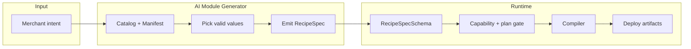

# AI Module Generator — Technical Reference

**Purpose:** Single source of truth for planning and building the modules core. No merchant-uploaded arbitrary code is deployed. Theme modules may include **AI-generated** Liquid/JS/CSS produced from the Module DSL, and must pass validation before publish. The AI module generator outputs **RecipeSpec** JSON; all deployable behaviour is compiled from that.

---

## Table of contents

1. [Quick reference](#1-quick-reference)
2. [Purpose and hard rules](#2-purpose-and-hard-rules) — includes [Theme compatibility (OS 2.0 only)](#23-theme-compatibility-and-extension-restrictions-os-20-only), [Compliance (privacy webhooks)](#24-compliance-privacy-webhooks-and-data), [Supported platforms](#25-supported-platforms)
3. [Output contract: RecipeSpec](#3-output-contract-recipespec)
4. [Canonical value sets (Allowed Values Manifest)](#4-canonical-value-sets-allowed-values-manifest)
5. [Taxonomy (Type → Category → Block)](#5-taxonomy-type--category--block) — includes [Complete surface map](#57-complete-surface-map-what-superapp-can-build) and [What surfaces can/can't do](#58-what-surfaces-can-and-cant-do-fast-reference)
6. [Business outcome categories (Goal / Category)](#6-business-outcome-categories-goal--category)
7. [Generator checklist (per-module fields)](#7-generator-checklist-per-module-fields)
8. [Capabilities and plan gating](#8-capabilities-and-plan-gating)
9. [Catalog and templates (code)](#9-catalog-and-templates-code)
10. [Constraints and important notes](#10-constraints-and-important-notes)
11. [Store-facing feature matrix](#11-store-facing-feature-matrix)
12. [Cart vs Checkout vs Post-checkout distinction](#12-cart-vs-checkout-vs-post-checkout-distinction)
13. [Thank you / Order status migration](#13-thank-you--order-status-migration)
14. [SuperApp AI Allowed Values Catalog (structured)](#14-superapp-ai-allowed-values-catalog-structured)
15. [Generator rule (order of picking)](#15-generator-rule-order-of-picking)
16. [SuperApp AI Picker UI spec](#16-superapp-ai-picker-ui-spec) — includes [Example recipes](#167-example-recipes-how-blocks-combine) and [Glossary](#168-glossary)
17. [Adding new surfaces or RecipeSpec types](#17-adding-new-surfaces-or-recipespec-types)
18. [RecipeSpec config enums (reference)](#18-recipespec-config-enums-reference)
19. [Use cases and purposes by surface](#19-use-cases-and-purposes-by-surface)
20. [Recipe coverage and expansion](#20-recipe-coverage-and-expansion)
21. [Recipe Library taxonomy (exhaustive target coverage)](#21-recipe-library-taxonomy-exhaustive-target-coverage) — includes [126 templates](#216-recipe-library-126-templates-14-categories--9), [searchable taxonomy structure](#217-searchable-recipe-library-taxonomy-structure), [Recipe Composer Rulebook](#218-recipe-composer-rulebook-how-ai-generates-reliably), [Expanded Upsell & AOV (45)](#219-expanded-category-upsell--aov-45-templates), [Support & Returns (45)](#2110-expanded-support--returns-45-templates-sup-001--sup-045), [Payments & COD (45)](#2111-expanded-payments--cod-45-templates-pay-001--pay-045), [Creative freedom + previews plan](#2112-creative-freedom--per-module-settings--previews-architecture-plan)
22. [Architecture (high level)](#22-architecture-high-level)
23. [SuperApp Module Studio Spec](#23-superapp-module-studio-spec) — purpose, entities, surface map, [Studio UX IA (screens A–H)](#233-studio-ux-ia-screens--panels), [Design from Image (Vision)](#235-design-from-image-vision--end-to-end-workflow), [Module DSL](#234-module-dsl-what-ai-generates-internally)
24. [Analytics + data model (used / triggered / saved data)](#24-analytics--data-model-used--triggered--saved-data) — [event taxonomy](#241-unified-event-taxonomy-events-logged-everywhere), [instrumentation by surface](#242-instrumentation-by-surface), [data governance](#243-data-governance-what-data-it-saved), [operational DB + analytics tables](#244-required-data-models-operational--analytics-warehouse), [Triggered vs Used](#245-triggered-vs-used-definitions), [implementation roadmap](#246-implementation-roadmap-practical-build-order)
25. [Component Compatibility Matrix](#25-component-compatibility-matrix-theme-vs-checkout-ui-vs-accounts-vs-admin-vs-pos) — [Layout](#251-layout--structure-components), [Content](#252-content-components), [Commerce](#253-commerce-components), [Forms](#254-forms--data-capture), [Behavior](#255-behavior--advanced-ui)
26. [Standard Settings Packs](#26-standard-settings-packs-per-module-archetype) — Global, Popup/Modal, Upsell, Survey, Announcement/Banner, Cart helper, Checkout guidance, Admin card/modal, POS tile+modal, Functions logic
27. [Storefront JS freedom with minimum standards](#27-storefront-js-freedom-with-minimum-standards) — [standard baseline](#271-storefront-module-standard-baseline-minimum-required), [publish-time validator](#272-publish-time-validator-run-before-uploading), [creative freedom slider](#273-creative-freedom-slider)
28. [Default Internal Component Library Spec](#29-default-internal-component-library-spec-implementation-ready) — [component spec format](#292-component-spec-format-every-component), [foundation types](#293-foundation-types-used-by-all-components), [component catalog](#294-component-catalog), [ActionRef spec](#295-actionref-spec-standard-for-all-components)
29. [Analytics Event Schema (telemetry)](#30-analytics-event-schema-telemetry-once-reuse-everywhere) — [base JSON envelope](#302-base-json-envelope-required-fields), [standard event names](#303-standard-event-names-finite-internal-list), [PII rules](#306-pii-rules-strict), [surface telemetry](#307-surface-specific-telemetry-requirements), [validation per event](#308-validation-required-fields-per-event_name)
30. [What this enables](#31-what-this-enables-in-your-product) — in-module analytics panel, global analytics dashboard
31. [Summary](#32-summary)

---

## 1. Quick reference

| Artifact | Location |
|----------|----------|
| RecipeSpec schema (Zod) | `packages/core/src/recipe.ts` |
| Capabilities & plan gating | `packages/core/src/capabilities.ts` |
| Storefront style schema | `packages/core/src/storefront-style.ts` |
| Module catalog (generated) | `packages/core/src/catalog.generated.json` |
| Catalog loader & filter | `packages/core/src/catalog.ts` |
| Catalog generator script | `packages/core/src/catalog.generator.ts` |
| Template definitions (specs) | `packages/core/src/templates.ts` |
| Workflow validator | `packages/core/src/workflow-validator.ts` |

---

## 2. Purpose and hard rules

### 2.1 Role of the AI module generator

- Consumes merchant intent (natural language or structured choices).
- Selects only **valid values** from the canonical enums (surfaces, targets, placement filters, setting types, capabilities).
- Outputs **RecipeSpec** JSON only. RecipeSpec is validated (Zod), versioned, and compiled to safe deploy operations.
- Does **not** emit arbitrary code, Liquid, or merchant-provided scripts.

### 2.2 Hard rules

1. **Output contract:** The AI must output RecipeSpec JSON only. All deployable behaviour is expressed as RecipeSpec and then compiled by the app.
2. **Schema validation:** All generated specs must validate against `RecipeSpecSchema` (discriminated union by `type`).
3. **Catalog-driven:** Target, placement, and capability values must come from the Allowed Values Manifest (Section 4). No ad-hoc strings for Shopify-facing identifiers.
4. **Capability gating:** Each recipe declares `requires: Capability[]`. Plan tier is checked via `isCapabilityAllowed(plan, cap)` before enabling features that need Plus (e.g. Checkout UI, Cart Transform).
5. **Telemetry and consent:** Telemetry must respect Customer Privacy consent; no tracking if consent disallows. Use Shopify’s Customer Privacy API and pixel privacy guidance; do not bypass consent requirements.
6. **No legacy customization paths:** SuperApp does not support ScriptTag-based storefront injection, checkout.liquid, or Thank you/Order status “additional scripts”. We use Theme App Extensions, UI extensions, Functions, and Pixels only. (The migration section may mention those legacy items as “what Shopify is removing,” but we do not use them.)

### 2.3 Theme compatibility and extension restrictions (OS 2.0 only)

**Theme compatibility (OS 2.0 + @app)**

- **App blocks** require JSON templates and a host section that supports blocks of type **@app**. App blocks are **not** supported in statically rendered sections.
- **We support Online Store 2.0 only.** App embeds may work on vintage themes in Shopify, but SuperApp does not support vintage (see Section 2.5).
- The **placement picker** must only expose templates/sections that can accept app blocks (JSON templates with @app support). Exclude non-placeable templates (e.g. gift_card) from the placement UI.

**Validation pipeline (placement)**

Before allowing placement or publish:

1. **Validate theme is OS 2.0** (JSON templates).
2. **Validate the target template is JSON** (placeable).
3. **Validate the section supports @app** (can render app blocks).

If any check fails, show: **“Cannot place here — theme doesn’t support app blocks in this area.”** Do not allow placement.

**Theme app extension restrictions (Liquid and JSON)**

- Theme app blocks/embeds **cannot render on checkout pages** (contact, shipping, payment, order status).
- Theme app extensions **do not have access** to certain Liquid objects: `content_for_header`, `content_for_index`, `content_for_layout`, and the parent section object (other than `section.id`). Structure creative JS/Liquid accordingly.
- **JSON:** JSON-with-comments and trailing commas are **not** supported in theme app extension JSON (section/block schema files). Output strict JSON only.

**Theme app extension bundle contents:** App blocks, app embed blocks, assets (JS/CSS), and snippets. Compilers must emit only valid bundle structure for the Theme app extension.

### 2.4 Compliance (privacy webhooks and data)

For a public app that stores “what data it saved” and handles customer/shop data, Shopify expects mandatory compliance handling.

**Mandatory compliance webhooks (App Store apps)**

- Implement and respond to: **customers/data_request**, **customers/redact**, **shop/redact**.
- Verify **HMAC** and return correct status codes per Shopify’s Privacy law compliance documentation.

**Data model requirements**

- Support **redact/delete customer data** by shop + customer (for customers/data_request and customers/redact).
- Support **shop/redact** (delete or anonymize all data for the shop on uninstall).

**Retention and uninstall**

- Define **retention policy defaults** for captured data (e.g. data_captures, module_events).
- Define **delete-on-uninstall** behaviour: what is removed or anonymized when the app is uninstalled (shop/redact and any app-specific uninstall hooks).

**Merchant-side reality:** Shopify offers **erase** and **data request** flows to merchants/customers; your app’s webhook responses feed into those flows.

### 2.5 Supported platforms

**Supported**

- **Online Store 2.0 (JSON templates) only** — Theme App Extensions (App Blocks + App Embeds) on JSON-based themes only.
- **Theme App Extensions only** — App Blocks + App Embeds; no direct theme file editing, no Liquid-only theme customization.
- **Checkout & Accounts editor blocks** — Via UI extensions where applicable (Checkout UI, Customer account UI).
- **Shopify Functions** — For logic (discount, payment customization, delivery customization, validation, cart transform, etc.).

**Not supported**

- **Vintage themes** — No Liquid-only theme customization support; OS 2.0 required.
- **ScriptTag / legacy storefront injection** — Deprecated direction; not supported.
- **checkout.liquid / Additional scripts** on Thank you / Order status — Legacy; Shopify is moving to blocks/pixels. We support only the new model (Checkout UI blocks + Pixels).
- **Direct theme file editing** — You only deliver app blocks/embeds; no editing of theme source files.

**UI:** When a theme module is selected or the store theme is not OS 2.0, show: **“This module requires an Online Store 2.0 theme.”**

---

## 3. Output contract: RecipeSpec

### 3.1 Definition

- **RecipeSpec** is the only artifact the AI is allowed to generate.
- Defined in `packages/core/src/recipe.ts` as a Zod `discriminatedUnion('type', [...])`.
- Base shape: `{ name, category, requires }` plus a `type` discriminator and type-specific `config` (and optionally `style` for storefront UI).

### 3.2 Module categories (code)

```ts
type ModuleCategory =
  | 'STOREFRONT_UI'
  | 'ADMIN_UI'
  | 'FUNCTION'
  | 'INTEGRATION'
  | 'FLOW'
  | 'CUSTOMER_ACCOUNT';
```

### 3.3 RecipeSpec type variants (current)

| `type` | Category | Primary capability |
|--------|----------|---------------------|
| `theme.banner` | STOREFRONT_UI | THEME_ASSETS |
| `theme.popup` | STOREFRONT_UI | THEME_ASSETS |
| `theme.notificationBar` | STOREFRONT_UI | THEME_ASSETS |
| `proxy.widget` | STOREFRONT_UI | APP_PROXY (see scope note below) |
| `functions.discountRules` | FUNCTION | DISCOUNT_FUNCTION |
| `functions.deliveryCustomization` | FUNCTION | SHIPPING_FUNCTION |
| `functions.paymentCustomization` | FUNCTION | PAYMENT_CUSTOMIZATION_FUNCTION |
| `functions.cartAndCheckoutValidation` | FUNCTION | VALIDATION_FUNCTION |
| `functions.cartTransform` | FUNCTION | CART_TRANSFORM_FUNCTION_UPDATE |
| `checkout.upsell` | STOREFRONT_UI | CHECKOUT_UI_INFO_SHIP_PAY |
| `integration.httpSync` | INTEGRATION | (connector-based) |
| `flow.automation` | FLOW | (trigger/steps) |
| `platform.extensionBlueprint` | ADMIN_UI | (blueprint) |
| `customerAccount.blocks` | CUSTOMER_ACCOUNT | CUSTOMER_ACCOUNT_UI |

**proxy.widget / APP_PROXY scope:** RecipeSpec includes `proxy.widget` (APP_PROXY), which is not deprecated but expands the storefront surface beyond “Theme App Extensions only.” If the product goal is **Theme App Extensions only for storefront UI**, either remove `proxy.widget` from the public module library or mark it **internal/optional** and not part of the default catalog. Document the decision so the generator and UI do not expose it unless intended.

### 3.4 Storefront style (storefront UI types)

For `theme.banner`, `theme.popup`, `theme.notificationBar`, `proxy.widget`, an optional `style` object conforms to `StorefrontStyleSchema` (`packages/core/src/storefront-style.ts`):

- **layout:** mode, anchor, offsetX/Y, width, zIndex (all enums).
- **spacing:** padding, margin, gap.
- **typography:** size, weight, lineHeight, align.
- **colors:** text, background, border, buttonBg/buttonText, overlay (hex).
- **shape:** radius, borderWidth, shadow.
- **responsive:** hideOnMobile, hideOnDesktop.
- **accessibility:** focusVisible, reducedMotion.
- **customCss:** optional string, max 2000 chars; sanitized and scoped at compile time.

---

## 4. Canonical value sets (Allowed Values Manifest)

The generator **must** select only from these finite enums when producing RecipeSpec or catalog entries. For **everything possible** (finite vs unlimited, all limits, Function APIs, use cases, recipe expansion), see also: **4.2.7** (finite vs unlimited), **4.2.8** (all limits), **4.2.9** (Function run targets), **Section 19** (use cases and purposes by surface), **Section 20** (recipe coverage and expansion).

### 4.1 Types (surfaces) you can generate into

From Shopify’s app extension surfaces:

| Surface | Extension families |
|---------|--------------------|
| **Online store** | Theme app extensions (App block, App embed) |
| **Checkout** | Checkout UI extensions, Shopify Functions, Post-purchase |
| **Customer accounts** | Customer account UI extensions |
| **Admin** | Admin actions, Admin blocks, Product configuration, Discount function settings, etc. |
| **POS** | POS UI extensions |
| **Flow** | Triggers, Actions, Templates, Lifecycle events |
| **Marketing/analytics** | Web pixel |
| **Payments** | Payments extension (review-required) |

### 4.2 Theme app extensions

#### 4.2.1 Extension kinds and targets

| Kind | Schema target | Purpose |
|------|---------------|---------|
| App block | `section` | Merchant places block inside a theme section (Theme Editor). |
| App embed | `head` \| `compliance_head` \| `body` | Global on/off (scripts, floating widgets, consent). |

**Note:** Theme app blocks/embeds do **not** render on checkout step pages (contact/shipping/payment/order status).

**App blocks and @app:** App blocks only work in sections that support blocks of type **@app** (JSON-template sections). Statically rendered sections do not support @app; use **Online Store 2.0** (JSON themes) for app block placement. The section must be able to render app blocks for the block to appear.

#### 4.2.2A Liquid template.name values (reference only)

Shopify Liquid `template.name` possible values are exactly:

`404`, `article`, `blog`, `cart`, `collection`, `list-collections`, `customers/account`, `customers/activate_account`, `customers/addresses`, `customers/login`, `customers/order`, `customers/register`, `customers/reset_password`, `gift_card`, `index`, `page`, `password`, `product`, `search`.

**SuperApp policy:** We do not support legacy customer account theme templates (`customers/*`) and we do not support Liquid-only `gift_card` templates for placements. (OS 2.0 only.)

#### 4.2.2B Supported Theme App Block placement templates (OS 2.0 only)

**Placeable in SuperApp Theme App Blocks picker:**

`404`, `article`, `blog`, `cart`, `collection`, `list-collections`, `index`, `page`, `password`, `product`, `search`, `metaobject/<type>`.

`metaobject/<type>` means templates like `metaobject/book`.

**Exclude from placement picker:** `customers/*` (legacy), `gift_card` (Liquid-only). Do not list `robots.txt` as a template placement option — it is not a Theme Editor placeable page type and not part of Liquid `template.name`.

**Non-placeable special files:** Special theme files like `robots.txt.liquid` are not placeable via Theme Editor blocks; SuperApp does not target these.

Use the 4.2.2B list for `enabled_on.templates` / `disabled_on.templates` when generating Theme App Block config.

#### 4.2.3 Section group types (placement filter)

Use for `enabled_on.groups` / `disabled_on.groups`:

```
header | footer | aside | custom.<NAME> | *
```

#### 4.2.4 Theme Editor deep-link target modes (Install block UX)

| Mode | Description |
|------|-------------|
| `target=newAppsSection` | Adds block in a new “Apps” section in any JSON template. |
| `target=sectionGroup:{header\|footer\|aside}` | Adds block to that section group. |
| `target=mainSection` | Adds to main section (ID `main`). |
| `target=sectionId:{sectionId}` | Adds to a specific section instance. |

All Theme Store JSON templates must support app blocks via the “Apps section” flow. The **section must support rendering app blocks** (type @app); otherwise the block cannot be placed there.

#### 4.2.5 Theme setting input types (32 total)

**Basic (7):** `checkbox`, `number`, `radio`, `range`, `select`, `text`, `textarea`

**Specialized (25):**  
`article`, `article_list`, `blog`, `collection`, `collection_list`,  
`color`, `color_background`, `color_scheme`, `color_scheme_group`,  
`font_picker`, `html`, `image_picker`, `inline_richtext`, `link_list`,  
`liquid`, `metaobject`, `metaobject_list`, `page`,  
`product`, `product_list`, `richtext`, `text_alignment`,  
`url`, `video`, `video_url`

**App block/embed schema knobs (finite keys the generator should allow):**  
`name`, `target`, `settings`, `javascript`, `stylesheet`, `tag`, `class`, `default`, `available_if`, `enabled_on`, `disabled_on`.

**Hard rule:** Use only **one** of `enabled_on` or `disabled_on` for placement filters.

#### 4.2.6 Section schema attributes (Shopify)

When defining a section schema: `name`, `tag`, `class`, `limit`, `settings`, `blocks`, `max_blocks`, `presets`, `default`, `locales`, `enabled_on`, `disabled_on`. Section group names beyond header/footer/aside are **unlimited** via `custom.<NAME>`.

#### 4.2.7 Finite vs unlimited (Shopify)

| Aspect | Finite (use only these) | Unlimited (your choice within Shopify rules) |
|--------|--------------------------|---------------------------------------------|
| **Block kinds** | App block (target=section), App embed (target=head\|compliance_head\|body) | — |
| **Block names** | — | Custom block names (unlimited); map to one of the 2 kinds above |
| **Template types** | Liquid template.name: see 4.2.2A (reference). **Placeable for Theme App Blocks:** 4.2.2B only (404, article, blog, cart, collection, list-collections, index, page, password, product, search, metaobject/<type>). Exclude customers/*, gift_card; do not list robots.txt. | — |
| **Section groups** | header, footer, aside, * | custom.\<NAME\> (NAME is unlimited) |
| **Theme setting input types** | 32 only (7 basic + 25 specialized) | — |
| **Schema knobs** | name, target, settings, javascript, stylesheet, tag, class, default, available_if, enabled_on, disabled_on | — |
| **Target values** | section \| head \| compliance_head \| body | — |
| **Checkout/Admin/POS/Customer account targets** | Finite enum per surface (see Sections 4.3–4.7) | — |
| **Function APIs** | Finite list (discount, payment_customization, delivery_customization, cart_and_checkout_validation, cart_transform, fulfillment_constraints, order_routing_location_rule) | — |
| **Web pixel events** | Standard event enum only | — |
| **Flow extension kinds** | flow.trigger, flow.action, flow.template, flow.lifecycle_event | Trigger IDs, action IDs (app-defined) |
| **Recipe combinations** | — | Category × Surface × Target × Settings × companion blocks (many thousands) |

---

#### 4.2.8 All limits (single reference)

Every numeric, size, and count limit the generator and runtime must respect.

| Where | Limit | Notes |
|-------|--------|------|
| **RecipeSpec** | | |
| name | 3–80 chars | Base shape |
| theme.banner heading | 1–80 chars | config |
| theme.banner subheading | 0–200 chars | optional |
| theme.popup title | 1–60 chars | config |
| theme.popup body | 0–240 chars | optional |
| theme.popup delaySeconds | 0–300 | config |
| theme.popup maxShowsPerDay | 0–100 | config |
| theme.popup customPageUrls | max 20 items, each max 200 chars | config |
| theme.popup countdownSeconds | 0–86400 | config |
| theme.popup countdownLabel | max 40 chars | config |
| theme.notificationBar message | 1–140 chars | config |
| StorefrontStyleSchema customCss | max 2000 chars | Sanitized/scoped at compile |
| **Functions** | | |
| Discount functions | max **25 active** per store | Run concurrently |
| Delivery customization | max **25 active** per store | |
| Cart & checkout validation | max **25 active** per store | |
| Payment customization | max **25 active** per store | |
| Fulfillment constraints | part of “25 per Function API” | |
| Cart Transform | **one per store** (cart.transform.run) | |
| functions.discountRules rules | 1–50 | config.rules |
| functions.deliveryCustomization rules | 1–50 | config.rules |
| functions.paymentCustomization rules | 1–50 | config.rules |
| functions.cartAndCheckoutValidation rules | 1–50 | config.rules |
| functions.cartTransform bundles | 1–50 | config.bundles |
| **Checkout UI** | | |
| UI extension bundle | ≤ **64 KB** | Enforced at deployment |
| **Flow / integration** | | |
| flow.automation steps | 1–40 | config.steps |
| integration.httpSync endpointPath | 1–200 chars, regex /[a-z0-9\-/]+/ | |
| **Customer account** | | |
| customerAccount.blocks blocks[] | 1–20 items | config.blocks |
| **Theme section schema** | | |
| blocks / max_blocks | Per Shopify section schema | Use for block limits if defined |

---

#### 4.2.9 Function run targets (exact APIs)

Stable run targets for Shopify Functions (use for capability/compiler mapping).

| Function API | Run target | Limit |
|--------------|------------|--------|
| Cart Transform | `cart.transform.run` | One per store |
| Discount (lines/order) | `cart.lines.discounts.generate.run` | 25 active per store |
| Discount (delivery) | `cart.delivery-options.discounts.generate.run` | (unified with discount) |
| Fulfillment Constraints | `cart.fulfillment-constraints.generate.run` | 25 per API |
| Delivery Customization | (Delivery Customization API) | 25 active per store |
| Payment Customization | (Payment Customization API) | 25 active per store |
| Cart & Checkout Validation | (Cart and Checkout Validation API) | 25 active per store |
| Order Routing Location Rule | (Order Routing Location Rule API) | Per API rules |

**Unstable / preview (not in latest):** Pickup point delivery option generator, local pickup delivery option generator, discounts allocator — may appear in docs but not supported in latest API version or developer preview.

---

### 4.3 Checkout UI extensions

**Availability:** Checkout UI for info/shipping/payment steps requires **Shopify Plus**. Thank-you / order-status style placements vary by plan.

**Performance:** UI extension compiled bundle ≤ **64 KB** (enforced at deployment).

**Security:** Many targets require **protected customer data** access (request via Partner Dashboard for public apps).

#### 4.3.1 Target enum (complete)

| Group | Target | Purpose |
|-------|--------|---------|
| **Address** | `purchase.address-autocomplete.suggest` | Provide address suggestions. |
| | `purchase.address-autocomplete.format-suggestion` | Format a chosen suggestion. |
| **Announcement** | `purchase.thank-you.announcement.render` | Dismissible announcement on Thank you page. |
| **Block** | `purchase.checkout.block.render` | Merchant-placeable block in checkout editor. |
| | `purchase.thank-you.block.render` | Same on Thank you page. |
| **Footer** | `purchase.checkout.footer.render-after` | Content below checkout footer. |
| | `purchase.thank-you.footer.render-after` | Below Thank you footer. |
| **Header** | `purchase.checkout.header.render-after` | Below checkout header. |
| | `purchase.thank-you.header.render-after` | Below Thank you header. |
| **Information** | `purchase.checkout.contact.render-after` | After contact form. |
| | `purchase.thank-you.customer-information.render-after` | After customer info on Thank you. |
| **Local pickup** | `purchase.checkout.pickup-location-list.render-before` | |
| | `purchase.checkout.pickup-location-list.render-after` | |
| | `purchase.checkout.pickup-location-option-item.render-after` | |
| **Navigation** | `purchase.checkout.actions.render-before` | Before action buttons. |
| **Order summary** | `purchase.checkout.cart-line-item.render-after` | Per line item, under properties. |
| | `purchase.checkout.cart-line-list.render-after` | After line items. |
| | `purchase.checkout.reductions.render-before` | Before discount form. |
| | `purchase.checkout.reductions.render-after` | After discount form + tags. |
| | `purchase.thank-you.cart-line-item.render-after` | |
| | `purchase.thank-you.cart-line-list.render-after` | |
| **Payments** | `purchase.checkout.payment-method-list.render-before` | Between heading and list. |
| | `purchase.checkout.payment-method-list.render-after` | Below list. |
| **Pickup points** | `purchase.checkout.pickup-point-list.render-before` | |
| | `purchase.checkout.pickup-point-list.render-after` | |
| **Shipping** | `purchase.checkout.delivery-address.render-before` | |
| | `purchase.checkout.delivery-address.render-after` | |
| | `purchase.checkout.shipping-option-item.details.render` | |
| | `purchase.checkout.shipping-option-item.render-after` | |
| | `purchase.checkout.shipping-option-list.render-before` | |
| | `purchase.checkout.shipping-option-list.render-after` | |

---

### 4.4 Post-purchase extensions

| Target | Purpose |
|--------|---------|
| `Checkout::PostPurchase::ShouldRender` | Decide whether to show the offer/interstitial. |
| `Checkout::PostPurchase::Render` | Render the interstitial UI and return result. |

**Note:** Post-purchase is review-required and may require access request for live stores.

---

### 4.5 Customer account UI extensions

#### 4.5.1 Target enum (complete)

| Group | Target |
|-------|--------|
| **Footer** | `customer-account.footer.render-after` |
| **Full page** | `customer-account.page.render`, `customer-account.order.page.render` |
| **Order action menu** | `customer-account.order.action.menu-item.render`, `customer-account.order.action.render` |
| **Order index** | `customer-account.order-index.announcement.render`, `customer-account.order-index.block.render` |
| **Order status** | `customer-account.order-status.announcement.render`, `customer-account.order-status.block.render`, `customer-account.order-status.cart-line-item.render-after`, `customer-account.order-status.cart-line-list.render-after`, `customer-account.order-status.customer-information.render-after`, `customer-account.order-status.fulfillment-details.render-after`, `customer-account.order-status.payment-details.render-after`, `customer-account.order-status.return-details.render-after`, `customer-account.order-status.unfulfilled-items.render-after` |
| **Profile (B2B)** | `customer-account.profile.company-details.render-after`, `customer-account.profile.company-location-addresses.render-after`, `customer-account.profile.company-location-payment.render-after`, `customer-account.profile.company-location-staff.render-after` |
| **Profile (default)** | `customer-account.profile.addresses.render-after`, `customer-account.profile.announcement.render`, `customer-account.profile.block.render` |

**Behavior:** Block targets render between core features and are always rendered regardless of other elements. Many targets note protected customer data for some properties.

---

### 4.6 Admin UI extensions

#### 4.6.1 Admin surface enum

Admin actions, Admin blocks, Product configuration, Admin link extensions, Discount function settings, Navigation links, Purchase options extensions, Subscription link.

#### 4.6.2 Admin target enum (render)

**Action targets:**  
`admin.abandoned-checkout-details.action.render`, `admin.catalog-details.action.render`, `admin.collection-details.action.render`, `admin.collection-index.action.render`, `admin.company-details.action.render`, `admin.customer-details.action.render`, `admin.customer-index.action.render`, `admin.customer-index.selection-action.render`, `admin.customer-segment-details.action.render`, `admin.discount-details.action.render`, `admin.discount-index.action.render`, `admin.draft-order-details.action.render`, `admin.draft-order-index.action.render`, `admin.draft-order-index.selection-action.render`, `admin.gift-card-details.action.render`, `admin.order-details.action.render`, `admin.order-fulfilled-card.action.render`, `admin.order-index.action.render`, `admin.order-index.selection-action.render`, `admin.product-details.action.render`, `admin.product-index.action.render`, `admin.product-index.selection-action.render`, `admin.product-variant-details.action.render`, `admin.product-purchase-option.action.render`, `admin.product-variant-purchase-option.action.render`

**Block targets:**  
`admin.abandoned-checkout-details.block.render`, `admin.catalog-details.block.render`, `admin.collection-details.block.render`, `admin.company-details.block.render`, `admin.company-location-details.block.render`, `admin.customer-details.block.render`, `admin.draft-order-details.block.render`, `admin.gift-card-details.block.render`, `admin.discount-details.function-settings.render`, `admin.order-details.block.render`, `admin.product-details.block.render`, `admin.product-variant-details.block.render`

**Print action targets:**  
`admin.order-details.print-action.render`, `admin.product-details.print-action.render`, `admin.order-index.selection-print-action.render`, `admin.product-index.selection-print-action.render`

**Segmentation:** `admin.customers.segmentation-templates.render`

**Product configuration:** `admin.product-details.configuration.render`, `admin.product-variant-details.configuration.render`

**Validation settings:** `admin.settings.validation.render`

**Note:** Many admin actions have companion `*.action.should-render` targets that control visibility.

---

### 4.7 POS UI extensions

| Screen | Targets |
|--------|---------|
| **Home** | `pos.home.tile.render`, `pos.home.modal.render` |
| **Cart** | `pos.cart.line-item-details.action.menu-item.render`, `pos.cart.line-item-details.action.render` |
| **Customer** | `pos.customer-details.block.render`, `pos.customer-details.action.menu-item.render`, `pos.customer-details.action.render` |
| **Draft order** | `pos.draft-order-details.block.render`, `pos.draft-order-details.action.menu-item.render`, `pos.draft-order-details.action.render` |
| **Order** | `pos.order-details.block.render`, `pos.order-details.action.menu-item.render`, `pos.order-details.action.render` |
| **Exchange (post)** | `pos.exchange.post.block.render`, `pos.exchange.post.action.menu-item.render`, `pos.exchange.post.action.render` |
| **Purchase (post)** | `pos.purchase.post.block.render`, `pos.purchase.post.action.menu-item.render`, `pos.purchase.post.action.render` |
| **Return (post)** | `pos.return.post.block.render`, `pos.return.post.action.menu-item.render`, `pos.return.post.action.render` |
| **Product** | `pos.product-details.block.render`, `pos.product-details.action.menu-item.render`, `pos.product-details.action.render` |
| **Receipt** | `pos.receipt-header.block.render`, `pos.receipt-footer.block.render` |
| **Register** | `pos.register-details.block.render`, `pos.register-details.action.menu-item.render`, `pos.register-details.action.render` |

**Render constraints:** Some targets strictly limit what you can render (e.g. `pos.home.tile.render` only renders a Tile component). Exchange/Return/Receipt may be preview/beta.

---

### 4.8 Shopify Functions

#### 4.8.1 Function API enum (latest)

| API | Purpose |
|-----|---------|
| **Cart Transform** | Change cart lines (merge/split/bundle-style). Run: `cart.transform.run` (one per store). |
| **Discount** | Line/order + delivery discounts. Run: `cart.lines.discounts.generate.run`, `cart.delivery-options.discounts.generate.run`. |
| **Delivery Customization** | Rename/sort/hide delivery options. |
| **Payment Customization** | Rename/reorder/hide payment methods, terms, review requirement. |
| **Cart & Checkout Validation** | Server-side rules to allow/block checkout. |
| **Fulfillment Constraints** | Constrain fulfillment options/groups. Run: `cart.fulfillment-constraints.generate.run`. |
| **Order Routing Location Rule** | Fulfillment location priority. |

#### 4.8.2 Hard limits

- **Discount functions:** max 25 active per store (run concurrently).
- **Delivery customization functions:** max 25 active per store.
- **Cart & checkout validation:** max 25 active per store; errors exposed to Storefront API cart, cart template, and checkout.
- **Payment customization:** max 25 active (part of “25 per Function API” expansion).
- **Fulfillment constraints:** part of “25 per Function API” expansion.

#### 4.8.3 Unstable / preview

- Pickup point delivery option generator, local pickup delivery option generator, discounts allocator: may appear in docs but not supported in latest API version or are developer preview.

---

### 4.9 Web pixel — standard events

```
alert_displayed, cart_viewed,
checkout_address_info_submitted, checkout_completed, checkout_contact_info_submitted,
checkout_shipping_info_submitted, checkout_started,
collection_viewed, page_viewed, payment_info_submitted,
product_added_to_cart, product_removed_from_cart, product_viewed,
search_submitted, ui_extension_errored
```

**Event behavior:** `checkout_completed` typically fires once per checkout on Thank you, but can fire on the first upsell offer page instead (and then not again on Thank you).

---

### 4.10 Flow

**Extension kinds (finite):** `flow.trigger`, `flow.action`, `flow.template`, `flow.lifecycle_event`.

**App-defined:** Trigger IDs and Action IDs are published by the app; only the four kinds above are in the stable catalog. Templates are packaged “recipes” (triggers + conditions + actions).

---

### 4.11 Payments

Payments extension is a distinct type. **Availability:** Only approved Partners. **Review constraints:** Payments Partner application review + Payments app review required. **Live payments:** Signed revenue share agreement required before approval. Taxonomy label: “Payment method provider”.

---

## 5. Taxonomy (Type → Category → Block)

### 5.1 Theme → App blocks (target = section)

| Block archetype | Typical placement | Typical settings |
|-----------------|--------------------|------------------|
| Universal UI | Any template; optional header/footer/aside | text, richtext, color, image, url, checkbox |
| Product page | product | product/product_list, richtext, color, select/radio |
| Collection/listing | collection, list-collections | collection/collection_list, product_list, image_picker |
| Cart UI | cart | checkbox, range, product_list, richtext |
| Content pages | page, blog, article | article/blog, richtext, form-related |

### 5.2 Theme → App embeds (target = head | compliance_head | body)

| Archetype | Target | Purpose |
|-----------|--------|---------|
| Tracking/scripts | head or body | Analytics, A/B, attribution |
| Compliance | compliance_head / body | Cookie consent, required head tags |
| Floating UI | body | Chat bubble, sticky widgets |

### 5.3 Checkout UI — SuperApp categories

- **Trust/messaging:** header, footer, announcement.
- **Upsell:** block targets, line-item targets, reductions.
- **Shipping UX:** delivery address, shipping options, pickup.
- **Payment UX:** payment method list.
- **CTA workflow:** actions area.

### 5.4 Customer account — SuperApp categories

- **Support & returns:** return-details, fulfillment-details, order status block.
- **Reorder/subscriptions:** cart-line targets, order action menu.
- **B2B:** company/profile targets.
- **Account marketing:** announcements, footer.

### 5.5 Admin — SuperApp categories

- In-page cards: Admin blocks.
- Task modals: Admin actions (optionally gated by should-render).
- Print: Print action targets.
- Discount config: `admin.discount-details.function-settings.render`.
- Segmentation: segmentation templates.
- Product config: product configuration render.
- Checkout rules: validation settings render.

### 5.6 Functions — SuperApp categories

- Cart logic: Cart Transform.
- Discount logic: Discount.
- Shipping logic: Delivery Customization.
- Payment logic: Payment Customization.
- Checkout gating: Cart & Checkout Validation.
- Fulfillment routing: Fulfillment Constraints, Order Routing Location Rule.

### 5.7 Complete surface map: what SuperApp can build

SuperApp AI supports **all** Shopify app extension surfaces. Each surface has a finite set of valid targets and constraints (Shopify’s official extension types). No surfaces are missing from this map.

| # | Surface | Used for | Does not change / Important |
|---|---------|----------|-----------------------------|
| **1** | **Online store (Theme)** | Storefront UI: pages, product pages, cart page/drawer UI. | Checkout logic (pricing/eligibility) unless paired with Functions. Theme blocks/embeds **don’t render on checkout pages/steps**. |
| **2** | **Checkout UI** | UI blocks inside checkout and post-checkout (Thank you). | Checkout-step UI (information/shipping/payment) is **Plus-only**. Logic changes require Functions. |
| **3** | **Shopify Functions** | Pricing, eligibility, cart transformations, payment/shipping availability, validation rules. **Truth layer** for logic. | Does not show UI; use Theme/Checkout/Account blocks to explain rules. |
| **4** | **Post-purchase offers** | Post-purchase upsell page (one-click offers after payment, before Thank you). | Beta; access requirements may apply. |
| **5** | **Customer account UI** | New account pages: order status/index/profile/footer/full pages. | — |
| **6** | **Admin UI** | Merchant admin tools on orders/products/customers/discounts. | — |
| **7** | **POS UI** | Staff tools inside Shopify POS (home tile, cart actions, receipts). | — |
| **8** | **Web Pixels** | Event-based analytics tracking. | Does not change UI or logic; use for tracking on Thank you / Order status (we support blocks + pixels only; legacy additional scripts are not supported). |
| **9** | **Flow** | If-this-then-that automations (triggers, actions, templates). | Does not directly render storefront UI. |

**Best for (by surface):**

- **Theme App Block:** Banners, product widgets, cart upsells, free shipping bars, FAQs. **Theme App Embed:** Consent banners, chat bubble overlays, analytics loaders.
- **Checkout UI:** Upsell messages in order summary; shipping/payment guidance; checkout trust messaging; Thank-you blocks (surveys, support CTAs).
- **Functions:** COD restrictions; tier discounts, BOGO, shipping discounts; blocking checkout on restricted items; bundling logic.
- **Post-purchase:** One-click upsell after payment.
- **Customer account:** Returns portal, reorder tools, account surveys, post-purchase education & support.
- **Admin:** Operational dashboards & cards; admin actions/modals (bulk tools); discount function settings; print actions.
- **POS:** Staff workflows (apply rules, verify customer, recommend add-ons); receipt blocks; POS action modals.
- **Pixels:** Add-to-cart, checkout started/completed, product views; replacing legacy scripts.
- **Flow:** Send Slack/email, add tags, create tasks; react to events; publish templates into Flow library.

### 5.8 What surfaces can and can’t do (fast reference)

| Surface | Can do | Cannot do |
|---------|--------|-----------|
| **Storefront (Theme)** | Show UI (banners, widgets, cart UI). | Enforce checkout rules without Functions; modify checkout step pages. |
| **Checkout UI** | Show UI inside checkout/thank-you; improve conversion with guidance. | Change prices/eligibility by itself (needs Functions for logic). |
| **Functions** | Change pricing, validation, shipping/payment availability; enforce logic. | Show UI (needs Theme/Checkout/Account blocks to explain rules). |
| **Pixels** | Track events for analytics/ads. | Change UI or logic. |
| **Flow** | Automate workflows (actions + triggers + templates). | Directly render storefront UI. |

---

## 6. Business outcome categories (Goal / Category)

**Categories** are the goals you want to achieve. They are **human-friendly labels** used in the Picker UI and for organizing solutions. They do **not** change Shopify behavior by themselves — they help you find the right kind of solution fast.

| Goal (Category) | Description |
|----------------|-------------|
| **Upsell & cross-sell** | Cart/checkout/thank-you upsells, product recommendations. |
| **Trust & conversion** | Trust badges, reassurance, social proof, FAQs. |
| **Shipping & delivery** / Shipping clarity | Delivery messaging, shipping progress, pickup options. |
| **Payments & COD control** / Payment nudges | Payment method messaging, COD visibility, terms. |
| **Checkout rules (validation)** | Block/allow checkout by rule (Functions: Cart & Checkout Validation). |
| **Discounts & pricing** | Discount rules, tiered pricing (Functions: Discount). |
| **Cart bundling / transforms** | Bundle/unbundle cart lines (Functions: Cart Transform). |
| **Post-purchase engagement** | Surveys, downloads, support, reorder (Thank you / Order status / Customer account). |
| **Support & returns** / Customer support & returns | Returns UI, support CTAs, order status blocks. |
| **Tracking & analytics** | Event tracking (Web Pixels), analytics embeds. |
| **Automation (Flow)** | Triggers, actions, templates (if-this-then-that). |
| **Admin tools** | Admin actions/blocks, config screens, print actions. |
| **POS tools** | POS tiles, modals, cart/order/customer screens. |
| **Payments provider** | Payments extension (review-required). |

**Where should it happen?** (optional; can be auto-derived)

- Storefront (Theme)
- Cart (Theme)
- Checkout (Plus-only targets badge)
- Thank you / Order status
- Customer account pages
- Admin
- POS
- Background logic (Functions)
- Tracking (Pixels)
- Automation (Flow)

---

## 7. Generator checklist (per-module fields)

For every block or module the generator produces, ensure:

| Field | Description | Source |
|-------|-------------|--------|
| **type** | RecipeSpec `type` (discriminator) | RecipeSpecSchema variants |
| **category** | ModuleCategory | STOREFRONT_UI, ADMIN_UI, FUNCTION, etc. |
| **name** | Human-readable name (3–80 chars) | User or default |
| **requires** | Capability[] | From Section 7; plan-gated where applicable |
| **targets** | Shopify target(s) for this module | Section 4 target enums per surface |
| **placement_filters** | Theme only: templates + groups | Section 4.2.2A–4.2.2B (placeable only), 4.2.3 |
| **settings_schema** | Theme: from 32 setting types; others: internal config | Section 4.2.5 or RecipeSpec config shape |
| **data_needs** | Which Shopify objects (products, orders, cart, etc.) | For scope derivation |
| **permissions** | Derived from data needs (e.g. products → read_products, discounts → write_discounts) | Derivation rule; no fixed global list |

---

## 8. Capabilities and plan gating

### 8.1 Capability type (code)

```ts
type Capability =
  | 'THEME_ASSETS'
  | 'THEME_APP_EXTENSION'
  | 'APP_PROXY'
  | 'DISCOUNT_FUNCTION'
  | 'SHIPPING_FUNCTION'
  | 'PAYMENT_CUSTOMIZATION_FUNCTION'
  | 'VALIDATION_FUNCTION'
  | 'CART_TRANSFORM_FUNCTION_UPDATE'
  | 'CHECKOUT_UI_INFO_SHIP_PAY'
  | 'CUSTOMER_ACCOUNT_UI'
  | 'CUSTOMER_ACCOUNT_B2B_PROFILE';
```

### 8.2 Plan tiers

```ts
type PlanTier =
  | 'STARTER' | 'BASIC' | 'GROW' | 'ADVANCED' | 'PLUS' | 'ENTERPRISE' | 'UNKNOWN';
```

### 8.3 Minimum plan for capability

| Capability | Min plan |
|------------|----------|
| `CHECKOUT_UI_INFO_SHIP_PAY` | PLUS |
| `CART_TRANSFORM_FUNCTION_UPDATE` | PLUS |
| (all others) | No minimum (or document per Shopify) |

Use `isCapabilityAllowed(plan, cap)` before enabling a recipe that requires a given capability.

---

## 9. Catalog and templates (code)

### 9.1 Module catalog entry

```ts
type ModuleCatalogEntry = {
  catalogId: string;
  category: ModuleCategory;
  requires: Capability[];
  description: string;
  templateKind?: string;
  surface?: string;
  intent?: string;
  trigger?: string;
  resource?: string;
  pattern?: string;
  condition?: string;
  action?: string;
  direction?: string;
  complexity?: string;
  defaults?: Record<string, unknown>;
};
```

- **MODULE_CATALOG:** Loaded from `catalog.generated.json`.
- **findCatalogEntry(catalogId):** Returns one entry by ID.
- **filterCatalog(query):** Filters by category, templateKind, surface, intent, trigger, etc.

### 9.2 Catalog generator

- **Script:** `packages/core/src/catalog.generator.ts`.
- **Output:** `packages/core/src/catalog.generated.json`.
- **Logic:** Builds entries from Cartesian product of surfaces × components × intents (and trigger variants for popup/modal/drawer/toast). Extend with admin/function/integration/flow in the same pattern.
- **Surfaces (current):** home, collection, product, cart, mini_cart, search, account, blog, page, footer, header, policy.
- **Intents (current):** promo, capture, upsell, cross_sell, trust, urgency, info, support, compliance, localization.
- **Components (current):** banner, announcement_bar, notification_bar, popup, modal, drawer, toast, badge, progress_bar, tabs, accordion, sticky_cta, coupon_reveal.
- **Triggers (current):** page_load, time_3s, time_10s, scroll_25, scroll_75, exit_intent, add_to_cart, cart_value_x, product_view_2, returning_visitor.

### 9.3 Template entry

```ts
type TemplateEntry = {
  id: string;
  name: string;
  description: string;
  category: ModuleCategory;
  type: string;           // RecipeSpec type
  icon?: string;
  tags?: string[];
  spec: RecipeSpec;
};
```

- **MODULE_TEMPLATES:** Array of TemplateEntry in `templates.ts`. Each `spec` must parse with `RecipeSpecSchema`.
- **Adding a new template:** Add catalogId (or map to existing), schema-compliant spec, compiler support if needed, and tests. Prefer config-driven generic extensions; avoid per-store compiled code.

---

## 10. Constraints and important notes

1. **Theme:** App blocks/embeds do **not** render on checkout step pages.
2. **Theme embeds:** Deactivated by default after install; merchant enables in Theme Editor → Theme settings → App embeds.
3. **Checkout UI:** Info/shipping/payment steps require Shopify Plus; Thank-you/order-status availability varies by plan.
4. **Post-purchase:** Review-required; beta/access for live stores.
5. **Functions:** Max 25 active per Function API (discount, delivery customization, cart_and_checkout_validation, payment_customization, fulfillment_constraints, etc.); v2025-07+ naming applies.
6. **Flow:** Only extension kinds are finite; trigger/action IDs are app-defined.
7. **Payments:** Review-required; approvals and revenue share agreement.
8. **Metaobject templates:** `metaobject/<type>`. For placement picker use Section 4.2.2B only; exclude customers/*, gift_card. robots.txt is not a template.name and is not a placement option (see Non-placeable special files).
9. **Style:** Storefront `customCss` is sanitized and scoped at compile time; no @import, url(), expression(), or script.
10. **Theme placement:** Use only one of `enabled_on` or `disabled_on` for placement filters.
11. **Checkout UI bundle:** Compiled extension bundle ≤ 64 KB (enforced at deployment).

---

## 11. Store-facing feature matrix

Merchant-facing summary: where they configure, what it changes, and key messages.

### A) Online Store Theme (Theme Editor)

| Aspect | Detail |
|--------|--------|
| **Where merchant configures** | Theme Editor (customize theme). |
| **What it changes** | Storefront UI only (pages, sections, cart page/drawer UI). |
| **Shopify capability** | Theme app extension. |

**A1) Theme App Block**

- **Appears in:** Theme sections (merchant places it in a section).
- **Target enum:** `section`.
- **Placement filters:** Only supported placement templates (Section 4.2.2B): 404, article, blog, cart, collection, list-collections, index, page, password, product, search, metaobject/<type>. Exclude customers/*, gift_card; do not list robots.txt. Section groups: `header` \| `footer` \| `aside` \| `custom.<NAME>` \| `*`.
- **Examples:** Banners, upsells, FAQs, trust badges, cart upsells, product widgets.
- **Merchant settings:** The 32 theme setting input types (finite enum).

**A2) Theme App Embed Block (global)**

- **Target enum:** `head` \| `compliance_head` \| `body`.
- **Used for:** Chat bubble overlays, badges, analytics loaders, consent scripts.
- **Important:** Embeds are **OFF by default** after install; merchants enable in Theme Editor → Theme settings → App embeds.

**Key message for merchants:** “Theme blocks customize your storefront (including cart page UI). They don’t change checkout logic.”

### B) Checkout & Accounts (Checkout and accounts editor)

| Aspect | Detail |
|--------|--------|
| **Where merchant configures** | Shopify admin → Checkout and accounts editor (separate from Theme editor). |
| **What it changes** | UI inside checkout / thank you / order status / customer accounts pages. |

**B1) Checkout UI — Checkout steps (Plus-only)**

- **Plan requirement:** Information, shipping, and payment step targets are **Shopify Plus only**.
- **Use:** Banners, upsells, shipping/payment nudges, extra UI blocks.
- **Targets:** All under `purchase.checkout.*` (order summary, shipping, payments, navigation/actions, etc.).

**B2) Checkout UI — Thank you & Order status**

- Customizable via checkout UI extensions; merchants use blocks in checkout and accounts editor.
- **Non-Plus migration deadline:** Aug 26, 2026 to upgrade Thank you + Order status to new version.
- **Plus:** Aug 28, 2025 deadline; auto-upgrades (Jan 2026); Shopify is retiring legacy customizations. We support only Checkout UI blocks + Pixels.
- **Tracking:** Use Checkout UI blocks + Pixels. Legacy additional scripts and checkout.liquid are not supported.

**B3) Protected customer data**

- Some checkout/thank-you/order-status/customer-account targets require **protected customer data access** (application + strict review).

**Key message for merchants:** “Checkout UI extensions add UI blocks inside checkout and post-checkout pages. Checkout-step UI is Plus-only; post-checkout pages are moving everyone to blocks/pixels via the upgrade path.”

### C) Post-purchase product offers

- **Where it appears:** Post-purchase page (after payment, before Thank you).
- **Status:** Beta.
- **Live stores:** Access request required; dev stores unrestricted.

**Key message for merchants:** “This is the ‘one-click upsell after payment’ page.”

### D) Shopify Functions (backend logic)

| Aspect | Detail |
|--------|--------|
| **Where merchant configures** | App UI + Shopify admin objects (discount nodes, payment/delivery customization settings, etc.). |
| **What it changes** | Real checkout/cart logic (prices, shipping/payment availability, validation errors, cart transformation). |

- **Discount:** max 25 active per store.
- **Payment customization:** max 25 active.
- **Cart & checkout validation:** max 25 active; errors surface in cart + during checkout.
- “25 active per Function API” applies across multiple Function APIs.

**Key message for merchants:** “Functions are the ‘logic engine’. If you want to change pricing, eligibility, payments/shipping, or enforce rules — it’s Functions.”

### E) Web Pixels (tracking)

- **Where it runs:** Storefront/checkout tracking in Shopify’s pixel system.
- **What it does:** Event-based tracking without legacy “Additional scripts”.
- **Standard events:** page_viewed, product_viewed, product_added_to_cart, checkout_started, checkout_completed, etc. (finite enum).

**Key message for merchants:** “Use blocks + pixels on the new Thank you / Order status pages. Legacy tracking scripts are not supported.”

### F) Customer Account UI extensions

- **Where:** Checkout and accounts editor.
- **What it changes:** Blocks/pages inside the new customer accounts UI.
- **Targets:** Finite (order index, order status, profile, footer, full pages).

**Key message for merchants:** “Account pages can show post-purchase content, surveys, support tools, reorder tools.”

### G) Admin UI extensions

- **Where:** Shopify admin pages (orders, products, customers, discounts, etc.).
- **What it changes:** Merchant/admin UI (actions, modals, cards, settings).
- **Targets:** Finite; see Admin target enum.

**Key message for merchants:** “Admin extensions power the configuration screens + operational tools.”

### H) POS UI extensions

- **Where:** Shopify POS app (home tile, cart/customer/order screens, receipts).
- **What it changes:** In-store workflow UI.
- **Targets:** Finite; see POS target enum.

**Key message for merchants:** “POS extensions add staff tools at checkout counter.”

### I) Flow (automation)

- **Where:** Shopify Flow (workflows).
- **What it changes:** Automation logic (if-this-then-that).
- **Finite kinds:** Triggers, actions, templates, lifecycle events.

**Key message for merchants:** “Flow is automation; your app supplies triggers/actions + templates (recipes).”

---

## 12. Cart vs Checkout vs Post-checkout distinction

Use this to avoid confusing these in the SuperApp AI UI.

| # | Zone | Tools | What you can do | What you cannot do |
|---|------|--------|------------------|--------------------|
| **1** | **Storefront Cart UI (Theme)** | Theme app blocks (target=section) on cart template; cart drawer sections. | Show upsells, progress bars, donation options, cart messages. | Guarantee pricing logic changes (unless paired with Functions). |
| **2** | **Cart/Checkout Logic (Backend)** | Shopify Functions. | Discounts change pricing; Cart transforms restructure lines; Validation blocks checkout (errors in cart + checkout); Payment/Delivery customization hide/reorder options. This is the “truth layer.” | — |
| **3** | **Checkout UI (During checkout)** | Checkout UI extensions. | UI during information/shipping/payment steps (Plus-only). Guide, nudge, collect input, explain rules, show offers. Logic changes still come from Functions. | — |
| **4** | **Post-checkout pages (Thank you / Order status / Customer accounts)** | Checkout UI extensions + Customer account UI extensions + Pixels. | Shopify is moving everyone to blocks/pixels (non-Plus deadline Aug 26, 2026). Surveys, downloads, support, reorder, tracking. | — |
| **5** | **Post-purchase upsell page (between confirmation and Thank you)** | Post-purchase offers (Beta). | One-click upsell after payment. | Live store requires access request. |

---

## 13. Thank you / Order status migration

Shopify is upgrading merchants to the new Thank you and Order status pages. **We support only the new model: Checkout UI blocks + Pixels.** Legacy methods (additional scripts, script tags, checkout.liquid) are **not supported**.

| Audience | Deadline / behavior |
|----------|---------------------|
| **Non-Plus** | **Aug 26, 2026** — upgrade Thank you + Order status pages to the new version. |
| **Plus** | **Aug 28, 2025** deadline; auto-upgrades begin **Jan 2026**; legacy customizations are being retired by Shopify. |

- **Use Checkout UI blocks + Pixels** for Thank you and Order status UI and tracking. Do not rely on or document additional scripts / checkout.liquid as a supported method.
- **Type label for catalog:** `checkout.thank_you_and_order_status_migration` — use for docs/UI context (upgrade path, blocks + pixels).

---

## 14. SuperApp AI Allowed Values Catalog (structured)

Structured manifest so the generator never invents invalid values. Only finite Shopify-defined enums + constraints.

**Meta**

- `catalog_version`: 1
- `generated_on`: 2026-03-04

### Type: online_store.theme

- **Extension kinds:** `app_block` (target `section`), `app_embed_block` (target `head` \| `compliance_head` \| `body`). Embeds deactivated by default.
- **Theme compatibility:** We support Online Store 2.0 only. App embeds may work on vintage themes in Shopify, but SuperApp does not support vintage. App blocks require JSON templates and section must support blocks of type **@app**. Bundle contents: app blocks, app embed blocks, assets, snippets.
- **Deep-link insertion modes:** `target=newAppsSection`, `target=sectionGroup:{header|footer|aside}`, `target=mainSection`, `target=sectionId:{sectionId}`.
- **Placement filters:** Placement picker exposes only supported placement templates (Section 4.2.2B): 404, article, blog, cart, collection, list-collections, index, page, password, product, search, metaobject/<type>. Exclude customers/*, gift_card; do not list robots.txt. `section_group`: header \| footer \| aside \| custom.\<NAME> \| *.
- **Merchant setting input types:** 32 (basic 7 + specialized 25) — see Section 4.2.5.
- **App block/embed schema knobs (finite keys):** name, target, settings, javascript, stylesheet, tag, class, default, available_if, enabled_on, disabled_on.
- **Hard rules:** App blocks/embeds cannot render on checkout step pages. Use only **one** of `enabled_on` or `disabled_on`. Theme app extensions have no access to content_for_header, content_for_index, content_for_layout, or parent section (except section.id); extension JSON must be strict (no comments/trailing commas).
- **SuperApp categories (labels):** Universal UI, Product page modules, Collection/list modules, Cart UI modules, Header/footer/aside modules, Global embeds (tracking, consent, floating widgets).

### Type: checkout.ui_extensions

- **Plan:** Plus-only for information, shipping, payment steps.
- **Target enum:** See Section 4.3.1 (Address, Announcement, Block, Footer, Header, Information, Local pickup, Navigation, Order summary, Payments, Pickup points, Shipping).
- **Security:** Many targets require “protected customer data” access (request via Partner Dashboard).
- **Performance:** UI extension compiled bundle ≤ **64 KB** (enforced at deployment).

### Type: checkout.post_purchase

- Post-purchase page in checkout (product offers, surveys). Separate surface; access/review gated.

### Type: checkout.thank_you_and_order_status_migration

- Shopify is upgrading merchants to the new pages; we support **Checkout UI blocks + Pixels** only. Non-Plus: Aug 26, 2026. Plus: Aug 28, 2025; auto-upgrades Jan 2026.

### Type: functions

- **Function API enum:** discount (25 active), payment_customization (25), delivery_customization (25), cart_and_checkout_validation (25), cart_transform, fulfillment_constraints (25), order_routing_location_rule.
- **SuperApp logic categories:** Cart logic → cart_transform; Pricing → discount; Checkout gating → cart_and_checkout_validation; Shipping → delivery_customization; Payment → payment_customization; Fulfillment → fulfillment_constraints + order_routing_location_rule.

### Type: customer_accounts.ui_extensions

- **Target enum:** See Section 4.5.1.
- **Behavior:** Block targets render between core features and are always rendered regardless of other elements. Protected customer data may apply.

### Type: admin.ui_extensions

- **Target enum:** See Section 4.6.2 (Actions, Blocks, Print, Segmentation, Product configuration, Validation settings).
- **Extra gating:** Many Admin actions support **ShouldRender** API to control visibility.

### Type: pos.ui_extensions

- **Target enum:** See Section 4.7 (full list: home, cart, customer, draft order, order, exchange/purchase/return post, product, receipt, register).

### Type: analytics.web_pixels

- **Standard event enum:** See Section 4.9. **Note:** `checkout_completed` typically fires once per checkout on Thank you but can fire on first upsell offer page instead.

### Type: automation.flow

- **Extension kinds:** flow.trigger, flow.action, flow.template, flow.lifecycle_event. Trigger/action IDs are app-defined. Templates = example workflows merchants can copy.

### Type: payments.extensions

- **Availability:** Only approved Partners. Requires Payments Partner application review + Payments app review + **signed revenue share agreement** before approval for live payments.

---

## 15. Generator rule (order of picking)

When SuperApp AI generates anything, it must pick values in this order:

1. **type** — Surface (e.g. online_store.theme, checkout.ui_extensions, functions).
2. **extension kind** — e.g. app_block, app_embed_block.
3. **target** — Must match that type’s finite target enum.
4. **filters** — Theme: template_type + section_group (finite enums). Others: as applicable.
5. **settings types** — Theme: one of the 32; others: internal config schema.
6. **constraints badges** — Plus-only, protected data, review-required, migration deadline.

---

## 16. SuperApp AI Picker UI spec

### 16.1 Core UX: Category, Block, Recipe

SuperApp AI helps you create Shopify features by assembling **Blocks** (deployable units) into **Recipes** (complete solutions). Everything is organized by **Categories** (business goals).

| Noun | Definition |
|------|------------|
| **Category** | The goal you want to achieve (e.g. Upsell & cross-sell, Discounts & pricing, Shipping & delivery, Payments & COD control, Checkout rules, Tracking & analytics, Automation, Support & returns, Admin tools, POS tools). Human-friendly labels; they don’t change Shopify behavior — they help you find the right solution. See Section 6. |
| **Block** | **One** deployable module on **one** Shopify surface. Every block has: **Type (surface)** — where it runs (Theme, Checkout, Admin, etc.); **Target** — exact placement (finite Shopify-defined value); **Configuration** — settings and inputs (schema); **Constraints** — plan/review/protected-data requirements. A recipe can include one block or many blocks across different surfaces. |
| **Recipe** | A **packaged solution** made of **1+ blocks**. It can include: UI blocks (storefront, checkout, accounts), logic blocks (Shopify Functions), tracking blocks (Web Pixel), automation blocks (Flow), admin/POS blocks (merchant operations). Example: “COD Risk Control” = Block 1: Functions → Payment customization (hide COD for risky orders) + Block 2: Checkout UI message (explain why COD unavailable) + Block 3: Admin card (risk score and override tools). |

Combinations of (Category × Surface × Target × Settings × Optional companion blocks) yield many valid combinations; SuperApp **never uses invalid values** (only finite targets and enums from this doc).

### 16.2 Builder modes

- **Mode A — Guided (default):** Merchant describes what they want → AI picks valid surfaces/targets → merchant confirms.
- **Mode B — Advanced:** Merchant manually picks Type → Target → Filters → Settings from finite enums.

### 16.3 Three-step picker (systematic + stable)

Expose only valid enums:

1. **Where do you want this to run?**  
   Theme \| Checkout \| Thank you/Order status \| Customer accounts \| Admin \| POS \| Automation (Flow) \| Tracking (Pixels)

2. **What are you trying to do?**  
   UI Widget \| Logic change \| Tracking \| Automation

3. **Pick the exact placement (target)**  
   Theme: section OR head/compliance_head/body + template/group filters.  
   Checkout: target list (finite) + show “Plus-only” badge on purchase.checkout.*.  
   Thank you/order status: show “Upgrade path / blocks + pixels” context.  
   Functions: pick Function API (finite) and warn about 25 active limit.

### 16.4 Screen-by-screen UI spec

**Screen 1 — What do you want to achieve?**

- **Goal (Category):** Single select from Section 6 list (Upsell & cross-sell, Trust & conversion, … Payments provider).
- **Where should it happen?** (optional; can be auto) — Storefront, Cart, Checkout, Thank you/Order status, Customer account, Admin, POS, Background logic, Tracking, Automation.
- **Primary KPI:** (optional) AOV, conversion, shipping selection, COD reduction, returns deflection, etc.
- **Output:** Suggested “Recipe plan” preview: 1–3 blocks that usually work together.

**Screen 2 — Recommended implementation plan**

- **Recipe graph:** Cards for Block 1 (e.g. Theme App Block “Cart Upsell Widget”), Block 2 (e.g. Functions: Discount “Bundle discount rule”), Block 3 (e.g. Checkout UI Block “Checkout reassurance message”).
- **Per card:** Type, Target (finite enum), Plan badges: “Plus-only”, “Protected data”, “Review-required”, “Migration note”.
- **Controls:** Toggle blocks on/off; “Replace with alternative surface” (e.g. non-Plus → swap checkout-step UI for Thank you + Customer Account blocks).

**Screen 3 — Placement picker (per block)**

- **Theme App Block:** Template filter (multi-select), Section group filter, Insertion mode (new Apps section / main section / section group / section ID), Visibility (enabled_on or disabled_on — only one). Preview: “Open theme editor and add block”.
- **Theme App Embed:** Target head/compliance_head/body; “Embed is OFF by default” notice.
- **Checkout UI:** Target picker (single select, grouped). Auto-check plan: “This target requires Shopify Plus” for purchase.checkout.*. Thank you: allow purchase.thank-you.*.
- **Customer Account:** Target group + exact target (finite list).
- **Admin:** Action / Block / Print / Configuration / Validation / Segmentation + exact target. Optional: ShouldRender gating toggle.
- **POS:** Screen group + exact target (finite list).

**Screen 4 — Configuration schema**

- **Theme block:** Use only the 32 theme setting input types; expose palette of allowed setting types.
- **Checkout/Accounts/Admin/POS:** Internal config schema (text, number, select, multi-select, toggle, date, file, product/collection picker, conditionals, visibility rules, localization). “Simple” tab vs “Advanced” tab.

**Screen 5 — Data & permissions**

- **Derived summary:** Required Shopify resources (Products, Orders, Customers, etc.), Required scopes (derived), “Protected customer data access” warning, “Review-required” for post-purchase/payments/Flow templates.

**Screen 6 — Review & deploy**

- **Checklist:** Targets valid; plan constraints satisfied (no Plus-only on non-Plus); no illegal combos (e.g. Theme block on checkout); Functions 25 limit; Pixel events from standard enum.
- **Deploy:** Creates theme app extension artifacts, checkout/accounts/admin/POS extension config, Functions registration, Pixel subscription, Flow trigger/action/template packaging.

### 16.5 Auto-mapping engine (intent → valid surfaces/targets)

SuperApp AI converts a merchant request into **valid Shopify placements** using a deterministic pipeline. It never emits invalid or unshippable output.

**Step 1 — Classify request into intent class**

- UI Widget (show something)
- Logic Change (eligibility/price/shipping/payment/validation)
- Tracking (measure events)
- Automation (if-this-then-that)

**Step 2 — Decide best surface (with fallbacks)**

| Intent example | Primary | Optional companion | Fallback |
|----------------|---------|--------------------|----------|
| Upsell in cart | Theme App Block on cart | Discount Function | Thank you block |
| Upsell in checkout order summary | Checkout UI “Order summary” (cart-line-item/list render-after) | — | Thank you + Customer account order-status (non-Plus) |
| Hide COD for high value | Functions → Payment Customization | Checkout UI message (Plus) | Thank you messaging |
| Free shipping progress bar | Theme App Block (cart/header) | Discount Function if rule | — |
| Block checkout if restricted product | Functions → Cart & Checkout Validation | Theme block warning on product/cart | — |
| Track checkout + add-to-cart | Web Pixel (standard events) | Theme App Embed if needed | — |
| Send Slack when VIP buys | Flow trigger + Flow action (Slack connector) | — | — |

**Step 3 — Pick exact target**

- “Message at top” → header/announcement targets.
- “Inline near line items” → cart-line-item targets.
- “Near shipping choice” → shipping option list/item.
- “Near payment methods” → payment-method-list.
- “Global injection” → embed head/body.

**Step 4 — Enforce constraints**

- **Shopify plan:** Block checkout-step targets if store is not Plus.
- **Protected customer data:** Show warning and access steps if needed.
- **Review-required:** Flag post-purchase, payments, Flow templates.
- **System limits:** Flag Functions “active limit” (e.g. 25 active per Function API).

**Fallback when a surface is unavailable:** If a surface is unavailable (e.g. checkout step UI on non-Plus), SuperApp automatically suggests valid alternatives: Thank you page blocks, Customer account order status blocks, Theme cart blocks + Functions logic.

### 16.6 What to show merchants (per block card)

Every block card should display:

- **Runs on:** Storefront / Cart / Checkout / Thank you / Account / Admin / POS
- **Changes:** UI only \| Logic (Functions) \| Tracking \| Automation
- **Requirements:** Plus-only \| Review-required \| Protected data \| Migration notes

### 16.7 Example recipes (how blocks combine)

| Recipe | Blocks | Purpose |
|--------|--------|---------|
| **Free Shipping Booster** | Theme block on cart: free shipping progress bar. Optional: Discount function (shipping discount logic). Optional: Pixel (track conversion lifts). | Drive AOV with progress bar + optional logic and tracking. |
| **COD Risk Control** | (1) Payment customization function: hide COD when risky. (2) Checkout UI message: explain COD unavailable (Plus-only targets; fallback to Thank you/account blocks). (3) Admin card: risk score and override tools. | Restrict COD by rule and explain to customer; merchant can override in admin. |
| **Returns Deflection** | (1) Customer account order status block: self-serve returns + FAQs. (2) Thank you block: “how to use product” guide. (3) Flow automation: create return ticket in helpdesk. | Reduce support load with in-app returns and post-purchase guidance; automate ticket creation. |

### 16.8 Glossary

| Term | Meaning |
|------|---------|
| **Surface / Type** | Where the feature runs: Theme, Checkout, Admin, POS, Customer account, Functions, Pixels, Flow. |
| **Target** | Exact placement enum defined by Shopify for that surface (finite list per surface). |
| **Block** | One deployable module on one surface/target. |
| **Recipe** | Multi-block solution that achieves a goal (1+ blocks across surfaces). |
| **Category** | Business goal used to organize and discover recipes (e.g. Upsell, Trust, Shipping, Payments & COD control). |

---

## 17. Adding new surfaces or RecipeSpec types

1. **Schema:** Add a new variant to `RecipeSpecSchema` in `recipe.ts` (discriminated union by `type`).
2. **Capability:** If the surface requires a new platform capability, add it to `Capability` in `capabilities.ts` and set `MIN_PLAN_FOR_CAPABILITY` if plan-gated.
3. **Templates:** Add one or more `TemplateEntry` in `templates.ts` with a valid `spec` for the new type.
4. **Catalog:** Extend `catalog.generator.ts` (and regenerate `catalog.generated.json`) if the new type should be discoverable via catalogId/filter.
5. **Compiler:** Implement or extend the compiler that turns RecipeSpec into deployable artifacts (theme blocks, extensions, function config, etc.).
6. **Tests:** Unit tests for new logic; happy-path and edge-case tests; ensure no secrets/PII in logs.
7. **Docs:** Update this doc and any implement/README references per project rules.

---

## 18. RecipeSpec config enums (reference)

### 18.1 theme.popup

- **trigger:** `ON_LOAD` | `ON_EXIT_INTENT` | `ON_SCROLL_50` | `ON_SCROLL_25` | `ON_SCROLL_75` | `ON_CLICK` | `TIMED`
- **frequency:** `EVERY_VISIT` | `ONCE_PER_SESSION` | `ONCE_PER_DAY` | `ONCE_PER_WEEK` | `ONCE_EVER`
- **showOnPages:** `ALL` | `HOMEPAGE` | `COLLECTION` | `PRODUCT` | `CART` | `CUSTOM`

### 18.2 integration.httpSync

- **trigger:** `MANUAL` | `SHOPIFY_WEBHOOK_ORDER_CREATED` | `SHOPIFY_WEBHOOK_PRODUCT_UPDATED` | `SHOPIFY_WEBHOOK_CUSTOMER_CREATED` | `SHOPIFY_WEBHOOK_FULFILLMENT_CREATED` | `SHOPIFY_WEBHOOK_DRAFT_ORDER_CREATED` | `SHOPIFY_WEBHOOK_COLLECTION_CREATED` | `SCHEDULED`

### 18.3 flow.automation

- **trigger:** Same as integration.httpSync plus `SUPERAPP_MODULE_PUBLISHED` | `SUPERAPP_CONNECTOR_SYNCED` | `SUPERAPP_DATA_RECORD_CREATED` | `SUPERAPP_WORKFLOW_COMPLETED` | `SUPERAPP_WORKFLOW_FAILED`
- **steps (kind):** `HTTP_REQUEST` | `SEND_HTTP_REQUEST` | `TAG_CUSTOMER` | `ADD_ORDER_NOTE` | `WRITE_TO_STORE` | `SEND_EMAIL_NOTIFICATION` | `TAG_ORDER` | `SEND_SLACK_MESSAGE` | `CONDITION`
- **CONDITION operator:** `equal_to` | `not_equal_to` | `greater_than` | `less_than` | `greater_than_or_equal` | `less_than_or_equal` | `contains` | `not_contains` | `starts_with` | `ends_with` | `is_set` | `is_not_set`

### 18.4 customerAccount.blocks

- **target:** `customer-account.order-status.block.render` | `customer-account.order-index.block.render` | `customer-account.profile.block.render` | `customer-account.page.render`
- **blocks[].kind:** `TEXT` | `LINK` | `BADGE` | `DIVIDER`
- **blocks[].tone:** `info` | `success` | `warning` | `critical`

### 18.5 platform.extensionBlueprint

- **surface:** `CHECKOUT_UI` | `THEME_APP_EXTENSION` | `FUNCTION`

---

## 19. Use cases and purposes by surface

Exhaustive “what it’s used for” so the generator and UI can map intent to surfaces and targets.

### 19.1 Online store (Theme)

| Archetype | Use cases / purposes |
|-----------|----------------------|
| **App block (section)** | Banners, hero, rich text, image/video, FAQ, testimonials, icons, comparison tables; upsell/cross-sell widget, bundle UI, size chart, sticky ATC helper, reviews summary, delivery estimator; featured collection tiles, promo grid, quick-add; free-shipping progress, donation, gift-wrap, order note UI, cart upsells; announcement strip, trust badges, countdown, localization helpers. |
| **App embed** | Floating chat/help button, sticky promo bubble, cookie banner, announcement overlay; tracking, A/B testing loader, consent mode helpers, SEO meta injection. |

### 19.2 Checkout UI

| Group | Use cases / purposes |
|-------|----------------------|
| **Address** | Address autocomplete provider, address normalizer (suggest + format). |
| **Announcement** | Post-purchase instructions, warranty activation notice (Thank you). |
| **Block (merchant-placeable)** | Upsell block, trust block, order note / gift message (checkout or Thank you). |
| **Footer / Header** | Support CTA, legal/disclaimer; shipping cut-off timer, secure checkout badge row. |
| **Information** | After contact form or customer info (Thank you). |
| **Order summary** | Line-item upsells, reductions-area messaging. |
| **Shipping** | Delivery address messaging, shipping option list/item details. |
| **Payments** | Payment method list messaging, COD/terms nudges. |
| **Navigation** | Actions area (buttons). |

### 19.3 Post-purchase

| Purpose | Use cases |
|---------|-----------|
| **Post-purchase page** | One-click upsell after payment, product offers, surveys, order info (between confirmation and Thank you). |

### 19.4 Customer account UI

| Group | Use cases / purposes |
|-------|----------------------|
| **Footer / Full page** | Sitewide account footer; new pages (e.g. loyalty, reorder, subscriptions). |
| **Order action menu** | “Reorder”, “Return”, “Download invoice” (button + modal). |
| **Order index / Order status** | Announcements, blocks; surveys, support, reorder tools, fulfillment/payment/return details. |
| **Profile (B2B / default)** | Company details, locations, addresses, announcement, block. |

### 19.5 Admin UI

| Kind | Use cases / purposes |
|------|----------------------|
| **Actions** | “Do something now” modals: fraud check, edit metadata, fulfill, print, approvals. |
| **Blocks** | Always-visible status + controls card on resource page. |
| **Print actions** | Order/product documents. |
| **Function settings** | Configure discount functions inside discount details. |
| **Segmentation / Product configuration / Validation** | Segmentation templates, product/variant configuration, checkout rule settings. |

### 19.6 POS UI

| Screen | Use cases / purposes |
|--------|----------------------|
| **Home** | Tile + modal (quick actions, info). |
| **Cart / Customer / Draft order / Order / Product** | Block + action menu item + modal (line-item tools, customer/order/product details). |
| **Receipt** | Header/footer receipt blocks. |
| **Register** | Register details block/actions. |
| **Post-purchase / Post-return / Exchange** | Post flows (some preview/beta). |

### 19.7 Functions (backend logic)

| API | Use cases / purposes |
|-----|----------------------|
| **Cart Transform** | Bundle builder logic, gift-with-purchase line merge (restructure cart lines). |
| **Discount** | Tiered discount rules, BOGO, shipping discount (pricing). |
| **Delivery Customization** | Hide COD for risky carts, prioritize fastest delivery (rename/sort/hide delivery options). |
| **Payment Customization** | Hide COD for high value, rename wallet labels (reorder/rename/hide payment methods). |
| **Cart & Checkout Validation** | Minimum order rules, restricted items by region (block checkout or show errors). |
| **Fulfillment Constraints** | Split fragile items, force certain items to ship alone. |
| **Order Routing Location Rule** | Prefer nearest warehouse, prefer location with stock buffer. |

### 19.8 Web pixels

| Purpose | Use cases |
|---------|-----------|
| **Tracking** | page_viewed, product_viewed, product_added_to_cart, checkout_started, checkout_completed, etc. Use pixels + blocks on Thank you / Order status; legacy additional scripts are not supported. |

### 19.9 Flow

| Kind | Use cases / purposes |
|------|----------------------|
| **Trigger** | App emits event; Flow starts workflow. |
| **Action** | Flow calls app to do something. |
| **Template** | Packaged “recipe” in template library (triggers + conditions + actions). |
| **Lifecycle** | Flow notifies app about trigger usage, etc. |

---

## 20. Recipe coverage and expansion

### 20.1 Current RecipeSpec coverage vs Shopify surfaces

| Shopify surface | Extension kind | Current RecipeSpec type(s) | Gap |
|-----------------|----------------|----------------------------|-----|
| **Online store (Theme)** | App block, App embed | theme.banner, theme.popup, theme.notificationBar, proxy.widget | Generic “theme.block” with target + placement + 32 setting types not yet in schema; embed not explicit. |
| **Checkout UI** | Checkout UI extension | checkout.upsell | Single type; other targets (address, header, footer, order summary, shipping, payments, etc.) could be additional types or one generic with `target` enum. |
| **Post-purchase** | Post-purchase | — | **None.** Possible: postPurchase.offer (ShouldRender + Render). |
| **Customer account** | Customer account UI | customerAccount.blocks | Covers 4 targets + blocks[]; full target list in doc for reference. |
| **Admin** | Actions, blocks, print, etc. | platform.extensionBlueprint | Blueprint only; no admin.action / admin.block RecipeSpec with target enum. |
| **POS** | POS UI | — | **None.** Possible: pos.extension with target enum (all POS targets). |
| **Functions** | Each Function API | functions.discountRules, functions.deliveryCustomization, functions.paymentCustomization, functions.cartAndCheckoutValidation, functions.cartTransform | Covered. |
| **Integration** | Connector/sync | integration.httpSync | Covered. |
| **Flow** | Trigger, action, template | flow.automation | Covered (steps + trigger). |
| **Web Pixels** | Pixel | — | **None.** Possible: analytics.pixel with events[] (standard event enum). |
| **Payments** | Payments extension | — | **None** (review-required; approval flow). |

### 20.2 Possible RecipeSpec expansions (for compiler/catalog)

To approach “everything possible” without deploying arbitrary code, consider extending RecipeSpec with:

| Suggested type | Category | Config shape (conceptual) | Capability |
|-----------------|----------|---------------------------|------------|
| **theme.block** | STOREFRONT_UI | target: section \| head \| compliance_head \| body; placement: { templates[], groups[] }; settings: array of { type: one of 32, id, label, default? } | THEME_ASSETS / THEME_APP_EXTENSION |
| **checkout.block** | STOREFRONT_UI | target: full Checkout UI target enum; config: { title?, message?, productVariantGid? } (or generic key-value) | CHECKOUT_UI_INFO_SHIP_PAY |
| **postPurchase.offer** | STOREFRONT_UI or dedicated | ShouldRender + Render behavior; config: product/offer, messaging | (New capability or existing) |
| **admin.action** / **admin.block** | ADMIN_UI | target: Admin target enum; config: { label, shouldRender? } | (New capability) |
| **pos.extension** | (New category or ADMIN_UI) | target: POS target enum; config: { screen, label, blockKind? } (tile vs block vs action) | (New capability) |
| **analytics.pixel** | (New category) | events: standard event enum[]; config: pixelId?, mapping? | (New capability) |

Expansion rule: add as catalogId + schema + compiler + tests; keep config-driven and avoid per-store compiled code.

---

## 21. Recipe Library taxonomy (exhaustive target coverage)

This taxonomy covers **every possible Shopify-defined capability slot**: all surfaces, all finite target groups/targets, all Function APIs, all Pixel events, and Flow extension kinds. Anything beyond this (e.g. “VIP = customer tag X”, “AOV threshold = ₹2,999”) is an **infinite parameter variation**, not a new Shopify capability. Using this taxonomy ensures you never miss a surface or target.

### 21.1 Naming convention

**Category → Intent → Surface → Placement (Target group/target) → Recipe Archetype**

Example: **Payments → Logic → Functions → payment_customization → Hide COD for high AOV**

### 21.2 Key constraints (reference)

- **Checkout step UI** targets are **Plus-only**.
- **Theme embeds** targets: `head` | `compliance_head` | `body`.
- **Functions:** up to **25 active per Function API** (e.g. discount, delivery customization).
- **Pixel events** include `checkout_completed`, etc. (see Section 4.9); note `checkout_completed` may fire on first upsell page in post-purchase flow.

### 21.3 Category index (top-level library folders)

1. Upsell & AOV  
2. Discounts & Pricing  
3. Bundles & Cart Transform  
4. Checkout Rules & Validation  
5. Shipping & Delivery  
6. Payments (COD, wallets, terms)  
7. Trust & Conversion Messaging  
8. Post-purchase Engagement (Thank you / Order status / Accounts)  
9. Support & Returns  
10. Loyalty & Referrals  
11. Personalization & Merchandising  
12. Analytics & Attribution  
13. Automation (Flow recipes)  
14. Admin Operations  
15. POS Operations  
16. Compliance & Consent  
17. B2B (Company accounts)

### 21.4 Exhaustive surface coverage map (every place a recipe can “land”)

#### A) Theme (Online Store)

**A1) Theme App Block (UI)**  
- **Placement:** `section` (merchant places inside sections).  
- **Template filters:** product, collection, cart, page, blog, article, home, etc.  
- **Recipe archetype families:** Hero/banner/promo strip; Trust badge row / guarantees; FAQ / accordion; Testimonial slider; Countdown timer; Product upsell widget; Collection promo grid; Cart upsell + free shipping progress; Donation / gift wrap / note UI (cart); Store locator embed; Contact/lead form embed; Announcement bar (header group); Footer utility (footer group).

**A2) Theme App Embed (global)**  
- **Placement targets:** `head`, `compliance_head`, `body`.  
- **Recipe archetype families:** Consent banner / compliance loader (compliance_head/body); Sitewide floating widget (body); Chat/help bubble (body); Analytics/bootstrap loader (head/body); SEO metadata helper (head).

#### B) Checkout UI Extensions (UI)

Checkout-step groups are **Plus-only**. Includes every checkout target group.

| Target group | Targets | Recipe archetypes |
|--------------|---------|-------------------|
| **Address** | purchase.address-autocomplete.suggest, purchase.address-autocomplete.format-suggestion | Address autocomplete provider, Address normalization, Pincode/ZIP validator UI hint |
| **Announcement (Thank you)** | purchase.thank-you.announcement.render | Order next steps, Warranty registration notice, Delivery expectation banner |
| **Block (merchant-placeable)** | purchase.checkout.block.render, purchase.thank-you.block.render | Upsell block, Trust block, Survey block, Support CTA, Download/guide block |
| **Header** | purchase.checkout.header.render-after, purchase.thank-you.header.render-after | Security reassurance, “Ships in X days”, Limited-time offer, Support hotline |
| **Footer** | purchase.checkout.footer.render-after, purchase.thank-you.footer.render-after | Policies, WhatsApp support, Payment security badges, Return policy reminder |
| **Information** | purchase.checkout.contact.render-after, purchase.thank-you.customer-information.render-after | Contact verification hint, Address instructions, “How we use your phone/email” |
| **Navigation** | purchase.checkout.actions.render-before | Final-step warnings, “Review your items” prompt, Consent acknowledgment UI |
| **Order Summary** | purchase.checkout.cart-line-item.render-after, cart-line-list, reductions (before/after), purchase.thank-you.cart-line-item/list | Cross-sell per item, Bundle suggestion, Donation add-on, Discount explanation, Shipping threshold reminder |
| **Shipping** | delivery-address (before/after), shipping-option-list (before/after), shipping-option-item.details/render-after | Delivery promise messaging, Pickup guidance, Insurance add-on, Weekend delivery note, Address-quality helper |
| **Payments** | purchase.checkout.payment-method-list.render-before/after | COD availability explanation, Wallet incentive, EMI education, “Pay online save X%” message |
| **Local Pickup** | pickup-location list/item targets | Pickup instructions, Store hours, ID required note |
| **Pickup Points** | pickup-point list targets | Pickup point education, “choose nearest”, pickup SLA note |

#### C) Post-purchase Offers (UI + offer logic)

**Recipes:** One-click upsell offer, Warranty/insurance offer, Donation add-on offer.  
**Note:** `checkout_completed` pixel may fire on first upsell page in this flow.

#### D) Customer Account UI Extensions (UI)

Covers every target group: order index/status/profile/footer/full page/action.

| Group | Recipe archetypes |
|-------|-------------------|
| **Footer** | Support CTA, Loyalty points summary, Policy links |
| **Full Page** (customer-account.page.render, customer-account.order.page.render) | Returns portal, Invoice download center, Subscription management, Loyalty dashboard, Order help center |
| **Order Action Menu** (menu item + modal) | “Start return”, “Reorder”, “Report issue”, “Update delivery preference”, “Download tax invoice” |
| **Order Index** (announcement + block) | Promo for repeat purchase, Loyalty reminder, Support links, Reorder recommendations |
| **Order Status** (announcement + block + line-item + details) | Delivery tracking embed, Return eligibility, Product education, Warranty activation, Recommended add-ons, Support escalation |
| **Profile (Default + B2B)** | Address book helper, B2B staff tools, Company payment terms view, Account notices |

#### E) Admin UI Extensions (UI for merchants)

Covers every admin target family: actions, blocks, print actions, segmentation templates, product configuration, validation settings.

**Recipes (patterns):** Order risk dashboard (order-details block); Bulk tagger (order-index selection-action); Customer segmentation helper (segmentation templates); Discount builder UI (discount-details.function-settings); Product QC checklist (product-details block); Fulfillment helper modal (order-fulfilled-card action); Print packing slip/custom invoice (print-action); Validation rules settings screen (settings.validation).

#### F) POS UI Extensions (UI for staff)

Covers every POS target family: home tile/modal, cart actions, customer/order/product/register blocks & actions, receipt header/footer.

**Recipes:** Staff upsell assistant (cart line item action); Loyalty lookup (customer-details block); Return workflow helper (post-return targets); Receipt promo / QR (receipt header/footer); Register checklist (register details block); Product education quick view (product-details modal).

#### G) Shopify Functions (logic engine)

Full stable Function API set; **25 active per API** limits.

| API | Recipe archetypes |
|-----|-------------------|
| **Discount** | Tiered discount, BOGO, bundle discount, shipping discount pairing, VIP discount, category-based discount, threshold offers |
| **Payment Customization** | Hide COD for high AOV, hide COD for risky carts, reorder payment methods, rename payment labels, require extra review flagging |
| **Delivery Customization** | Hide slow shipping for VIP, reorder shipping options, rename carrier labels, enforce local delivery constraints, show pickup first |
| **Cart & Checkout Validation** | Block checkout for restricted items, minimum order validation, max quantity validation, region-based restrictions, age/consent validations |
| **Cart Transform** | Bundle merge/split, auto-add gift line handling, pack-size transformations |
| **Fulfillment Constraints** | Force split shipments for fragile items, restrict items to specific locations |
| **Order Routing Location Rule** | Prefer nearest warehouse, prefer location with higher stock buffer, prefer location by region |

#### H) Web Pixels (tracking)

Covers standard events including `checkout_completed`.

**Recipe families (per event):** Attribution + ROAS tracking (page_viewed, product_viewed, add_to_cart, checkout_started, checkout_completed); Funnel drop-off dashboards; A/B test exposure + conversion (pair with theme embed loader); Error monitoring (ui_extension_errored); Search intent tracking (search_submitted).

#### I) Flow (automation)

Covers finite Flow extension kinds: trigger, action, template, lifecycle.

**Recipe families:** Order paid → notify Slack/WhatsApp/email; High-value order → add tag + create task; Low stock → alert team; Customer created → enroll in loyalty; Return created → notify helpdesk + update tags; Abandoned checkout → winback sequence.

### 21.5 Every possible recipe slot (category-to-surface map)

Each slot can produce multiple merchant-specific templates (parameters/conditions); the **slot list** is exhaustive.

| # | Category | Surface slots (where recipes can land) |
|---|----------|--------------------------------------|
| 1 | **Upsell & AOV** | Theme App Block (product upsell, cart upsell, collection promo grid); Checkout UI (order summary upsell, reductions, payment nudge — Plus-only for steps); Post-purchase (one-click upsell); Customer accounts (reorder + add-on on order status); POS (staff upsell on cart line item). |
| 2 | **Discounts & Pricing** | Functions: discount (tier/BOGO/threshold); Theme (discount preview UI); Checkout UI (discount explanation near reductions); Admin (discount settings UI + analytics). |
| 3 | **Bundles & Cart Transform** | Functions: cart transform (bundle merge/split); Theme (bundle builder UI on product); Checkout UI (bundle applied explanation in order summary). |
| 4 | **Checkout Rules & Validation** | Functions: cart & checkout validation; Theme (pre-check warnings); Checkout UI (inline messaging — Plus-only on steps); Admin (validation settings UI). |
| 5 | **Shipping & Delivery** | Functions: delivery customization; Checkout UI (shipping targets — Plus-only for steps); Theme (shipping estimator); Accounts (tracking + delivery status helpers). |
| 6 | **Payments (COD, wallets, terms)** | Functions: payment customization; Checkout UI (payment method list messaging — Plus-only); Theme (payment methods teaser); Admin (payment policy/override cards). |
| 7 | **Trust & Conversion Messaging** | Theme (trust badges, guarantees, FAQs); Checkout UI (header/footer/announcement); Accounts (post-purchase instructions); POS (staff reassurance / receipt messaging). |
| 8 | **Post-purchase Engagement** | Thank you (surveys, downloads, onboarding); Accounts (order status education + support); Pixels (measure engagement); Flow (post-purchase follow-up). |
| 9 | **Support & Returns** | Accounts (returns portal, “start return” action + modal); Admin (operations blocks on order details); Flow (helpdesk tickets, notify teams); Theme (support widgets, FAQs). |
| 10 | **Loyalty & Referrals** | Theme (loyalty teaser, referral banner); Accounts (loyalty dashboard page); Admin (customer details loyalty card); POS (loyalty lookup & redeem); Flow (earn points, milestones). |
| 11 | **Personalization & Merchandising** | Theme (personalized product/collection modules); Pixels (segmentation signals); Admin (merchandising dashboards); Flow (segmentation workflows). |
| 12 | **Analytics & Attribution** | Pixels (all standard events; checkout_completed caveat with upsells); Theme embed (analytics loader); Admin (reporting blocks/actions). |
| 13 | **Automation (Flow recipes)** | Triggers + actions + templates + lifecycle; often paired with Pixels + Admin dashboards. |
| 14 | **Admin Operations** | Admin action (bulk ops, selection actions); Admin block (dashboards); Print actions; Segmentation templates. |
| 15 | **POS Operations** | Home tile; Cart/customer/order/product/register tools; Receipt header/footer. |
| 16 | **Compliance & Consent** | Theme embed (compliance_head/body: cookie consent); Checkout UI (consent language where allowed); Admin (compliance configuration). |
| 17 | **B2B (Company accounts)** | Accounts profile B2B targets (company details, staff, payment sections); Admin (company/customer ops); Flow (approval workflows). |

### 21.6 Recipe Library: 126 templates (14 categories × 9)

Below is a **126-template Recipe Library** (14 categories × 9 templates) that covers every Shopify “capability slot” you can ship with SuperApp AI: Theme app blocks/embeds, Checkout UI targets, Customer account targets, Admin targets, POS targets, Functions (25-active limit), Pixels (standard events), Flow templates, plus Admin links, Purchase options, Subscription link, and Payments extensions.

#### Legend (compact block notation)

| Notation | Meaning |
|----------|---------|
| **THM-BLK(section, template=...)** | Theme App Block (target section) |
| **THM-EMB(head \| compliance_head \| body)** | Theme App Embed |
| **CO-UI(target)** | Checkout UI Extension target; **[Plus]** if purchase.checkout.* |
| **TY-UI(target)** | Thank you target (purchase.thank-you.*) |
| **ACC(target)** | Customer Account UI Extension target |
| **FUNC(api)** | Shopify Functions API (Discount, Payment customization, Delivery customization, Validation, Cart transform, etc.) |
| **PIX(event)** | Web Pixel event |
| **FLOW(template/trigger/action)** | Flow extension (template publishing or trigger/action) |
| **ADM(target)** | Admin UI extension target |
| **POS(target)** | POS UI extension target |
| **ADM-LINK(...)** | Admin Link Extension |
| **PO-EXT(...)** | Purchase options extension |
| **SUB-LINK(...)** | Subscription link extension |
| **PAY-EXT(...)** | Payments extension (approved partners) |
| **[Protected]** | May require Protected Customer Data access request |

**Note:** Thank you / Order status pages are moving everyone to blocks/pixels; non-Plus deadline Aug 26, 2026.

---

#### 1) Upsell & AOV (9)

| # | Template | Blocks |
|---|----------|--------|
| 1 | **Cart Upsell Strip** — “Add X to get Y” + suggested items | THM-BLK(section, template=cart) + PIX(product_added_to_cart) |
| 2 | **PDP Cross-Sell Carousel** — “Frequently bought together” on product page | THM-BLK(section, template=product) + PIX(product_viewed) |
| 3 | **Collection Add-On Tiles** — promote add-ons inside collection pages | THM-BLK(section, template=collection) + PIX(collection_viewed) |
| 4 | **Free-Shipping Ladder + Add-Ons** — progress bar + suggested items; optionally apply discount | THM-BLK(section, template=cart) + (optional) FUNC(discount) |
| 5 | **Checkout Line-Item Cross-Sell** — per line item recommendation | CO-UI(purchase.checkout.cart-line-item.render-after) [Plus] |
| 6 | **Checkout Reductions “Why this discount”** — explain discount logic next to discount area | CO-UI(purchase.checkout.reductions.render-after) [Plus] |
| 7 | **Thank-You Upsell Block** — post-purchase add-on suggestions | TY-UI(purchase.thank-you.block.render) + PIX(checkout_completed) |
| 8 | **Account Reorder Action** — one-tap reorder from order pages | ACC(customer-account.order.action.menu-item.render) + ACC(customer-account.order.action.render) |
| 9 | **POS Staff Upsell Assistant** — staff sees suggested add-ons for cart line | POS(pos.cart.line-item-details.action.menu-item.render) + POS(pos.cart.line-item-details.action.render) |

#### 2) Discounts & Pricing (9)

| # | Template | Blocks |
|---|----------|--------|
| 1 | **Tiered Cart Discount (Spend X Save Y)** — automatic tier pricing | FUNC(discount) + (optional) THM-BLK(section, template=cart) |
| 2 | **BOGO Discount** — buy one get one logic | FUNC(discount) + (optional) THM-BLK(section, template=product) |
| 3 | **VIP Customer Discount** — apply discount for tagged segment | FUNC(discount) + ADM(admin.customer-details.block.render) |
| 4 | **Shipping Discount + Messaging** — apply delivery discount and explain it | FUNC(discount) + CO-UI(purchase.checkout.reductions.render-before) [Plus] |
| 5 | **First-Order Discount Onboarding** — show banner + apply discount | THM-BLK(section, template=index) + FUNC(discount) |
| 6 | **Discount Explanation in Order Summary** — show computed savings near items | CO-UI(purchase.checkout.cart-line-list.render-after) [Plus] |
| 7 | **Thank-You “You saved” Receipt** — show savings summary post-purchase | TY-UI(purchase.thank-you.cart-line-list.render-after) |
| 8 | **Admin Discount Builder Panel** — merchant config UI for discount rules | ADM(admin.discount-details.function-settings.render) + FUNC(discount) |
| 9 | **Promo Schedule Automation** — turn discounts on/off using Flow | FLOW(template) + FLOW(action) + (optional) ADM-LINK(admin-links) |

#### 3) Bundles & Cart Transform (9)

| # | Template | Blocks |
|---|----------|--------|
| 1 | **Fixed Bundle Builder (PDP)** — choose bundle parts; transform cart lines | THM-BLK(section, template=product) + FUNC(cart_transform) |
| 2 | **Mix-and-Match Bundle** — buy any N of collection, bundle into one offer | THM-BLK(section, template=collection) + FUNC(cart_transform) |
| 3 | **Pack-Size Normalize (e.g. 6-pack)** — convert multiples into packs | FUNC(cart_transform) + (optional) THM-BLK(section, template=cart) |
| 4 | **Gift With Purchase (GWP)** — add/transform gift line when eligible | FUNC(cart_transform) + THM-BLK(section, template=cart) |
| 5 | **Bundle Discount Combo** — transform bundle + discount on the bundle | FUNC(cart_transform) + FUNC(discount) |
| 6 | **Checkout “Bundle Applied” Note** — clarify bundle transformations in summary | CO-UI(purchase.checkout.cart-line-list.render-after) [Plus] |
| 7 | **Thank-You Bundle Education** — explain how bundle ships/works | TY-UI(purchase.thank-you.block.render) |
| 8 | **Admin Bundle Debug Card** — show bundle mapping, issues, logs | ADM(admin.order-details.block.render) |
| 9 | **Flow: Bundle Exception Alerts** — if bundle fails, notify team | FLOW(trigger) + FLOW(action) |

#### 4) Cart UX & Conversion (9)

| # | Template | Blocks |
|---|----------|--------|
| 1 | **Cart Donation Module** — donation add-on UI in cart | THM-BLK(section, template=cart) + (optional) FUNC(discount) |
| 2 | **Gift Wrap Selector** — upsell gift wrap service | THM-BLK(section, template=cart) |
| 3 | **Order Note + Delivery Instructions** — collect notes in cart | THM-BLK(section, template=cart) |
| 4 | **Shipping Estimator (Cart)** — ETA and shipping guidance widget | THM-BLK(section, template=cart) |
| 5 | **Cart Trust Panel** — secure payment, returns, COD messaging | THM-BLK(section, template=cart) |
| 6 | **Cart Exit-Intent Offer (Overlay)** — show offer before exit | THM-EMB(body) + (optional) FUNC(discount) |
| 7 | **Cart “Minimum Order” Warning** — explain validation rule early | THM-BLK(section, template=cart) + FUNC(cart_and_checkout_validation) |
| 8 | **Cart “Only X left” Urgency** — inventory urgency UI | THM-BLK(section, template=product) + THM-BLK(section, template=cart) |
| 9 | **Cart Analytics Signals** — send cart_viewed + events to analytics | PIX(cart_viewed) + THM-EMB(head) |

#### 5) Checkout UX (Plus) — during checkout steps (9)

All purchase.checkout.* below are **Plus-only**.

| # | Template | Blocks |
|---|----------|--------|
| 1 | **Address Autocomplete Provider** — suggest/format address entries | CO-UI(purchase.address-autocomplete.suggest) [Plus] + CO-UI(purchase.address-autocomplete.format-suggestion) [Plus] |
| 2 | **Contact Field Helper** — “Use WhatsApp number / format tips” | CO-UI(purchase.checkout.contact.render-after) [Plus] [Protected] |
| 3 | **Checkout Header Trust Banner** — trust message at top | CO-UI(purchase.checkout.header.render-after) [Plus] |
| 4 | **Checkout Footer Policy Links** — shipping/returns policy links | CO-UI(purchase.checkout.footer.render-after) [Plus] |
| 5 | **Action-Area Warning** — “Review your address / items” | CO-UI(purchase.checkout.actions.render-before) [Plus] |
| 6 | **Order Summary Savings Breakdown** — show savings per line | CO-UI(purchase.checkout.cart-line-item.render-after) [Plus] |
| 7 | **Discount Field Education** — explain discount stacking | CO-UI(purchase.checkout.reductions.render-before) [Plus] |
| 8 | **Shipping Option Detail Helper** — show SLA, cutoff times, etc. | CO-UI(purchase.checkout.shipping-option-item.details.render) [Plus] |
| 9 | **Payment Method Helper** — show why COD unavailable / incentives | CO-UI(purchase.checkout.payment-method-list.render-before) [Plus] [Protected] |

#### 6) Thank you & Order status (post-checkout) (9)

| # | Template | Blocks |
|---|----------|--------|
| 1 | **Thank-You Announcement: Next Steps** — dismissible instructions | TY-UI(purchase.thank-you.announcement.render) |
| 2 | **Thank-You Support CTA Footer** — support links, WhatsApp | TY-UI(purchase.thank-you.footer.render-after) |
| 3 | **Thank-You Reorder Recommendations** — recommended items | TY-UI(purchase.thank-you.block.render) + PIX(checkout_completed) |
| 4 | **Thank-You Line-Item Education** — show care instructions per item | TY-UI(purchase.thank-you.cart-line-item.render-after) |
| 5 | **Thank-You Post-Purchase Survey** — feedback survey block | TY-UI(purchase.thank-you.block.render) |
| 6 | **Order Status: Announcement** — order status banner | ACC(customer-account.order-status.announcement.render) |
| 7 | **Order Status: Tracking Embed** — carrier tracking / ETA module | ACC(customer-account.order-status.block.render) [Protected] |
| 8 | **Order Status: Line-Item Returns Button** — add returns button per item | ACC(customer-account.order-status.cart-line-item.render-after) |
| 9 | **Order Status: Payment/Return Details Helper** — guidance near those cards | ACC(customer-account.order-status.payment-details.render-after) + ACC(customer-account.order-status.return-details.render-after) |

#### 7) Customer account experience (9)

| # | Template | Blocks |
|---|----------|--------|
| 1 | **Account Footer Loyalty Teaser** — points + CTA | ACC(customer-account.footer.render-after) |
| 2 | **Orders Index Promo Banner** — announcement at top of orders list | ACC(customer-account.order-index.announcement.render) |
| 3 | **Orders Index Quick Actions** — reorder / invoice download block | ACC(customer-account.order-index.block.render) |
| 4 | **Order Action: Download Invoice** — menu item + modal | ACC(customer-account.order.action.menu-item.render) + ACC(customer-account.order.action.render) |
| 5 | **Account Page: Loyalty Dashboard** — full page | ACC(customer-account.page.render) |
| 6 | **Order Page: Support Center** — full page tied to order | ACC(customer-account.order.page.render) |
| 7 | **Profile Announcement** — show account notices | ACC(customer-account.profile.announcement.render) |
| 8 | **Profile Addresses Helper** — suggest address format / management tools | ACC(customer-account.profile.addresses.render-after) [Protected] |
| 9 | **B2B Company Details Helper** — company info block (B2B) | ACC(customer-account.profile.company-details.render-after) |

#### 8) Shipping & Delivery (9)

| # | Template | Blocks |
|---|----------|--------|
| 1 | **Hide/Sort Delivery Options by Rules** — logic: hide/reorder delivery options | FUNC(delivery_customization) |
| 2 | **Delivery Option Labels (Rename carriers)** — logic rename/sort methods | FUNC(delivery_customization) |
| 3 | **Checkout Shipping Option Helper** — show SLA/notes beside options | CO-UI(purchase.checkout.shipping-option-list.render-before) [Plus] |
| 4 | **Checkout Address Guidance** — “Apartment, landmark tips” | CO-UI(purchase.checkout.delivery-address.render-before) [Plus] |
| 5 | **Local Pickup Instructions** — store hours + ID needed | CO-UI(purchase.checkout.pickup-location-list.render-before) [Plus] |
| 6 | **Pickup Point Education** — “choose nearest point” helper | CO-UI(purchase.checkout.pickup-point-list.render-before) [Plus] |
| 7 | **Cart Shipping Estimator** — storefront shipping guidance | THM-BLK(section, template=cart) |
| 8 | **Order Status Delivery Card Helper** — show tracking + instructions | ACC(customer-account.order-status.fulfillment-details.render-after) |
| 9 | **Admin Delivery Ops Card** — show delivery exceptions and notes | ADM(admin.order-details.block.render) |

#### 9) Payments & COD (9)

| # | Template | Blocks |
|---|----------|--------|
| 1 | **Hide COD by Risk/AOV** — logic: hide COD for risky/high AOV | FUNC(payment_customization) |
| 2 | **Reorder Payment Methods** — promote preferred methods | FUNC(payment_customization) |
| 3 | **Rename Payment Methods** — clearer labels (e.g. “UPI (Instant)”) | FUNC(payment_customization) |
| 4 | **Payment Terms / Review Requirement (B2B)** — set review requirement / terms | FUNC(payment_customization) |
| 5 | **Checkout Payment Helper Message** — explain COD restrictions | CO-UI(purchase.checkout.payment-method-list.render-after) [Plus] [Protected] |
| 6 | **Checkout “Pay Online Save” Nudge** — promo near payment methods | CO-UI(purchase.checkout.payment-method-list.render-before) [Plus] |
| 7 | **Thank-You Payment Confirmation Block** — show payment help / invoice info | TY-UI(purchase.thank-you.block.render) |
| 8 | **Account Payment Details Helper** — clarify paid/unpaid/payment method | ACC(customer-account.order-status.payment-details.render-after) [Protected] |
| 9 | **Admin Payment Ops Action** — merchant tool on order details | ADM(admin.order-details.action.render) |

#### 10) Trust & Messaging (9)

| # | Template | Blocks |
|---|----------|--------|
| 1 | **Homepage Trust Strip** — guarantees + delivery promise | THM-BLK(section, template=index) |
| 2 | **Product Page Trust Badges** — returns, warranty, authenticity | THM-BLK(section, template=product) |
| 3 | **Cart Trust Panel** — “secure checkout / COD available (rules)” | THM-BLK(section, template=cart) |
| 4 | **Checkout Header Trust Banner** — conversion reassurance | CO-UI(purchase.checkout.header.render-after) [Plus] |
| 5 | **Checkout Footer Legal/Policy** — policy links + support | CO-UI(purchase.checkout.footer.render-after) [Plus] |
| 6 | **Thank-You Announcement** — “what happens next” trust message | TY-UI(purchase.thank-you.announcement.render) |
| 7 | **Account Announcement** — account-wide notices | ACC(customer-account.profile.announcement.render) |
| 8 | **POS Receipt Footer Policy** — return policy + QR link | POS(pos.receipt-footer.block.render) |
| 9 | **Sitewide Consent/Trust Overlay** — cookie consent / trust popup | THM-EMB(compliance_head) + THM-EMB(body) |

#### 11) Support & Returns (9)

| # | Template | Blocks |
|---|----------|--------|
| 1 | **Account Returns Portal Page** — start return + instructions | ACC(customer-account.page.render) + ACC(customer-account.order.action.menu-item.render) |
| 2 | **Order Action: Start Return** — button + modal workflow | ACC(customer-account.order.action.menu-item.render) + ACC(customer-account.order.action.render) [Protected] |
| 3 | **Order Status Return Card Helper** — show return eligibility and steps | ACC(customer-account.order-status.return-details.render-after) |
| 4 | **Thank-You Support CTA** — contact options post-purchase | TY-UI(purchase.thank-you.footer.render-after) |
| 5 | **Cart “Need help?” Widget** — support widget on cart | THM-BLK(section, template=cart) |
| 6 | **Admin Order Support Card** — merchant tools + context on order page | ADM(admin.order-details.block.render) |
| 7 | **Admin Bulk Support Tagger** — multi-select action on order index | ADM(admin.order-index.selection-action.render) |
| 8 | **Flow: Create Ticket on Condition** — auto create ticket + notify | FLOW(trigger) + FLOW(action) |
| 9 | **POS: Customer Support Quick Action** — staff action in POS customer screen | POS(pos.customer-details.action.menu-item.render) + POS(pos.customer-details.action.render) |

#### 12) Loyalty & Referrals (9)

| # | Template | Blocks |
|---|----------|--------|
| 1 | **Theme Loyalty Widget (Header/Footer)** — points teaser + CTA | THM-BLK(section, template=*) + filters: group=header/footer |
| 2 | **Account Loyalty Dashboard** — full page showing points | ACC(customer-account.page.render) [Protected] |
| 3 | **Order Status Loyalty Earned** — show points earned for this order | ACC(customer-account.order-status.block.render) [Protected] |
| 4 | **Orders Index Loyalty Promo** — announcement banner | ACC(customer-account.order-index.announcement.render) |
| 5 | **POS Loyalty Lookup** — show points at checkout counter | POS(pos.customer-details.block.render) [Protected] |
| 6 | **POS Loyalty Redeem Action** — staff menu item + modal redemption | POS(pos.cart.line-item-details.action.menu-item.render) + POS(pos.cart.line-item-details.action.render) |
| 7 | **Admin Customer Loyalty Card** — points + tier info in admin | ADM(admin.customer-details.block.render) [Protected] |
| 8 | **Flow: Points Award Automation** — on order paid, award points | FLOW(trigger) + FLOW(action) |
| 9 | **Referral Overlay** — floating referral CTA sitewide | THM-EMB(body) + PIX(page_viewed) |

#### 13) Analytics & Attribution (Pixels) (9)

| # | Template | Blocks |
|---|----------|--------|
| 1 | **Full Funnel Pixel Pack** — standard event subscriptions + routing | PIX(page_viewed) + PIX(product_viewed) + PIX(product_added_to_cart) + PIX(checkout_started) + PIX(checkout_completed) |
| 2 | **Product View Quality Tracker** — tag products/collections by engagement | PIX(product_viewed) + FLOW(action) (optional) |
| 3 | **Search Intent Tracker** — capture search queries and outcomes | PIX(search_submitted) |
| 4 | **Checkout Step Form Submit Tracker** — capture checkout form submits | PIX(checkout_contact_info_submitted) + PIX(checkout_shipping_info_submitted) + PIX(payment_info_submitted) |
| 5 | **Cart Health Tracker** — cart views + adds/removes | PIX(cart_viewed) + PIX(product_added_to_cart) + PIX(product_removed_from_cart) |
| 6 | **Collection Engagement Tracker** — collection views → remarketing audiences | PIX(collection_viewed) |
| 7 | **Extension Error Monitor** — alert on UI extension failures | PIX(ui_extension_errored) + FLOW(action) |
| 8 | **Upsell Flow Checkout Completed Caveat** — account for post-purchase page firing | PIX(checkout_completed) (may fire on upsell page) |
| 9 | **Analytics Loader (Theme Embed)** — load analytics SDK globally | THM-EMB(head) + PIX(page_viewed) |

#### 14) Automation & Ops (Flow + Admin + POS + Links + Purchase Options) (9)

| # | Template | Blocks |
|---|----------|--------|
| 1 | **Flow Template: Order Paid → Notify Slack/Email** — publish a ready template | FLOW(template) |
| 2 | **Flow Template: High-Value Order → Tag + Task** — standard ops automation | FLOW(template) |
| 3 | **Admin Link: “Run automation for this order”** — deep link from admin to your app workflow | ADM-LINK(admin-links) |
| 4 | **Admin Segmentation Templates Pack** — provide segment templates for marketing ops | ADM(admin.customers.segmentation-templates.render) |
| 5 | **Admin Validation Settings Console** — merchant settings UI for validation rules | ADM(admin.settings.validation.render) + FUNC(cart_and_checkout_validation) |
| 6 | **POS Home Tile: Staff Toolkit Launcher** — entry tile + modal “ops hub” | POS(pos.home.tile.render) + POS(pos.home.modal.render) |
| 7 | **POS Receipt Footer Campaign** — survey/QR/promo in receipts | POS(pos.receipt-footer.block.render) |
| 8 | **Purchase Options: Subscription / Preorder Action** — extend purchase options card workflows | PO-EXT(purchase options extension) |
| 9 | **Subscription Link: View Subscription Button** — customize the “View subscription” link in admin cards | SUB-LINK(subscription link extension) |

**Payments extensions (PAY-EXT):** Payments provider extensions require approved partner + agreements; treat as a separate gated surface slot.

### 21.7 Searchable Recipe Library taxonomy structure

Use this **canonical data model** for every recipe so the UI can filter and search reliably.

#### 21.7.1 Canonical data model (what you store for every recipe)

**Recipe**

| Field | Type | Description |
|-------|------|-------------|
| **id** | string | Stable key (e.g. UAO-001, DAP-010) |
| **category** | enum label | e.g. Upsell & AOV |
| **title** | string | Recipe title |
| **summary** | string | One-line summary |
| **intents** | set | ui_widget \| logic_change \| tracking \| automation |
| **surfaces** | set | theme, checkout_ui, thank_you, customer_accounts, admin, pos, functions, pixels, flow, purchase_options, subscription_link, payments |
| **blocks[]** | 1..n | Each block is one deployable unit |
| **requirements** | set badges | plus_only (true if any purchase.checkout.*), protected_data_possible, review_required_possible (post-purchase / payments / Flow template publishing) |
| **fallbacks[]** | optional | Alternative blocks if requirement not met |
| **tags** | set | e.g. cart, pdp, order_summary, cod, returns, b2b |

**Block**

| Field | Type | Description |
|-------|------|-------------|
| **type** | enum | THM-BLK, THM-EMB, CO-UI, TY-UI, ACC, ADM, POS, FUNC, PIX, FLOW, ADM-LINK, PO-EXT, SUB-LINK, PAY-EXT |
| **target** | string | Exact Shopify target or Function API name or Pixel event |
| **filters** | optional | template/group filters (Theme only) |
| **notes** | optional | “Plus-only”, “Protected data possible”, etc. |

#### 21.7.2 Search facets (how merchants find recipes)

Create filters across:

- **Category** — Recipe category (e.g. Upsell & AOV)
- **Surface** — Theme, Checkout, Thank you, Accounts, Admin, POS, Functions, Pixels, Flow
- **Intent** — UI, Logic, Tracking, Automation
- **Placement** — Cart, PDP, Collection, Order Summary, Shipping, Payments, Order status, Profile
- **Badges** — Plus-only, Protected data possible, Review-required
- **Tags** — COD, returns, loyalty, bundle, survey, etc.

#### 21.7.3 Full Library Index (126 templates, compact block spec)

Notation: THM-BLK(section, template=...), THM-EMB(head|compliance_head|body), CO-UI(checkout target) [Plus if purchase.checkout.*], TY-UI, ACC, ADM, POS, FUNC, PIX, FLOW, ADM-LINK, PO-EXT, SUB-LINK, PAY-EXT.

| ID | Template | Blocks |
|----|----------|--------|
| **Upsell & AOV** | | |
| UAO-001 | Cart Upsell Strip | THM-BLK(section, template=cart) + PIX(product_added_to_cart) |
| UAO-002 | PDP Cross-Sell Carousel | THM-BLK(section, template=product) + PIX(product_viewed) |
| UAO-003 | Collection Add-On Tiles | THM-BLK(section, template=collection) + PIX(collection_viewed) |
| UAO-004 | Free-Shipping Ladder + Add-Ons | THM-BLK(section, template=cart) + (opt) FUNC(discount) |
| UAO-005 | Checkout Line-Item Cross-Sell | CO-UI(purchase.checkout.cart-line-item.render-after) |
| UAO-006 | Checkout Reductions Upsell Message | CO-UI(purchase.checkout.reductions.render-after) |
| UAO-007 | Thank-You Upsell Block | TY-UI(purchase.thank-you.block.render) + PIX(checkout_completed) |
| UAO-008 | Account Reorder Action | ACC(customer-account.order.action.menu-item.render) + ACC(customer-account.order.action.render) |
| UAO-009 | POS Upsell Assistant | POS(pos.cart.line-item-details.action.menu-item.render) + POS(pos.cart.line-item-details.action.render) |
| **Discounts & Pricing** | | |
| DAP-010 | Tiered Cart Discount | FUNC(discount) + (opt) THM-BLK(section, template=cart) |
| DAP-011 | BOGO Discount | FUNC(discount) + (opt) THM-BLK(section, template=product) |
| DAP-012 | VIP Discount + Admin Card | FUNC(discount) + ADM(admin.customer-details.block.render) |
| DAP-013 | Shipping Discount + Explain | FUNC(discount) + CO-UI(purchase.checkout.reductions.render-before) |
| DAP-014 | First-Order Discount Onboarding | THM-BLK(section, template=index) + FUNC(discount) |
| DAP-015 | Checkout Savings Breakdown | CO-UI(purchase.checkout.cart-line-list.render-after) |
| DAP-016 | Thank-You “You saved” | TY-UI(purchase.thank-you.cart-line-list.render-after) |
| DAP-017 | Admin Discount Builder Panel | ADM(admin.discount-details.function-settings.render) + FUNC(discount) |
| DAP-018 | Promo Schedule Automation | FLOW(template) + FLOW(action) |
| **Bundles & Cart Transform** | | |
| BCT-019 | Fixed Bundle Builder | THM-BLK(section, template=product) + FUNC(cart_transform) |
| BCT-020 | Mix-and-Match Bundle | THM-BLK(section, template=collection) + FUNC(cart_transform) |
| BCT-021 | Pack-Size Normalize | FUNC(cart_transform) + (opt) THM-BLK(section, template=cart) |
| BCT-022 | Gift With Purchase | FUNC(cart_transform) + THM-BLK(section, template=cart) |
| BCT-023 | Bundle + Discount Combo | FUNC(cart_transform) + FUNC(discount) |
| BCT-024 | Checkout “Bundle Applied” Note | CO-UI(purchase.checkout.cart-line-list.render-after) |
| BCT-025 | Thank-You Bundle Education | TY-UI(purchase.thank-you.block.render) |
| BCT-026 | Admin Bundle Debug Card | ADM(admin.order-details.block.render) |
| BCT-027 | Flow Bundle Exception Alerts | FLOW(trigger) + FLOW(action) |
| **Cart UX & Conversion** | | |
| CUX-028 .. CUX-036 | (Cart Donation, Gift Wrap, Order Note, Shipping Estimator, Trust Panel, Exit-Intent, Min-Order Warning, Low-Stock Urgency, Cart Analytics) | See Section 21.6 category 4. |
| **Checkout UX (Plus)** | | |
| CHK-037 .. CHK-045 | (Address Autocomplete, Contact Helper, Header/Footer Trust, Action-Area Warning, Line-Item Savings, Discount Education, Shipping Helper, Payment Helper) | See Section 21.6 category 5. |
| **Thank you & Order status** | | |
| TYO-046 .. TYO-054 | (TY Announcement, Support CTA, Reorder Recs, Line-Item Education, Survey, Order Status Announcement/Tracking/Returns/Payment-Return Helpers) | See Section 21.6 category 6. |
| **Customer account experience** | | |
| ACC-055 .. ACC-063 | (Footer Loyalty, Orders Index Promo/Quick Actions, Download Invoice, Loyalty Dashboard, Support Center, Profile Announcement/Addresses, B2B Company Details) | See Section 21.6 category 7. |
| **Shipping & Delivery** | SHP-064 .. SHP-072 | See Section 21.6 category 8. |
| **Payments & COD** | PAY-073 .. PAY-081 (summary); **expanded 45:** [PAY-001 … PAY-045](#2111-expanded-payments--cod-45-templates-pay-001--pay-045) | See Section 21.6 category 9; Section 21.11. |
| **Trust & Messaging** | TRU-082 .. TRU-090 | See Section 21.6 category 10. |
| **Support & Returns** | SUP-091 .. SUP-099 (summary); **expanded 45:** [SUP-001 … SUP-045](#2110-expanded-support--returns-45-templates-sup-001--sup-045) | See Section 21.6 category 11; Section 21.10. |
| **Loyalty & Referrals** | LOY-100 .. LOY-108 | See Section 21.6 category 12. |
| **Analytics & Attribution** | ANA-109 .. ANA-117 | See Section 21.6 category 13. |
| **Automation & Ops** | OPS-118 .. OPS-126 | See Section 21.6 category 14. |

---

### 21.8 Recipe Composer Rulebook (how AI generates reliably)

#### 21.8.1 Inputs your AI must capture (minimum)

- **Merchant request** (free text)
- **Store plan** (Plus or not) → governs purchase.checkout.*
- **Target location preference** (optional): “cart”, “product page”, “checkout”, “thank you”, “account”, etc.
- **Desired action type:** UI vs Logic vs Tracking vs Automation
- **Sensitivity:** needs customer email/phone/address? → flag “protected data possible”
- **Theme capability:** theme app blocks supported? (OS2.0 JSON template available)

#### 21.8.2 Decision pipeline (deterministic)

**Step 1 — Classify intent**

- If request changes prices/eligibility/shipping/payment → **logic_change** → choose Functions
- If request is “show something” → **ui_widget** → choose Theme / Checkout UI / Accounts / Admin / POS by location
- If request is analytics → **tracking** → choose Pixels (+ optional Theme embed loader)
- If request is “if this then that” → **automation** → choose Flow (with app triggers/actions)

**Step 2 — Map location → surface**

- “Storefront / PDP / Collection / Cart page/drawer” → Theme App Block
- “Sitewide overlay/script” → Theme App Embed
- “Checkout step UI” → Checkout UI (purchase.checkout.*) → **Plus-only gate**
- “Thank you page UI” → Thank you targets (purchase.thank-you.*)
- “Order status / accounts UI” → Customer account targets (customer-account.*)
- “Merchant admin tool” → Admin targets (admin.*)
- “In-store staff tool” → POS targets (pos.*)

**Step 3 — Pick exact target (target selection rules)**

- “Top message” → Header/Announcement targets
- “Bottom/legal/support” → Footer targets
- “Per item” → cart-line-item targets
- “After list” → cart-line-list targets
- “Discount explanation” → reductions targets
- “Shipping guidance” → shipping-option-list / item.details targets
- “Payment guidance” → payment-method-list targets
- “User action button” → action menu item + action modal (accounts/admin/pos)

**Step 4 — Add companion blocks when needed (recipe completeness)**

- If using Functions that hide/change something → add a UI block explaining it: Payment customization → Checkout payment-method-list message (Plus) OR TY/Accounts fallback; Validation → Theme cart warning + (optional) checkout action-area warning (Plus); Discount → Order summary “you saved” UI (Plus) OR TY “savings” UI
- If tracking requested → Pixels pack + optional Theme embed loader
- If automation requested → Flow template + admin link entry point (optional)

**Step 5 — Enforce guardrails**

- If **not Plus** → never output purchase.checkout.* blocks; replace with: TY targets + Accounts targets + Theme cart blocks (depending on request)
- **Never** place Theme blocks “on checkout” (Theme surface doesn’t render there)
- Mark “protected data possible” when blocks touch customer/contact/address/order detail contexts
- Warn about Functions limits (25 active per Function API): prefer rule consolidation

#### 21.8.3 Output format (what AI returns)

For every generated recipe:

- **recipe:** id, title, summary, category, tags
- **blocks[]** with (type, target, filters, badges)
- **fallbacks[]** (if plus-only or protected-data dependency)
- **setup_steps** (merchant-facing, surface-specific)

---

### 21.9 Expanded category: Upsell & AOV (45 templates)

This **expanded** Upsell & AOV library has 45 templates (still only valid Shopify surfaces/targets). It can replace or extend the 9 UAO-001..009 templates in Section 21.6.

#### Cart (Theme) — 12

| ID | Template | Blocks |
|----|----------|--------|
| UAO-001 | Cart Upsell Strip | THM-BLK(cart) |
| UAO-002 | Free-Shipping Progress + Upsells | THM-BLK(cart) |
| UAO-003 | “Complete the set” Cart Add-ons | THM-BLK(cart) |
| UAO-004 | Cart Bundle Suggestion Panel | THM-BLK(cart) + (opt) FUNC(cart_transform) |
| UAO-005 | Cart Gift Wrap Upsell | THM-BLK(cart) |
| UAO-006 | Cart Donation Add-on | THM-BLK(cart) |
| UAO-007 | Cart “Buy More Save More” Ladder | THM-BLK(cart) + (opt) FUNC(discount) |
| UAO-008 | Cart Cross-Sell by Collection | THM-BLK(cart) |
| UAO-009 | Cart Postcode Offer (region upsell) | THM-BLK(cart) |
| UAO-010 | Cart Sticky Mini-Offer Overlay | THM-EMB(body) + THM-BLK(cart) |
| UAO-011 | Cart “Upgrade shipping” Nudge | THM-BLK(cart) + (opt) FUNC(delivery_customization) |
| UAO-012 | Cart A/B Upsell Experiment | THM-EMB(head) + PIX(cart_viewed) |

#### Product page (Theme) — 12

| ID | Template | Blocks |
|----|----------|--------|
| UAO-013 | PDP Frequently Bought Together | THM-BLK(product) |
| UAO-014 | PDP “Add warranty” Offer | THM-BLK(product) |
| UAO-015 | PDP Bundle Builder (fixed) | THM-BLK(product) + FUNC(cart_transform) |
| UAO-016 | PDP Mix-and-Match Add-ons | THM-BLK(product) |
| UAO-017 | PDP “Buy 2 save more” | THM-BLK(product) + (opt) FUNC(discount) |
| UAO-018 | PDP Upsell via Metaobject Table | THM-BLK(product) (metaobject settings) |
| UAO-019 | PDP Add-on Checklist (checkbox upsells) | THM-BLK(product) |
| UAO-020 | PDP Subscription CTA (if supported) | THM-BLK(product) + (opt) PO-EXT |
| UAO-021 | PDP Limited-time Offer Banner | THM-BLK(product) |
| UAO-022 | PDP Cross-Sell Tabs | THM-BLK(product) |
| UAO-023 | PDP “Spend X get gift” | THM-BLK(product) + (opt) FUNC(cart_transform) |
| UAO-024 | PDP View Tracking for Rec Engine | PIX(product_viewed) |

#### Collection / Listing (Theme) — 6

| ID | Template | Blocks |
|----|----------|--------|
| UAO-025 | Collection Add-On Tiles | THM-BLK(collection) |
| UAO-026 | Collection “Best Sellers Add-ons” | THM-BLK(collection) |
| UAO-027 | Collection “Quick add bundle” | THM-BLK(collection) + (opt) FUNC(cart_transform) |
| UAO-028 | Collection Promo Grid + Upsell | THM-BLK(collection) |
| UAO-029 | List-Collections Cross-Category Offers | THM-BLK(list-collections) |
| UAO-030 | Collection Tracking for Merch | PIX(collection_viewed) |

#### Checkout Order Summary (Plus) — 6

| ID | Template | Blocks |
|----|----------|--------|
| UAO-031 | Checkout Per-Item Upsell | CO-UI(purchase.checkout.cart-line-item.render-after) |
| UAO-032 | Checkout After-List Upsell | CO-UI(purchase.checkout.cart-line-list.render-after) |
| UAO-033 | Checkout Discount Box Upsell (before) | CO-UI(purchase.checkout.reductions.render-before) |
| UAO-034 | Checkout Discount Box Upsell (after) | CO-UI(purchase.checkout.reductions.render-after) |
| UAO-035 | Checkout Shipping Upsell (“faster shipping”) | CO-UI(purchase.checkout.shipping-option-list.render-after) |
| UAO-036 | Checkout Payment Incentive (“pay online save”) | CO-UI(purchase.checkout.payment-method-list.render-before) |

#### Thank you (post-checkout) — 3

| ID | Template | Blocks |
|----|----------|--------|
| UAO-037 | TY Upsell Block | TY-UI(purchase.thank-you.block.render) |
| UAO-038 | TY Line-Item Add-on Education | TY-UI(purchase.thank-you.cart-line-item.render-after) |
| UAO-039 | TY Announcement Limited Offer | TY-UI(purchase.thank-you.announcement.render) |

#### Customer accounts (order status/index) — 3

| ID | Template | Blocks |
|----|----------|--------|
| UAO-040 | Order Status Reorder Suggestions | ACC(customer-account.order-status.block.render) |
| UAO-041 | Orders Index “Buy again” Block | ACC(customer-account.order-index.block.render) |
| UAO-042 | Order Action “Reorder” Button | ACC(customer-account.order.action.menu-item.render) + ACC(customer-account.order.action.render) |

#### POS — 2

| ID | Template | Blocks |
|----|----------|--------|
| UAO-043 | POS Staff Upsell Assistant | POS(pos.cart.line-item-details.action.menu-item.render) + POS(pos.cart.line-item-details.action.render) |
| UAO-044 | POS Home Tile Upsell Hub | POS(pos.home.tile.render) + POS(pos.home.modal.render) |

#### Automation + Tracking — 1

| ID | Template | Blocks |
|----|----------|--------|
| UAO-045 | Flow: High-AOV Upsell Follow-up | FLOW(trigger) + FLOW(action) + PIX(checkout_completed) |

### 21.10 Expanded Support & Returns (45 templates, SUP-001 … SUP-045)

Notation: THM-BLK(section, template=...), THM-EMB(head|compliance_head|body), CO-UI(...) [Plus for checkout-step], TY-UI(...), ACC(...), ADM(...), POS(...), FLOW(...), PIX(...).

#### Storefront (Theme) — 15

| ID | Template | Blocks |
|----|----------|--------|
| SUP-001 | Cart “Need Help?” Widget | THM-BLK(section, template=cart) |
| SUP-002 | Floating WhatsApp/Chat Button | THM-EMB(body) |
| SUP-003 | Returns Policy FAQ Section | THM-BLK(section, template=page) |
| SUP-004 | Product Page “Returns in X Days” Badge | THM-BLK(section, template=product) |
| SUP-005 | Cart Return Eligibility Hint | THM-BLK(section, template=cart) |
| SUP-006 | Order Tracking CTA (storefront page) | THM-BLK(section, template=page) |
| SUP-007 | Exchange Guide Banner (blog/article) | THM-BLK(section, template=article) |
| SUP-008 | Contact Us Smart Form | THM-BLK(section, template=page) |
| SUP-009 | Delivery Issue Self-Help Panel | THM-BLK(section, template=cart) |
| SUP-010 | Warranty & Support Registration | THM-BLK(section, template=product) |
| SUP-011 | Support Knowledge Base Grid | THM-BLK(section, template=page) |
| SUP-012 | Sitewide “Support Hours” Announcement | THM-BLK(section, template=*) filter header group |
| SUP-013 | Cookie/Consent + Support Widget Combo | THM-EMB(compliance_head) + THM-EMB(body) |
| SUP-014 | Cart “Report Issue” Modal Overlay | THM-EMB(body) + THM-BLK(section, template=cart) |
| SUP-015 | Storefront Error Monitor | THM-EMB(head) + PIX(ui_extension_errored) |

#### Checkout + Thank you — 10

Checkout-step targets are **Shopify Plus only**.

| ID | Template | Blocks |
|----|----------|--------|
| SUP-016 | Checkout Header “Support Available” | CO-UI(purchase.checkout.header.render-after) [Plus] |
| SUP-017 | Checkout Footer “Return Policy Summary” | CO-UI(purchase.checkout.footer.render-after) [Plus] |
| SUP-018 | Checkout Actions “Confirm Address = fewer issues” | CO-UI(purchase.checkout.actions.render-before) [Plus] |
| SUP-019 | Checkout Contact Help Text | CO-UI(purchase.checkout.contact.render-after) [Plus] |
| SUP-020 | Checkout Order Summary Support Link | CO-UI(purchase.checkout.cart-line-list.render-after) [Plus] |
| SUP-021 | Thank-You “How to Get Support” Block | TY-UI(purchase.thank-you.block.render) |
| SUP-022 | Thank-You Announcement “Next steps + support” | TY-UI(purchase.thank-you.announcement.render) |
| SUP-023 | Thank-You Footer Support CTA | TY-UI(purchase.thank-you.footer.render-after) |
| SUP-024 | Thank-You “Report an issue” Form | TY-UI(purchase.thank-you.block.render) |
| SUP-025 | Thank-You “Care/Setup guide” (reduces returns) | TY-UI(purchase.thank-you.cart-line-item.render-after) |

#### Customer Accounts — 14

| ID | Template | Blocks |
|----|----------|--------|
| SUP-026 | Returns Portal Page | ACC(customer-account.page.render) |
| SUP-027 | Order-specific Help Page | ACC(customer-account.order.page.render) |
| SUP-028 | Order Action “Start Return” | ACC(customer-account.order.action.menu-item.render) + ACC(customer-account.order.action.render) |
| SUP-029 | Order Action “Report Issue” | ACC(customer-account.order.action.menu-item.render) + ACC(customer-account.order.action.render) |
| SUP-030 | Orders Index Announcement “Need help?” | ACC(customer-account.order-index.announcement.render) |
| SUP-031 | Orders Index Quick Links Block | ACC(customer-account.order-index.block.render) |
| SUP-032 | Order Status Support Block | ACC(customer-account.order-status.block.render) |
| SUP-033 | Order Status Return Details Helper | ACC(customer-account.order-status.return-details.render-after) |
| SUP-034 | Order Status Fulfillment Details Helper | ACC(customer-account.order-status.fulfillment-details.render-after) |
| SUP-035 | Order Status Payment Details Helper | ACC(customer-account.order-status.payment-details.render-after) |
| SUP-036 | Order Status Customer Info Helper | ACC(customer-account.order-status.customer-information.render-after) |
| SUP-037 | Line-Item “Return this item” CTA | ACC(customer-account.order-status.cart-line-item.render-after) |
| SUP-038 | Account Profile Announcement (support notices) | ACC(customer-account.profile.announcement.render) |
| SUP-039 | Account Footer “Support channels” | ACC(customer-account.footer.render-after) |

#### Admin — 4

| ID | Template | Blocks |
|----|----------|--------|
| SUP-040 | Admin Order Support Card | ADM(admin.order-details.block.render) |
| SUP-041 | Admin Order Support Action (open RMA modal) | ADM(admin.order-details.action.render) |
| SUP-042 | Admin Bulk Tag “return_requested” | ADM(admin.order-index.selection-action.render) |
| SUP-043 | Admin Print Return Label / Slip | ADM(admin.order-details.print-action.render) |

#### POS + Automation — 2

| ID | Template | Blocks |
|----|----------|--------|
| SUP-044 | POS Return Helper (post-return) | POS(pos.return.post.action.menu-item.render) + POS(pos.return.post.action.render) |
| SUP-045 | Flow “Return requested → notify/helpdesk” | FLOW(trigger) + FLOW(action) + (optional) PIX(checkout_completed) |

---

### 21.11 Expanded Payments & COD (45 templates, PAY-001 … PAY-045)

Payment customization: reorder/rename/hide methods + payment terms + review requirement; **max 25 active per store**.

#### Functions (logic layer) — 16

| ID | Template | Blocks |
|----|----------|--------|
| PAY-001 | Hide COD by AOV threshold | FUNC(payment_customization) |
| PAY-002 | Hide COD by buyer risk flags | FUNC(payment_customization) |
| PAY-003 | Hide COD for specific pincodes/regions | FUNC(payment_customization) |
| PAY-004 | Hide COD for certain products/collections | FUNC(payment_customization) |
| PAY-005 | Reorder payment methods (UPI first) | FUNC(payment_customization) |
| PAY-006 | Rename payment methods (clear labels) | FUNC(payment_customization) |
| PAY-007 | Set payment terms (B2B) | FUNC(payment_customization) |
| PAY-008 | Add “review required” for risky orders | FUNC(payment_customization) |
| PAY-009 | Hide specific wallets for high AOV | FUNC(payment_customization) |
| PAY-010 | Hide COD if shipping method is X | FUNC(payment_customization) |
| PAY-011 | Show COD only when address quality is high | FUNC(payment_customization) |
| PAY-012 | Pair: delivery + payment constraints (e.g. COD only with standard shipping) | FUNC(payment_customization) + FUNC(delivery_customization) |
| PAY-013 | Validation: block checkout if COD selected with restricted cart | FUNC(cart_and_checkout_validation) |
| PAY-014 | Discount: “Pay online save X” incentive | FUNC(discount) |
| PAY-015 | Cart Transform: add “COD fee line” pattern (if modeled as product/fee) | FUNC(cart_transform) |
| PAY-016 | Delivery customization: hide “COD shipping option” patterns | FUNC(delivery_customization) |

#### Checkout UI (Plus) — 10

Checkout info/shipping/payment step UI is **Plus-only**.

| ID | Template | Blocks |
|----|----------|--------|
| PAY-017 | Payment list banner (before) “Best method for you” | CO-UI(purchase.checkout.payment-method-list.render-before) [Plus] |
| PAY-018 | Payment list helper (after) “Why COD not available” | CO-UI(purchase.checkout.payment-method-list.render-after) [Plus] |
| PAY-019 | Actions warning “Pay online to speed dispatch” | CO-UI(purchase.checkout.actions.render-before) [Plus] |
| PAY-020 | Order summary “You save ₹X by paying online” | CO-UI(purchase.checkout.reductions.render-after) [Plus] |
| PAY-021 | Header trust “Secure payment guaranteed” | CO-UI(purchase.checkout.header.render-after) [Plus] |
| PAY-022 | Footer “Payment FAQ / support” | CO-UI(purchase.checkout.footer.render-after) [Plus] |
| PAY-023 | Contact helper “Use active phone for COD” | CO-UI(purchase.checkout.contact.render-after) [Plus] |
| PAY-024 | Line-item COD restriction explanation | CO-UI(purchase.checkout.cart-line-item.render-after) [Plus] |
| PAY-025 | Payment education modal via block target | CO-UI(purchase.checkout.block.render) [Plus] |
| PAY-026 | Shipping step tie-in (COD only for some shipping) | CO-UI(purchase.checkout.shipping-option-list.render-after) [Plus] |

**Styling note:** Checkout UI uses Polaris web components; CSS cannot be overridden; it inherits brand settings.

#### Theme (storefront messaging) — 8

| ID | Template | Blocks |
|----|----------|--------|
| PAY-027 | PDP “COD available?” checker widget | THM-BLK(section, template=product) |
| PAY-028 | Cart “COD eligibility” panel | THM-BLK(section, template=cart) |
| PAY-029 | Sitewide payment badges (header/footer) | THM-BLK(section, template=*) |
| PAY-030 | Floating “Pay online save” promo bubble | THM-EMB(body) |
| PAY-031 | Checkout upgrade prompt (non-Plus fallback guidance) | THM-BLK(section, template=cart) |
| PAY-032 | Payment FAQ (page) | THM-BLK(section, template=page) |
| PAY-033 | “EMI/Wallet explained” module | THM-BLK(section, template=product) |
| PAY-034 | Analytics loader for payment funnels | THM-EMB(head) + PIX(payment_info_submitted) |

#### Thank you + Customer accounts — 7

| ID | Template | Blocks |
|----|----------|--------|
| PAY-035 | Thank-you payment confirmation block | TY-UI(purchase.thank-you.block.render) |
| PAY-036 | Thank-you “invoice + payment help” footer | TY-UI(purchase.thank-you.footer.render-after) |
| PAY-037 | Order status payment help | ACC(customer-account.order-status.payment-details.render-after) |
| PAY-038 | Order action “Pay now” (if partial/unpaid flows) | ACC(customer-account.order.action.menu-item.render) + ACC(customer-account.order.action.render) |
| PAY-039 | Orders index announcement “Payment pending?” | ACC(customer-account.order-index.announcement.render) |
| PAY-040 | B2B company payment section helper | ACC(customer-account.profile.company-location-payment.render-after) |
| PAY-041 | Account footer “Payment support channels” | ACC(customer-account.footer.render-after) |

#### Admin + POS + Automation — 7

| ID | Template | Blocks |
|----|----------|--------|
| PAY-042 | Admin order payment card (risk/eligibility) | ADM(admin.order-details.block.render) |
| PAY-043 | Admin bulk tag risky COD orders | ADM(admin.order-index.selection-action.render) |
| PAY-044 | POS register “payment policy” helper | POS(pos.register-details.block.render) |
| PAY-045 | Flow “High-risk payment → notify + tag + task” | FLOW(trigger) + FLOW(action) + PIX(payment_info_submitted) |

---

### 21.12 Creative freedom + per-module settings + previews (architecture plan)

Separate **Surface Capability** (fixed Shopify targets/APIs) from **Module Design** (creative UI, unique settings, style presets, previews). Recipes stay fixed and systematic; each module has AI-driven creative freedom within surface constraints.

#### C1) Architecture: Surface-agnostic Module DSL → Surface adapters

Use a single internal spec (“**Module DSL**”) that the AI generates; then compile it to each surface.

**Module DSL (per module)**

| Field | Description |
|-------|-------------|
| **where** | type/surface + target (from finite enums) |
| **ui_tree** | Abstract component tree (Banner, Card, List, ProductPicker, Timer, Modal, Form, Tabs, …) |
| **settings_schema** | Per-module settings (fields, defaults, validations, conditional visibility) |
| **style_schema** | Design tokens + layout (spacing, typography, radius, shadows, animation) |
| **data_requirements** | products/collections/orders/customer fields needed |
| **actions** | add to cart, open modal, submit, apply coupon, navigate |
| **conditions** | Show/hide logic (segment, cart value, geo, time) |
| **i18n** | All strings keyed for translation |

**Surface adapters**

- **Theme blocks:** Compile to Liquid + section/block settings + optional JS/CSS.
- **Checkout UI / Customer Accounts UI:** Compile to UI extension component tree (Remote DOM / Polaris web components). Styling is constrained: no CSS override; design freedom via layout + component choices + copy. Bundle limit 64 KB per extension.
- **Functions:** Compile from “logic spec” into Function configs + admin settings UI; remind users about 25 active per Function API.
- **Admin/POS:** Compile to extension UIs that match each target container (card vs modal vs tile).

#### C2) Per-module unique settings (Settings Schema Engine)

Generate settings from the module DSL instead of one fixed panel.

- **Field types:** text, richtext, number, toggle, select, color, image/video, date/time, slider, URL.
- **Shopify pickers:** product_list, collection_list, metaobject_list (theme); Admin API pickers for app UI.
- **Validation:** required, min/max, regex, dependencies.
- **Conditional visibility:** e.g. “show timer settings only if popup_timer_enabled = true”.
- **Presets:** “Minimal / Brand / Bold / Festive” style presets.
- **Theme:** settings types must stay within Shopify’s 32 allowed types. Non-theme modules (checkout/admin/pos) can use a broader conceptual field library.

#### C3) Styling freedom by surface

| Surface | Freedom | Notes |
|---------|---------|--------|
| **Theme** | Highest | Full control: spacing, typography, colors, animations, custom CSS/JS, layout presets. |
| **Checkout UI & Customer Accounts** | Constrained | Inherit brand settings; CSS cannot be overridden. Creative freedom = component composition (cards, banners, stacks), copy + hierarchy, conditional rendering, small visual choices permitted by components. Bundle ≤ 64 KB. |
| **Admin & POS** | Moderate | Layout freedom inside extension container (card/modal/tile); must look native. Focus on information architecture + actions + previews. |

#### C4) Data sync / product list / pickers

- **Unified Data Binding:** product picker, collection picker, metaobject picker.
- **Sync strategy:** on-demand search (Admin API) for large catalogs; cached “recently used” per merchant; rule evaluator for segment-like conditions (tags, price, availability).

#### C5) Preview system (four modes)

| Mode | Purpose |
|------|---------|
| **Theme Preview** | Live theme editor deep link + in-app “preview snapshot” with sample product/cart contexts. |
| **Checkout Preview (Plus-aware)** | Simulator in app that previews layout using same UI extension component set. Badge: “This target is Plus-only.” |
| **Functions Preview (logic diff)** | “Before vs After” cart/checkout simulation: input cart lines + buyer info → output modified payments/shipping/discounts/validation errors. Show which rule fired, why, what changed. Warn: max 25 active per Function API. |
| **Admin/POS Preview** | Render module inside mock container (Order card, Customer card, POS tile/modal, receipt header/footer). Width toggles (narrow/wide), dark/light for POS. |

#### C6) Protected customer data

Any module that needs email/phone/address must be **flagged**: Shopify treats these as protected customer fields requiring Partner Dashboard requests and security requirements. Avoid getting blocked later by surfacing this in requirements badges and setup steps.

#### What this gives you

- **Recipes** remain fixed and systematic (always valid targets/APIs).
- **Per module:** AI creative freedom — unique layout, unique settings schema, unique style presets (where allowed), per-surface previews, data pickers + product sync — while staying within each surface’s technical limits (Liquid vs Checkout UI vs Functions).

---

## 22. Architecture (high level)



---

## 23. SuperApp Module Studio Spec

Module Studio is where merchants (or the AI) create a **Module** (one deployable unit) with: valid Shopify placement (surface + target + filters), unique UI (creative layouts per module), unique settings (per-module settings schema), surface-correct previews, analytics (usage + triggers + captured data summary), and deploy (publish to Shopify surfaces).

**Core rule:** Creative freedom is unlimited at the design layer; execution is constrained to Shopify’s finite surfaces, targets, and APIs.

### 23.1 Purpose

- Create a **Module** with valid placement, unique UI, unique settings, preview, analytics, and deploy.
- Support both merchant-driven and AI-driven creation from recipes/templates or from scratch.

### 23.2 Product concepts

#### 23.2.1 Entities

| Entity | Description |
|--------|-------------|
| **Recipe** | Packaged solution with multiple modules (e.g. cart UI + function + analytics + automation). |
| **Module Template** | Reusable archetype (Popup, Upsell, Banner, Admin Card, POS Tile, Checkout Block, …). |
| **Module Instance** | An installed placement of a module in a store (one module can have multiple placements). |
| **Module Revision** | Versioned snapshot (draft → published → rollback). |
| **Adapter** | Compiler from Module DSL to Shopify surface (Liquid block, UI extension, Function config, …). |

#### 23.2.2 Surface map (Studio supports all)

Theme app block/embed · Checkout UI extensions (Plus gates on checkout steps) · Thank you page blocks · Customer accounts UI · Admin UI · POS UI · Functions (logic) · Pixels (tracking) · Flow (automation).

### 23.3 Studio UX IA (screens + panels)

#### Screen A — Library

**Goal:** Pick a starting point.

- **Tabs:** Recipes (126 / 45 / 45 libraries), Module Templates (Popup, Upsell, Banner, Survey, Admin Card, POS Tile, …), My Modules (merchant-created).
- **Filters:** Surface, Category, Placement (Cart / PDP / Checkout / …), Badges (Plus-only, Protected data, Review required).
- **Actions:** “Create from Template”, “Create from Recipe”, “Start from Scratch”, **“Create from Image”** (Design from Image / Vision).
- **Create from Image** — Accepts: screenshot/photo of UI, Figma export, competitor reference, wireframe image (1–5 images; multi-screen allowed).

#### Screen B — Module Setup (Surface + Placement)

- **Entry points:** Start from Template / Recipe / Scratch / **Start from Image (Vision)**.
- **Panel: Placement** — Choose Surface Type (Theme / Checkout / TY / Accounts / Admin / POS / Functions / Pixel / Flow); choose Target (finite list for that surface). Theme-only: template filter (product, cart, collection, page, blog, article, index, …), section group filter (header, footer, aside, custom.*), insertion mode helper (Apps section, main, section group, sectionId deep link).
- **Panel: Requirements** — Auto badges: Plus-only (if purchase.checkout.*), Protected data possible (if module touches contact/address/order/customer), Review required possible (Flow templates, post-purchase, payments).

**Create from Image (Vision)** — Merchants can upload UI screenshots/images to generate a Module (layout + settings + style tokens) aligned with the selected surface (Theme / Checkout / Accounts / Admin / POS). The generated module remains editable and must pass validation before publish.

#### Screen C — Design (creative UI freedom)

**Goal:** Let AI generate unique UI while keeping it editable.

- **C1) Builder layout** — Left: Component palette (surface-aware). Center: Canvas (live preview). Right: Inspector (properties, style, conditions).
- **C2) Component palette (abstract components)** — Layout: Stack, Grid, Columns, Divider, Spacer. Content: Heading, Text, RichText, Image, Video, Badge, Icon, Countdown/Timer. Commerce: ProductList, ProductCard, VariantPicker, CollectionGrid, PriceDisplay. Actions: Button, Link, AddToCartButton, ApplyDiscountButton, Modal/Drawer. Forms: Input, Select, Checkbox, Radio, Textarea, Submit, Consent. Feedback: Toast, Banner (info/warn/success), Skeleton, Empty state. **Surface-aware restriction rules:** Theme = full palette + optional custom HTML/Liquid; Checkout UI / Accounts UI = restricted to components that compile to UI extension primitives (no custom CSS); Admin/POS = limited by container type (card, modal, tile, receipt block).
- **C3) AI generation modes** — “Generate layout” (1-click), “Regenerate style” (presets: Minimal / Brand / Bold / Festive), “Improve copy”, “Add personalization” (conditions + segments), “Add settings” (auto-creates schema).
- **C4) Image Reference panel (Design from Image)** — Shows uploaded images; “Re-run extraction” button; “Lock layout / allow layout changes” toggle.

#### Screen D — Settings Studio (per-module unique settings)

**Goal:** Every module gets its own settings panel generated from schema.

- **D1) Settings schema features** — Field types: text, number, toggle, select, multi-select, slider, color, image/video, URL, date/time, rich text. Shopify pickers (internal UI): product picker (single/list), collection picker (single/list), metaobject picker (single/list). Conditional visibility (show/hide sections by other fields). Validation: required, min/max, regex, allowed values. Defaults + Presets (“Preset packs” for quick setup).
- **D2) Theme constraint** — When Surface = Theme, only allow the 32 Shopify theme setting types in the compiled schema; Studio can show richer UI but must compile into Shopify’s allowed set.
- **D3) Design from Image — auto-generated settings packs** — Convert visible UI elements from uploaded image into settings groups: Content, Behavior, Layout, Style, Data, Analytics. Ensures “correct extensive settings,” not a random one-off (Section 26).

#### Screen E — Data & Actions

**Goal:** Define what the module reads and does.

- **E1) Data requirements builder** — Data sources: storefront context (product, collection, cart, customer), admin context (order/customer/product records), checkout context (line items, shipping/payment availability; limited + protected). Sync strategy: on-demand search (Admin API), cached “recently used” entities, optional scheduled sync for large catalogs.
- **E2) Action builder** — Actions: add to cart, open modal/drawer, navigate, submit form (to your backend), apply discount (UI coupon or logic via Functions), start Flow action (via backend connector).

#### Screen F — Preview Studio (surface-correct preview)

**Goal:** Preview exactly how the module behaves on each surface.

- **Theme Preview** — Simulated contexts: PDP with sample product, Cart with sample items, Collection page; “Open Theme Editor” deep link for real placement.
- **Checkout Preview** — If Plus-only target chosen, show “Plus required” badge; simulated order summary, shipping, payment sections using UI extension component set.
- **Functions Preview** — Before/After simulation (input: cart lines + buyer context + shipping/payment options; output: discounts, methods hidden/reordered, validation errors); “Explain why” rule trace.
- **Admin/POS Preview** — Mock containers: Admin order card, customer card, POS tile/modal, receipt header/footer; responsiveness toggles (narrow/wide), light/dark for POS.
- **Design from Image — Overlay diff** — Toggle: show detected bounding boxes from image. Highlight mismatches (especially on Checkout/Accounts). Side-by-side: left = original image, right = live preview (surface simulator). Edit tools: “Make it more minimal”, “Match my brand colors”, “Add animation” (Theme only), “Add product source”, “Add A/B variant”.

#### Screen G — Analytics (inside the module)

**Goal:** Show module performance per placement and per version.

- **Widgets (standard):** Impressions (render count), Interactions (clicks, submits, add-to-cart), Conversions (recipe-goal dependent), Errors (render/API errors), Saved data count (form submissions, configs stored, notes), Top placements, Trend (7/30/90 days), Version comparison (rev A vs rev B), A/B test breakdown (if enabled).

#### Screen H — Deploy & Versions

- **Draft → Publish → Rollback.** Validate: target allowed, plan requirements satisfied, protected data flags shown, Functions active-count limit warnings.
- **Publish artifacts** via correct adapter: Theme extension assets, UI extension bundles, Function registrations, Pixel subscriptions, Flow template packaging.

### 23.5 Design from Image (Vision) — end-to-end workflow

**Step 1 — Upload + classify image**

- **Inputs:** 1–5 images (multi-screen allowed). Optional: “This is for: Theme / Checkout / Accounts / Admin / POS”. Optional: “This is: Popup / Upsell / Survey / Banner / Admin Card / POS Tile …”.
- **Auto outputs:** Screen type detection (popup, page section, card, modal, banner, form, product list, …). Surface feasibility (Theme full fidelity; Checkout/Accounts constrained). Component extraction: layout regions, typography hierarchy, buttons, forms, lists, media, colors.

**Step 2 — Convert image → Internal UI Tree**

- Produce **ui_tree** using internal components: Stack, Grid, Card, Heading, Text, Image, Button, Form, Input, ProductList, Modal, etc.
- Create **style_schema** tokens: spacing scale, font scale, radius, shadow, color palette, button variants.
- Create **settings_schema**: configurable elements become settings (headline text, button labels, timer values, product list source, etc.).

**Step 3 — Bind data intelligently**

- If product tiles detected → ProductList with source (manual/collection/rules), maxItems, exclude out-of-stock, etc.
- If countdown detected → CountdownTimer + settings.
- If form detected → Form + data_saved capture type (survey/support/ticket).

**Step 4 — Surface compilation choice + constraint warnings**

- **Theme:** Full fidelity (CSS/JS animations OK).
- **Checkout/Accounts:** Convert to allowed primitives; show fidelity warning: “Exact styles may differ due to checkout styling constraints.”
- **Admin/POS:** Enforce native look; keep layout but use platform components.

**Step 5 — Preview + edit**

- Side-by-side: left = original image, right = live preview (surface simulator). Edit tools: “Make it more minimal”, “Match my brand colors”, “Add animation” (Theme only), “Add product source”, “Add A/B variant”.

**Step 6 — Validate + publish**

- Must pass: OS 2.0 placement checks (Theme), performance budgets, accessibility baseline, telemetry required fields, no forbidden surfaces/targets.

**Settings packs alignment:** Image generation should start from the closest archetype pack (Section 26): Popup screenshot → Popup pack defaults; Upsell screenshot → Upsell pack + product list/pickers; Admin card screenshot → Admin card pack + actions. This ensures the AI always produces correct extensive settings.

**Security / privacy for uploaded images**

- Images may include customer/order data screenshots → treat as sensitive.
- **Default retention:** Keep only for module design unless merchant opts into longer storage.
- **Access control:** Only shop staff with permission can view module assets.
- Do not include raw image content in analytics events (only metadata).

### 23.4 Module DSL (what AI generates internally)

Canonical internal schema (no code in docs; treat as spec).

#### 23.4.1 ModuleDefinition fields

| Field group | Fields |
|-------------|--------|
| **Identity** | module_id, recipe_id, category, name, description |
| **Source (Design from Image)** | source_type (template \| recipe \| scratch \| image), source_assets[] (optional), source_job_id (optional), extraction_metadata (optional) |
| **Placement** | surface_type, target, filters |
| **UI** | ui_tree (component tree with props) |
| **Settings** | settings_schema (fields, defaults, validations, conditional visibility) |
| **Style** | style_schema (tokens, layout options, presets) |
| **Data** | data_requirements (objects, pickers, API calls) |
| **Actions** | actions (events + side effects) |
| **Conditions** | visibility_rules |
| **i18n** | strings keyed |
| **Analytics** | analytics_spec (what events to emit, what “success” means) |

#### 23.4.2 Surface adapters (compiler outputs)

| Adapter | Output |
|---------|--------|
| **Theme** | Liquid + theme schema settings + optional JS/CSS assets. **Bundle contents:** app blocks, app embed blocks, assets (JS/CSS), snippets. Sections that receive app blocks must support blocks of type @app (OS 2.0 JSON templates). Theme app extensions cannot render on checkout; no access to `content_for_header`, `content_for_index`, `content_for_layout`, or parent section (except `section.id`); JSON must be strict (no comments/trailing commas). See Section 2.3. |
| **Checkout / Accounts** | UI extension component tree + message/event hooks |
| **Admin / POS** | Native-looking cards / modals / tiles |
| **Functions** | Logic config + admin settings UI + trace hooks |
| **Pixel** | Pixel subscription + event routing to backend |
| **Flow** | Trigger/action/template defs + lifecycle listeners |

---

## 24. Analytics + data model (used / triggered / saved data)

Track **used**, **triggered**, and **what data saved** for every module across every surface (Theme, Checkout UI, Accounts, Admin, POS, Functions, Pixels, Flow). Requires: unified event taxonomy, multi-tenant data model, surface instrumentation strategy, and a privacy model (do not store sensitive data blindly).

### 24.1 Unified event taxonomy (events logged everywhere)

#### Core events (all surfaces)

| Event | Description |
|-------|-------------|
| **module_rendered** | Fired when module successfully renders (counts as impression). |
| **module_impression** | Optional; for Theme, true viewport impressions (e.g. IntersectionObserver). |
| **module_interaction** | Click, tap, expand, collapse, scroll within module. |
| **module_action** | add_to_cart, apply_discount_click, open_modal, navigate, submit_form, start_return, reorder, etc. |
| **module_data_saved** | When module captures and stores data (form submissions, notes, preferences). Record **data type**, not raw PII unless needed. |
| **module_rule_evaluated** | When conditional visibility or logic rules are evaluated (debugging). |
| **module_error** | Render errors, API errors, adapter errors, Function evaluation failures. |
| **module_config_changed** | When merchant changes settings (draft/publish), including diff summary. |

#### Outcome events (optional, recipe-defined)

| Event | Description |
|-------|-------------|
| **module_goal_achieved** | e.g. upsell accepted, return initiated, COD disabled successfully. |

#### Design from Image events

| Event | Description |
|-------|-------------|
| **image_uploaded** | properties: asset_id, image_count, mime, size_bytes (metadata only; no raw image content). |
| **image_parsed** | properties: job_id, component_count, color_count, surface_hint. |
| **image_to_module_generated** | properties: job_id, module_template_detected, ui_tree_nodes, settings_fields. |
| **image_generation_failed** | properties: job_id, error_code. |
| **design_regenerated** | Design iteration. |
| **style_regenerated** | Style iteration. |
| **layout_modified** | Layout iteration. |

### 24.2 Instrumentation by surface

| Surface | How events are collected |
|---------|---------------------------|
| **Theme** | Inject JS via theme extension assets; emit render, impression, interaction, actions; attach module instance identifiers in DOM dataset. For add-to-cart from module: emit module_action. |
| **Checkout UI / Customer Account UI** | Extension network calls to your backend (lightweight). ui_extension_errored pixel can backstop errors; still emit module_error. Record: rendered, clicked, submitted, selected. |
| **Functions** | No direct “log from inside the function”; use previews + config events in app, explain traces from simulations, runtime correlation (inputs/outputs when app is called). Merchant-facing analytics: how often rule matched (from checkout/order outcomes), effect size (e.g. payment method removed count) from downstream signals. |
| **Pixels** | Subscribe to Shopify standard events; forward to backend. Link pixel sessions to module interactions via correlation IDs when possible. |
| **Flow** | Log Flow action executions (when Flow calls your action endpoint), trigger emissions, lifecycle enable/disable. |
| **Admin / POS** | Admin: action opened, modal submitted, print action used. POS: tile launched, modal actions executed, receipt block rendered. |

### 24.3 Data governance: “What data it saved”

Do not store raw PII unless truly needed. Store instead:

| Field | Description |
|-------|-------------|
| **data_type** | e.g. support_ticket, return_request, survey_response, note, preference. |
| **fields_saved** | Logical fields (e.g. reason_code, rating, comment_length). |
| **pii_flags** | Whether payload contains email / phone / address (true/false). |
| **storage_location** | Where saved (your DB, Shopify metafield, external system). |
| **retention_policy** | How long. |

If storing protected customer data, follow Shopify protected customer data requirements and restrict access; flag modules that may touch protected fields.

### 24.4 Required data models (operational + analytics warehouse)

Two layers: **Operational DB (Postgres)** for Studio + module runtime; **Analytics Warehouse** (e.g. BigQuery / Snowflake / ClickHouse) for fast dashboarding.

#### 24.4.1 Operational DB tables (minimum)

| Table | Key fields |
|-------|------------|
| **shops** | shop_id (PK), shop_domain, plan_type (plus/non_plus), timezone, created_at |
| **recipes** | recipe_id (PK), category, title, version, created_at |
| **module_definitions** | module_id (PK), recipe_id (FK), name, summary, surface_type, target, filters (json), ui_tree, settings_schema, style_schema, data_requirements, actions, analytics_spec (json), created_by, created_at; **Design from Image:** source_type (template \| recipe \| scratch \| image), source_asset_ids[] (optional), source_job_id (optional) |
| **module_assets** | asset_id (PK), shop_id, module_id, revision_id (nullable), asset_type (image_reference \| generated_mock \| exported_preview), storage_ref (S3/blob key), width, height, mime, created_at. Stores uploaded images and derived assets for Design from Image. |
| **image_ingestion_jobs** | job_id (PK), shop_id, module_id, status (queued \| processing \| complete \| failed), input_asset_ids[], detected_surface_hint (theme/checkout/admin/pos), extraction_result (json: regions, components, colors), generated_ui_tree (json), generated_settings_schema (json), created_at, completed_at. Tracks processing and reproducibility. |
| **module_revisions** | revision_id (PK), module_id (FK), status (draft/published/archived), published_at, diff_summary, compiled_artifacts_ref, rollback_of_revision_id |
| **module_instances** | instance_id (PK), shop_id, module_id, revision_id (active), surface_type, target, filters (json), enabled, created_at. **Optional placement identifiers** (for deep links + analytics): theme_id, theme_role (main/unpublished), theme_section_id; checkout_profile_id, checkout_configuration_id (for checkout/accounts); pos_location_id (for POS). |
| **module_settings_values** | instance_id, revision_id, settings_values (json), updated_at |
| **data_captures** | capture_id (PK), shop_id, instance_id, module_id, capture_type (survey_response, return_request, support_ticket, note, preference), payload_schema_version, payload (json), pii_flags (json), created_at |
| **connectors / integrations** | connector_id, shop_id, type, auth_ref, created_at |
| **function_rule_sets** | rule_set_id (PK), shop_id, function_api, module_id (FK), config (json), status (active/inactive), created_at |
| **flow_assets** | flow_asset_id, shop_id, module_id, kind (trigger/action/template), status, created_at |

#### 24.4.2 Event / analytics data model

**A) Fact table: module_events**

| Field group | Fields |
|-------------|--------|
| **Core** | event_id (PK), timestamp, shop_id, module_id, instance_id, revision_id, recipe_id, category, surface_type, target, template_context (theme template), session_id (anon), visitor_id (anon), user_type (buyer/merchant/staff) |
| **Event** | event_name (module_rendered, module_action, …), event_properties (json: action_name, clicked_element, rule_id, error_code, …), value_metrics (json: revenue, item_count — only if attributable), pii_flags (json), correlation_ids (json: pixel_event_id, flow_run_id, admin_action_id) |

**B) Daily aggregates: module_metrics_daily**

Pre-computed for speed: date, shop_id, module_id, instance_id, surface_type, target, impressions, interactions, actions, conversions, errors, data_captures, updated_at.

**C) Attribution bridge **

attribution_links: session_id, visitor_id, checkout_token/order_id (when available), first_seen_at, last_seen_at, source (pixel/theme/checkout-ui).

#### 24.4.3 How analytics shows inside the module

Module Analytics panel reads from **module_metrics_daily** and “recent events” from **module_events**.

**Default views:** Performance (7/30/90 days), Top placements (instances), Top actions, Error breakdown, Captured data counts by type, Version comparison (revision A vs B).

### 24.5 “Triggered” vs “Used” (definitions)

| Term | Definition |
|------|-------------|
| **Rendered** | Module successfully rendered (module_rendered). |
| **Impression** | Module visible in viewport (Theme only, optional). |
| **Used** | Any interaction (module_interaction) or action (module_action). |
| **Triggered** | A rule fired or automation executed: UI rules = module_rule_evaluated with matched=true; Flow = trigger emitted / action executed; Functions = derived via rule match counters (simulation logs + downstream signals). |
| **Saved data** | Any data_capture created. |

### 24.6 Implementation roadmap (practical build order)

| Phase | Scope |
|-------|--------|
| **Phase 1 — Studio foundation** | ModuleDefinition + ModuleInstance + versioning; Theme blocks + embeds adapter; Theme preview + basic analytics events. |
| **Phase 2 — UI extensions + previews** | Checkout/Accounts adapters (component subset); Admin/POS adapters; Preview containers. |
| **Phase 3 — Logic engine + simulation** | Functions rule-set UI + before/after simulator; Rule traces + analytics for “matches”. |
| **Phase 4 — Analytics platform** | Unified event pipeline; Daily aggregates; In-module analytics view + global dashboard. |
| **Phase 5 — Recipe marketplace polish** | 126 + expanded libraries; AI composer that generates unique UI + unique settings schema per module. |

---

## 25. Component Compatibility Matrix (Theme vs Checkout UI vs Accounts vs Admin vs POS)

Defines which internal Studio components are allowed (or constrained) on each surface. Use when generating UI trees and when enforcing surface adapters.

**Platform rule:** No arbitrary merchant code; only **SuperApp-generated code that passes validation** is deployed. Theme is the most creative surface (Liquid + JS/CSS inside theme extension assets), but all code is produced from the Module DSL and must pass the pre-publish validator (Section 27.2).

**Theme JS freedom:** Animations, interactions, A/B testing, personalization, and advanced logic are allowed on Theme modules, but they must pass: **performance budget**, **accessibility checks**, **security/sanitization**, and **consent + telemetry rules**. See Section 27 (Storefront JS freedom with minimum standards).

**Legend**

| Symbol | Meaning |
|--------|---------|
| ✅ | Allowed (native / recommended) |
| ⚠️ | Allowed with constraints (limited styling, performance, data access, or container rules) |
| ❌ | Not allowed / not meaningful on that surface |

**Surfaces**

- **Theme** — Theme app blocks/embeds (Liquid + JS/CSS allowed).
- **Checkout UI** — Checkout UI extensions (Plus-only for checkout steps; style constrained).
- **Accounts UI** — Customer account UI extensions (similar constraints to UI extensions).
- **Admin UI** — Admin UI extensions (cards/actions; native look).
- **POS UI** — POS UI extensions (tile/modal/receipt; container limits).

### 25.1 Layout & structure components

| Internal component | Theme | Checkout UI | Accounts UI | Admin UI | POS UI |
|-------------------|-------|-------------|-------------|----------|--------|
| Stack / Vertical layout | ✅ | ✅ | ✅ | ✅ | ✅ |
| Inline / Row | ✅ | ✅ | ✅ | ✅ | ✅ |
| Grid / Columns | ✅ | ⚠️ (simple) | ⚠️ (simple) | ✅ | ⚠️ (simple) |
| Divider / Spacer | ✅ | ✅ | ✅ | ✅ | ✅ |
| Tabs | ✅ | ⚠️ (avoid complex) | ⚠️ (avoid complex) | ✅ | ⚠️ |
| Accordion | ✅ | ⚠️ | ⚠️ | ✅ | ⚠️ |
| Modal / Drawer | ✅ | ⚠️ (must use allowed patterns) | ⚠️ | ✅ | ✅ |
| Sticky / Floating containers | ✅ (full) | ❌ | ❌ | ❌ | ❌ |

### 25.2 Content components

| Internal component | Theme | Checkout UI | Accounts UI | Admin UI | POS UI |
|-------------------|-------|-------------|-------------|----------|--------|
| Heading / Text | ✅ | ✅ | ✅ | ✅ | ✅ |
| RichText | ✅ | ✅ (limited formatting) | ✅ | ✅ | ⚠️ |
| Image | ✅ | ⚠️ (small/optimized) | ⚠️ | ✅ | ⚠️ |
| Video | ✅ | ❌ | ❌ | ⚠️ | ❌ |
| Icon / Badge | ✅ | ✅ | ✅ | ✅ | ✅ |
| Countdown / Timer | ✅ | ⚠️ (only if permitted UX) | ⚠️ | ⚠️ | ⚠️ |
| Carousel / Slider | ✅ | ❌ | ❌ | ⚠️ | ❌ |
| Custom HTML | ✅ | ❌ | ❌ | ❌ | ❌ |
| Custom Liquid | ✅ | ❌ | ❌ | ❌ | ❌ |

### 25.3 Commerce components

| Internal component | Theme | Checkout UI | Accounts UI | Admin UI | POS UI |
|-------------------|-------|-------------|-------------|----------|--------|
| Product Card | ✅ | ⚠️ (simple info) | ⚠️ | ✅ | ✅ |
| Product List / Picker display | ✅ | ⚠️ | ⚠️ | ✅ | ✅ |
| Variant picker | ✅ | ❌ | ❌ | ❌ | ⚠️ |
| Price display | ✅ | ✅ | ✅ | ✅ | ✅ |
| Add to Cart button | ✅ | ❌ | ❌ | ❌ | ❌ |
| Apply Discount UX (coupon hint) | ✅ | ⚠️ (inform only) | ❌ | ✅ | ✅ |
| Shipping estimator | ✅ | ❌ | ❌ | ❌ | ❌ |
| Payment method UI | ✅ (inform only) | ✅ (placement targets) | ✅ (details areas) | ✅ | ✅ |

### 25.4 Forms & data capture

| Internal component | Theme | Checkout UI | Accounts UI | Admin UI | POS UI |
|-------------------|-------|-------------|-------------|----------|--------|
| Input (text/number) | ✅ | ✅ | ✅ | ✅ | ✅ |
| Select / Radio / Checkbox | ✅ | ✅ | ✅ | ✅ | ✅ |
| Textarea | ✅ | ✅ | ✅ | ✅ | ✅ |
| File upload | ⚠️ (your backend) | ❌ | ❌ | ✅ | ✅ |
| Consent checkbox | ✅ | ✅ | ✅ | ✅ | ✅ |
| Survey (rating/NPS) | ✅ | ✅ | ✅ | ✅ | ✅ |
| Address autocomplete UI | ✅ | ✅ (dedicated targets) | ❌ | ❌ | ❌ |

### 25.5 Behavior & advanced UI

| Internal component | Theme | Checkout UI | Accounts UI | Admin UI | POS UI |
|-------------------|-------|-------------|-------------|----------|--------|
| Animation (CSS/JS) | ✅ (full) | ❌ | ❌ | ⚠️ (subtle only) | ⚠️ (subtle) |
| A/B testing hooks | ✅ | ⚠️ | ⚠️ | ✅ | ✅ |
| Personalization rules | ✅ | ✅ (limited inputs) | ✅ | ✅ | ✅ |
| External script loaders | ✅ (embed) | ❌ | ❌ | ❌ | ❌ |
| Tracking hooks | ✅ | ✅ | ✅ | ✅ | ✅ |

**Key takeaway:** Theme is the full creative canvas (Liquid + JS + CSS). Checkout/Accounts are structured UI surfaces: creative through composition + copy, not raw CSS/JS. Admin/POS are native UX surfaces for tools, dashboards, workflows.

---

## 26. Standard Settings Packs (per module archetype)

Each pack is a default schema bundle the AI can generate for a module archetype, then add/remove fields per specific module. Theme blocks must still compile to Shopify’s 32 allowed theme setting types where Surface = Theme.

### 26.1 Global settings pack (every module)

| Group | Fields |
|-------|--------|
| **Identity** | Module title, Short description (internal), Tags (for library) |
| **Visibility rules** | Enable/disable toggle, Schedule (start/end date-time), Audience (logged-in vs guest, customer tags, geo if supported), Page targeting (templates for Theme, surface-specific placements) |
| **Layout** | Alignment (left/center/right), Width (auto/full/container), Padding/margins (preset + advanced) |
| **Style tokens** | Color scheme (light/dark/custom), Typography scale (S/M/L), Corner radius (S/M/L), Shadow (none/low/medium/high), Button style (primary/secondary/outline) |
| **Analytics toggles** | Track impressions, Track clicks, Track submissions/actions, Debug mode (console logs / trace overlay in Theme preview) |

### 26.2 Popup / Modal pack (Theme-first)

| Group | Fields |
|-------|--------|
| **Behavior** | Trigger (on load / after delay / scroll % / exit intent / click), Delay timer (seconds), Frequency cap (once per session / day / X days), Close behavior (X, outside click, ESC, auto-close), Mobile rules (disable on mobile / different layout), Priority/stacking |
| **Content** | Heading + subheading, Image/video (Theme only), Body/rich text, Primary CTA (label + link/action), Secondary button, Coupon code + “copy code”, Countdown timer (optional) |
| **Design** | Size (S/M/L/custom), Animation style (fade/slide/zoom/bounce, Theme only), Backdrop opacity, Position (center/bottom-right/top bar, etc.) |
| **Data** | Collect email/phone (optional; protected data warnings), Consent checkbox + text |

### 26.3 Upsell / Cross-sell pack

| Group | Fields |
|-------|--------|
| **Merchandising** | Source (manual product_list / collection / rules: tag/vendor/type/price), Max items, Sorting (best-selling/newest/manual/random), Exclusions (already in cart, out of stock) |
| **Offer logic** | Discount tie-in (none / “save X%” / require discount function), Threshold (cart value &lt; X or &gt; X), Bundle hint (“complete set” label) |
| **UI** | Layout (carousel Theme / grid / list), Card fields (image, title, price, compare-at, badge), CTA (“Add”/“View”/“Choose variant” Theme), Variant handling Theme (default / picker / open product) |
| **Analytics** | Viewed products list, Clicked product, Added product (Theme only) |

### 26.4 Survey / Feedback pack

| Group | Fields |
|-------|--------|
| **Survey type** | NPS (0–10), Star rating (1–5), Emoji rating, Multi-question form |
| **Questions** | Question text, Required/optional, Follow-up conditional (“If rating ≤ 3 ask why”) |
| **Submission** | Success message, Optional incentive (coupon reveal), Save destination (your DB / external via connector / Flow action) |
| **Placement presets** | Thank you page, Customer account order status, Theme page |
| **Analytics** | Completion rate, Avg score, Response volume |

### 26.5 Announcement / Banner pack

| Group | Fields |
|-------|--------|
| **Placement** | In-section (Theme), Header/footer (Theme group), Checkout header/footer (Plus), Thank you announcement |
| **Behavior** | Dismissible toggle, Persist dismissal for N days, Link action (open page, open modal, copy coupon) |
| **Design** | Tone (info/success/warn) for Checkout/Accounts; Theme: full styling + animation |

### 26.6 Cart helper pack (Theme cart)

| Group | Fields |
|-------|--------|
| **Modules** | Free shipping progress bar (threshold), Donation/gift wrap toggles, Order note textarea, Shipping estimator input |
| **Rules** | Show only for cart subtotal range, Show only for certain products |
| **Actions** | Add suggested item to cart, Open upsell modal |

### 26.7 Checkout guidance pack (Checkout UI)

Style constraints apply; keep fields practical.

| Group | Fields |
|-------|--------|
| **Content** | Heading + body text, Bullet points, Links (FAQ/support) |
| **Context** | Which step group (shipping/payment/order summary), Conditional show (cart contents, shipping choice, payment availability) |
| **Analytics** | Render count, CTA clicks |

### 26.8 Admin card pack

| Group | Fields |
|-------|--------|
| **Card content** | Title + status badge, Key metrics (3–6), Table/list (recent events), Primary action button, Secondary actions menu |
| **Config** | Resource (order/customer/product), Role permissions (staff vs admin), Conditional show (ShouldRender gating) |
| **Preview** | Mock order/customer/product context |
| **Analytics** | Opens, actions, time-on-card |

### 26.9 Admin action modal pack

| Group | Fields |
|-------|--------|
| **Modal** | Form fields, Validation, Confirm/Cancel, Results toast |
| **Actions** | Tag order/customer, Create ticket in helpdesk, Generate print doc |

### 26.10 POS tile + modal pack

| Group | Fields |
|-------|--------|
| **Tile** | Icon + label, Badge count (optional) |
| **Modal** | Quick actions (buttons), Customer lookup, Cart actions |
| **Receipt block** | Header/footer message, QR code image (if supported), Campaign tracking code |

### 26.11 Functions logic pack (configuration + explainability)

| Group | Fields |
|-------|--------|
| **Rule definition** | Conditions: cart subtotal threshold, product tags/types/vendors, shipping country/region, customer tags. Outcome: Discount apply, Hide payment method, Reorder shipping options, Validation error message |
| **Explainability** | “Why this rule fired” string, Rule priority, Simulation test cases (saved) |
| **Analytics** | Match count (derived), Estimated impact |

---

## 27. Storefront JS freedom with minimum standards

On Theme storefront, JS can be highly flexible (animations, logic, optimization). Principle: **freedom at generation time, strict validation at publish time**.

### 27.1 Storefront module “standard baseline” (minimum required)

Every Theme module (block/embed) must include:

| Area | Requirements |
|------|--------------|
| **A) Performance & UX** | Lazy load non-critical assets; avoid layout shifts (reserve space, skeletons); event delegation (no excessive listeners); respect reduced motion (disable heavy animations when user prefers reduced motion). |
| **B) Safety & stability** | Namespaced JS (no global collisions); fail-soft rendering (fallback UI if data fetch fails); timeouts + retries for fetch; no blocking main thread (no heavy loops). |
| **C) Analytics instrumentation** | Emit: module_rendered, module_interaction, module_action, module_error. Include: shop_id, module_id, instance_id, revision_id, surface=theme, target=section/embed, template=product/cart/… |
| **D) Accessibility** | Keyboard navigation for modals; ARIA labels for interactive elements; focus trap in popups; contrast checks (optional validator). |
| **E) Security** | Sanitize user-generated HTML; never store PII in localStorage without explicit consent and policy. |

### 27.2 Pre-publish validator (mandatory hard gate)

Validation is **mandatory** before Publish. If any check fails, block publish and surface a clear error.

**Theme module validator (OS 2.0 only)**

| Check | Details |
|-------|---------|
| **OS 2.0 + placement** | Theme is OS 2.0; target template is JSON; target section supports blocks of type @app. If not: “Cannot place here — theme doesn’t support app blocks in this area.” |
| **JSON schema validity** | No trailing commas; no JSON-with-comments; strict JSON only in extension schema. |
| **Static JS checks** | No forbidden globals; no namespace collisions; no direct DOM writes without null checks; no large dependencies unless justified. |
| **Performance budgets** | Bundle size budget per module; runtime budget (max render time threshold, simple profiling). |
| **Reduced motion** | Respect `prefers-reduced-motion`; disable or tone down heavy animations when user prefers reduced motion. |
| **Accessibility baseline** | Modal focus trap present if modal used; buttons have labels; ARIA where required. |
| **Consent-respecting telemetry** | No tracking without consent; telemetry must respect Customer Privacy (Section 2.2). |
| **Surface compliance** | Theme block must not attempt checkout surfaces; embed targets must be head / compliance_head / body. |

**Checkout / Accounts UI validator**

| Check | Details |
|-------|---------|
| **Target + plan** | Target exists in manifest; plan requirement satisfied (Plus-only for purchase.checkout.*). |
| **Bundle size** | Compiled extension bundle within constraints (e.g. ≤ 64 KB for Checkout UI). |
| **No forbidden styling** | No CSS overrides or styling hacks that violate UI extension rules; use only supported layout and components. |

Only after all applicable checks pass, allow Publish.

### 27.3 “Creative freedom slider”

In the UI, expose **Creativity level:** Conservative / Balanced / Experimental.

- **Experimental** allows: richer animations, more advanced interaction patterns.
- All levels must still pass the standard baseline checks (Section 27.1).

---

## 29. Default Internal Component Library Spec (implementation-ready)

One internal component model that the AI generates (`ui_tree`); surface adapters compile it to Theme (Liquid + JS/CSS), Checkout UI + Accounts UI (UI extension primitives; styling constrained), and Admin/POS extensions (native container UI). Build once, reuse everywhere.

### 29.1 Goals

- Single internal component model for AI-generated `ui_tree`.
- Surface adapters compile to: Theme app block/embed (Liquid + JS/CSS), Checkout UI + Accounts UI (UI extension primitives; styling constrained), Admin/POS (native container UI).

### 29.2 Component spec format (every component)

Each component in the library must declare:

| Field | Description |
|-------|-------------|
| **id** | Stable node id within module. |
| **type** | Component type (e.g. Button). |
| **props** | Typed props + defaults. |
| **bindings** | How props bind to settings or data. |
| **events** | Emitted events. |
| **actions** | Allowed actions. |
| **slots** | Children content areas. |
| **surface_support** | Which surfaces allowed + constraints. |
| **compile_map** | What the component becomes on each surface. |

**Standard binding sources:** `settings.<key>`, `data.<objectPath>` (product/cart/order/customer), `context.<surfaceContext>` (template, locale, currency, time), `computed.<name>` (derived by module runtime).

### 29.3 Foundation types (used by all components)

**Common prop types:** String, RichText, Boolean, Number, Enum, Color, Url, ImageRef, VideoRef; Spacing (xs/s/m/l/xl or px); Alignment (left/center/right); Tone (neutral/info/success/warn/critical); VisibilityRule (conditions).

**Common events (all components can emit):** ui.rendered, ui.visible (theme only, optional), ui.clicked, ui.changed (input), ui.submitted, ui.error.

**Common actions (surface-aware):** open_url, open_modal, close_modal, add_to_cart (Theme only), submit_form (all), emit_event (all; to backend telemetry), copy_to_clipboard (Theme/Admin/POS; not checkout), track (alias for emit analytics).

### 29.4 Component catalog

#### A) Layout components

| Component | Purpose | Key props | Surface | Compile map |
|-----------|---------|-----------|---------|-------------|
| **Stack** | Vertical layout with spacing/alignment | direction (vertical\|horizontal), gap, align, justify, wrap, maxWidth | Theme ✅ / Checkout ✅ / Accounts ✅ / Admin ✅ / POS ✅ | Theme → `<div class="stack">`; Checkout/Accounts → BlockStack/InlineStack; Admin/POS → container layout |
| **Grid** | Grid layout (cards, lists) | columns, gap, responsive (auto\|fixed) | Theme ✅ / Checkout ⚠️ (simple) / Accounts ⚠️ / Admin ✅ / POS ⚠️ | Theme → CSS grid; Checkout/Accounts → simplified columns or Stack |
| **Card** | Boxed section | tone, padding, border, shadow, title (optional) | All ✅ | Theme → `<div class="card">`; Checkout/Accounts → Card primitive; Admin/POS → card container |
| **Divider** | Visual separator | spacingBefore, spacingAfter | All ✅ | Native divider primitives |

#### B) Content components

| Component | Key props | Surface | Compile map |
|-----------|-----------|---------|-------------|
| **Heading** | text (bindable), level (h1–h4), align | All ✅ | Native heading primitives |
| **Text** | text, size (xs\|s\|m\|l), tone, align | All ✅ | Native text |
| **RichText** | content, allowLinks | Theme ✅ / Checkout ✅ (limited) / Accounts ✅ / Admin ✅ / POS ⚠️ | Theme → safe HTML; Checkout/Accounts → rich text renderer; POS → plain text fallback |
| **Image** | src, alt, aspectRatio, fit, lazy | Theme ✅ / Checkout ⚠️ / Accounts ⚠️ / Admin ✅ / POS ⚠️ | Image primitives; enforce size limits on Checkout |
| **Badge** | text, tone | All ✅ | Native badge |

#### C) Actions / navigation

| Component | Key props | Surface | Compile map |
|-----------|-----------|---------|-------------|
| **Button** | label, variant (primary\|secondary\|outline\|plain), size, disabled, icon, action (ActionRef) | All ✅ (action constraints) | Theme → `<button>` + JS; Checkout/Accounts → Button primitive; Admin/POS → native button. Events: ui.clicked, ui.error |
| **Link** | label, url, openInNewTab | All ✅ (Checkout may restrict) | Native link. Events: ui.clicked |

#### D) Forms

| Component | Key props | Surface | Events |
|-----------|-----------|---------|--------|
| **InputText** | label, placeholder, value (bindable), required, minLength, maxLength, pattern | All ✅ | ui.changed, ui.submitted |
| **InputNumber** | As InputText + min/max | All ✅ | ui.changed, ui.submitted |
| **Select** | label, options [{value, label}], value, required | All ✅ | ui.changed |
| **Checkbox** | label, checked | All ✅ | ui.changed |
| **Textarea** | label, value, rows | All ✅ | ui.changed, ui.submitted |
| **Form** | submitLabel, onSubmit (ActionRef, usually submit_form), successMessage, errorMessage | All ✅ | ui.submitted, ui.error. Compile: Theme → JS submit → backend; Checkout/Accounts/Admin/POS → extension submit → backend |

#### E) Commerce components

| Component | Purpose | Key props | Surface | Compile map |
|-----------|---------|-----------|---------|-------------|
| **ProductList** | Display products from configured source | source (manual\|collection\|rules), productIds, collectionId, ruleQuery, maxItems, layout (grid\|list\|carousel; carousel Theme only), showPrice, showCompareAt, showBadge, ctaMode (add_to_cart\|view_product\|choose_variant) | Theme ✅ (all layouts) / Checkout ⚠️ (grid/list, info-only) / Accounts ⚠️ / Admin ✅ / POS ✅ | Theme → Liquid + JS for CTA; Checkout/Accounts → simplified product rows/cards; Admin/POS → table/list. Events: ui.rendered, commerce.product_clicked, commerce.product_cta_clicked |
| **ProductCard** | Single product display | productId, showImage, showTitle, showPrice, showBadge, ctaMode | Same constraints as ProductList | Same as ProductList |
| **AddToCartButton** | Add product to cart | productId, variantId (optional), quantity, label | Theme ✅ only; Checkout/Accounts/Admin/POS ❌ | Theme → JS storefront cart endpoints. Events: commerce.add_to_cart_attempt, commerce.add_to_cart_success, ui.error |

#### F) Overlays (Theme-heavy)

| Component | Key props | Surface | Compile map |
|-----------|-----------|---------|-------------|
| **Modal** | title, open (bindable), size (s\|m\|l), closeOnOutsideClick, closeOnEsc, focusTrap (default true) | Theme ✅ / Admin ✅ / POS ✅ / Checkout ⚠️ / Accounts ⚠️ | Theme → custom modal JS; Checkout/Accounts → only if allowed in UI extension patterns else inline. Events: ui.opened, ui.closed |
| **Drawer** | Similar to Modal | Theme ✅ / others ⚠️ or ❌ | Similar to Modal |

#### G) Feedback components

| Component | Key props | Surface |
|-----------|-----------|---------|
| **Banner** | tone, title, message, dismissible | All ✅. Events: ui.dismissed |
| **Toast** | — | Theme ✅ / Admin ✅ / POS ✅ / Checkout ⚠️ / Accounts ⚠️ |
| **Skeleton** | — | All ✅ (Checkout minimal) |

#### H) Specialized / surface-specific

| Component | Key props | Surface | Notes |
|-----------|-----------|---------|--------|
| **CountdownTimer** | endTime, format (hh:mm:ss\|mm:ss\|days), onExpire (action) | Theme ✅ / Admin ⚠️ / POS ⚠️ / Checkout ❌ / Accounts ❌ | In checkout/accounts use static text only. |
| **AddressAutocomplete** | provider, country, onSuggestionSelect (action) | Checkout ✅ via address-autocomplete targets only; Theme ⚠️ (custom JS); others ❌ | Checkout must bind to Shopify targets: purchase.address-autocomplete.suggest, purchase.address-autocomplete.format-suggestion. |

### 29.5 ActionRef spec (standard for all components)

An **ActionRef** is: `{ type: enum, payload: json }`.

**Action types:**

| type | payload |
|------|---------|
| open_url | { url, newTab } |
| open_modal | { modalId } |
| close_modal | { modalId } |
| add_to_cart | { variantId, qty } (Theme only) |
| submit_form | { endpoint, schemaId } |
| emit_event | { name, properties } |
| copy_to_clipboard | { text } |
| navigate | { route } (admin/app-internal) |
| trigger_flow_action | { actionKey, inputs } |

Adapters must reject invalid actions on a surface (e.g. add_to_cart in Checkout).

---

## 30. Analytics Event Schema (telemetry once, reuse everywhere)

Unified schema for all surfaces. Required identifiers to join analytics: shop, module, instance, revision, recipe. Default: no raw PII in analytics; store only hashes or high-level summaries unless explicitly needed and allowed. Any use of protected customer fields must be flagged and handled per Shopify’s protected customer data requirements.

### 30.1 Principles

- One unified schema for all surfaces.
- Required identifiers: shop, module, instance, revision, recipe.
- PII: default no raw PII; hashes/summaries only unless required and allowed; protected customer data flagged and restricted.

### 30.2 Base JSON envelope (required fields)

Required (always present):

```json
{
  "schema_version": "1.0",
  "event_id": "uuid",
  "event_name": "module_rendered",
  "occurred_at": "2026-03-04T12:34:56.789Z",
  "shop": { "shop_id": "uuid", "shop_domain": "example.myshopify.com" },
  "module": {
    "module_id": "uuid",
    "instance_id": "uuid",
    "revision_id": "uuid",
    "recipe_id": "uuid",
    "category": "Support & Returns"
  },
  "surface": {
    "surface_type": "theme",
    "target": "section",
    "context_template": "cart",
    "context_group": "footer"
  },
  "actor": { "actor_type": "buyer", "actor_id": null },
  "session": {
    "session_id": "anon_uuid",
    "visitor_id": "anon_uuid",
    "user_agent_hash": "sha256",
    "ip_country": "IN"
  },
  "properties": {},
  "metrics": {},
  "pii": { "contains_pii": false, "pii_types": [] },
  "correlation": {
    "pixel_event_id": null,
    "flow_run_id": null,
    "admin_action_id": null,
    "order_id": null,
    "checkout_token": null
  }
}
```

Optional (recommended when available): surface.context_resource_id (e.g. product_id/order_id in admin); surface.locale, surface.currency; actor.actor_id (merchant staff ID for admin/POS); correlation.order_id once purchase completed (if safely mappable).

**Idempotency and deduplication**

- Every event has `event_id` (e.g. UUID). For idempotent ingestion and deduplication, use a derived **dedupe_key**, e.g. `{instance_id}:{event_name}:{timestamp_bucket}:{element_id}` (or equivalent), so the pipeline can reject or collapse duplicates.

**Sampling and budgets (Theme JS)**

- **Optional sampling** for high-volume events (e.g. `module_visible`, scroll-based) to avoid performance impact on the storefront and on your ingestion pipeline.
- Apply event/size **budgets** where appropriate (e.g. cap events per session or per minute for visibility/scroll).

### 30.3 Standard event names (finite internal list)

| Category | Event names |
|----------|-------------|
| **Core lifecycle** | module_rendered, module_visible (theme only), module_unrendered (optional) |
| **Interaction** | module_clicked, module_expanded, module_collapsed, module_input_changed, module_submitted |
| **Commerce (theme-heavy)** | product_clicked, product_added_to_cart, product_removed_from_cart |
| **Rules / logic** | rule_evaluated (include matched true/false), rule_matched |
| **Data capture** | data_saved (form submitted, return request, ticket created) |
| **Errors** | module_error, api_error, compile_error (pre-publish), validation_failed (pre-publish) |
| **Admin/POS** | admin_action_opened, admin_action_completed, pos_tile_opened, pos_modal_completed, print_action_used |
| **Flow** | flow_trigger_emitted, flow_action_executed, flow_template_installed, flow_lifecycle_event |
| **Design from Image** | image_uploaded, image_parsed, image_to_module_generated, image_generation_failed, design_regenerated, style_regenerated, layout_modified |

### 30.4 Properties schema (inside properties)

**Common (optional):** ui_component, element_id, action_type, action_label, error_code, error_message_short (max 200 chars), rule_id, rule_matched, variant, experiment_id.

**Commerce (optional):** product_id, variant_id, collection_id, quantity, value_currency, value_amount (only if safe).

**Data capture (required for data_saved):** capture_type (survey_response\|return_request\|support_ticket\|note\|preference), fields_saved (array of logical field names), payload_size_bytes, storage_location (superapp_db\|shopify_metafield\|external_connector), connector_type (zendesk\|freshdesk\|gorgias\|slack\|email\|none).

### 30.5 Metrics schema (inside metrics)

Numeric counters: duration_ms, render_time_ms, network_time_ms, items_shown, items_clicked, conversion_value (optional), error_count.

### 30.6 PII rules (strict)

**PII types (controlled vocabulary):** email, phone, address, full_name, government_id, payment_info, free_text_possible_pii.

**Rules:** Never store raw PII in analytics by default. For data capture payloads: store raw only in data_captures.payload when required (e.g. support ticket text) and protect it; analytics event stores only fields_saved, lengths/counts, category codes. **Hashing:** If correlating customers, use customer_hash = sha256(salt + customer_id/email) in properties, never raw. **Free-text:** Assume can contain PII; set pii.contains_pii=true, pii_types=["free_text_possible_pii"]. **Protected customer data:** If module uses protected fields, flag module and restrict staff access per Shopify requirements.

### 30.7 Surface-specific telemetry requirements

| Surface | Must emit | Notes |
|---------|-----------|--------|
| **Theme** | module_rendered, module_visible (optional), module_clicked, module_error | — |
| **Checkout UI / Accounts UI** | module_rendered, module_clicked, module_submitted (if forms), module_error | Capture Shopify pixel event IDs when possible for correlation. |
| **Functions** | module_config_changed, validation_failed (simulations) | Runtime “rule matched” derived from order outcomes + correlated events + simulation traces; do NOT log directly from function runtime. |
| **Flow** | flow_trigger_emitted, flow_action_executed, flow_template_installed | — |
| **Admin/POS** | opened/completed for actions/modals, block rendered counts, print action usage, pos tile usage | — |

### 30.8 Validation: required fields per event_name

Schema validator with per-event requirements:

| event_name | Required in addition to base envelope |
|------------|--------------------------------------|
| module_rendered | surface, module, session |
| module_clicked | properties.element_id and/or properties.action_type |
| data_saved | properties.capture_type, fields_saved, storage_location |
| module_error | properties.error_code, properties.error_message_short |
| rule_evaluated | properties.rule_id, properties.rule_matched |

---

## 31. What this enables in your product

- **In-module analytics panel** — Pull from module_events and aggregates: impressions, interactions, action CTR, submission rate; data saved count by type; errors by code; rule matched rate.
- **Global analytics dashboard** — Group by: recipe category, module template type, surface type and targets; version/revision comparisons.

---

## 32. Summary

- **Purpose:** No merchant-uploaded arbitrary code; Theme modules may use AI-generated Liquid/JS/CSS from Module DSL subject to validation (Section 1 opening). The AI module generator outputs **RecipeSpec** only; all deployable behaviour is defined there and compiled by the app.
- **Hard rules** (Section 2): Output contract, schema validation, catalog-driven targets, capability gating, **telemetry/consent** (no tracking if Customer Privacy consent disallows). **Supported platforms** (2.5): OS 2.0 only; Theme App Extensions only; no vintage themes, ScriptTag, checkout.liquid, or additional scripts. **Theme compatibility** (2.3): App blocks require JSON + section supports @app; placement picker only exposes placeable templates; validation pipeline (theme OS 2.0, template JSON, section @app). **Compliance** (2.4): Mandatory webhooks, HMAC, redact/delete support, retention and delete-on-uninstall.
- **Allowed values** for surfaces, targets, placement, and settings are in the Canonical value sets (Section 4) and the Allowed Values Catalog (Section 14); the generator must not invent new Shopify-facing identifiers. **Template placement:** Use Section 4.2.2B for Theme App Block placement only; exclude customers/*, gift_card; do not list robots.txt (Section 4.2.2A–4.2.2B). **Hard rule:** No ScriptTag, checkout.liquid, or additional scripts (Section 2.2). **Optional:** module_instances placement identifiers (theme_id, theme_section_id, etc.) for deep links and analytics (Section 24.4.1). **proxy.widget:** Mark internal/optional if storefront UI is Theme App Extensions only (Section 3.3).
- **Business outcome categories** (Section 6) and **Generator rule** (Section 15) define merchant-facing goals and the order of picking (type → extension kind → target → filters → settings → constraints badges).
- **Capabilities** and **plan gating** (Section 8) determine what can be enabled per store.
- **Complete surface map** (Section 5.7) and **what surfaces can/can’t do** (Section 5.8) give a single reference for all surfaces and their limits.
- **Store-facing feature matrix** (Section 11) and **Cart vs Checkout vs Post-checkout** (Section 12) keep messaging and placement unambiguous.
- **Example recipes** (Section 16.7) and **Glossary** (Section 16.8) show how blocks combine and define Surface, Target, Block, Recipe, Category.
- **Thank you / Order status migration** (Section 13) and **Picker UI spec** (Section 16) support upgrade path and systematic builder UX.
- **Catalog** and **templates** (Section 9) provide discoverable, validated building blocks; new templates = catalogId + schema + compiler + tests.
- **Finite vs unlimited** (Section 4.2.7), **All limits** (Section 4.2.8), **Function run targets** (Section 4.2.9), **Use cases by surface** (Section 19), and **Recipe coverage and expansion** (Section 20) complete the “everything possible” reference.
- **Recipe Library taxonomy** (Section 21) gives exhaustive target coverage: Category index, surface coverage map, category-to-surface slot map, **126-template Library** (21.6) with compact block notation; **searchable taxonomy structure** (21.7): canonical Recipe/Block data model, search facets, full library index with stable IDs; **Recipe Composer Rulebook** (21.8); **Expanded Upsell & AOV** (21.9): 45 templates; **Support & Returns** (21.10): 45 templates SUP-001…SUP-045; **Payments & COD** (21.11): 45 templates PAY-001…PAY-045; **Creative freedom plan** (21.12): Module DSL, surface adapters, Settings Schema Engine, previews, protected data flagging.
- **Module Studio Spec** (Section 23): Purpose (valid placement, unique UI/settings, preview, analytics, deploy); entities (Recipe, Module Template, Module Instance, Module Revision, Adapter); surface map (all 9 surfaces); **Studio UX IA** — Screens A–H: Library (“Create from Image” + Create from Template/Recipe/Scratch), Module Setup (“Start from Image (Vision)”), Design (component palette, AI modes, **Image Reference panel**), Settings Studio (auto-generated packs for Design from Image), Preview (**Overlay diff** for image-based modules), Analytics, Deploy; **Design from Image (Vision)** (23.5): 6-step workflow (upload/classify → ui_tree/style/settings → bind data → surface compilation → preview/edit → validate/publish), security (sensitive images, retention, access control, no raw image in analytics); **Module DSL**: source_type (template|recipe|scratch|image), source_assets[], extraction_metadata; identity, placement, UI, settings, style, data, actions, conditions, i18n, analytics_spec; surface adapters. **Data model:** module_assets, image_ingestion_jobs; **Analytics:** image_uploaded, image_parsed, image_to_module_generated, image_generation_failed, design_regenerated, style_regenerated, layout_modified.
- **Analytics + data model** (Section 24): Track used / triggered / saved data per module across all surfaces. **Unified event taxonomy**: module_rendered, module_impression, module_interaction, module_action, module_data_saved, module_rule_evaluated, module_error, module_config_changed, module_goal_achieved; **instrumentation by surface** (Theme, Checkout/Accounts, Functions, Pixels, Flow, Admin/POS); **data governance** (data_type, fields_saved, pii_flags, storage_location, retention_policy); **operational DB** (shops, recipes, module_definitions, module_revisions, module_instances, module_settings_values, data_captures, connectors, function_rule_sets, flow_assets); **analytics**: module_events fact table, module_metrics_daily aggregates, attribution_links; **definitions**: Rendered, Impression, Used, Triggered, Saved data; **implementation roadmap** (Phase 1–5).
- **Component Compatibility Matrix** (Section 25): Per-surface support for internal Studio components. Legend: ✅ Allowed, ⚠️ Allowed with constraints, ❌ Not allowed. **Layout**: Stack, Grid, Tabs, Accordion, Modal, Sticky/Floating (Theme only). **Content**: Heading, RichText, Image, Video, Carousel, Custom HTML/Liquid (Theme only). **Commerce**: Product Card/List, Variant picker, Add to Cart (Theme only), Apply Discount, Shipping estimator (Theme only), Payment method UI. **Forms**: Input, Select, Textarea, File upload, Consent, Survey, Address autocomplete. **Behavior**: Animation (full on Theme only), A/B testing, Personalization, External script loaders (Theme embed only), Tracking. Theme = full canvas; Checkout/Accounts = composition + copy; Admin/POS = native UX.
- **Standard Settings Packs** (Section 26): Default schema bundles per archetype. **Global** (every module): Identity, Visibility rules, Layout, Style tokens, Analytics toggles. **Popup/Modal** (Theme-first): Behavior, Content, Design, Data. **Upsell/Cross-sell**: Merchandising, Offer logic, UI, Analytics. **Survey/Feedback**: Survey type, Questions, Submission, Placement, Analytics. **Announcement/Banner**: Placement, Behavior, Design. **Cart helper** (Theme cart): Modules, Rules, Actions. **Checkout guidance**: Content, Context, Analytics. **Admin card**: Card content, Config, Preview, Analytics. **Admin action modal**: Modal, Actions. **POS tile + modal**: Tile, Modal, Receipt block. **Functions logic**: Rule definition, Explainability, Analytics. Theme blocks must compile to Shopify’s 32 allowed setting types.
- **Storefront JS freedom with minimum standards** (Section 27): No arbitrary merchant code; only SuperApp-generated code that passes validation. **Standard baseline** (every Theme module): Performance, safety, analytics, accessibility, security. **Pre-publish validator (mandatory)**: Theme (OS 2.0 only; placement: template JSON + section @app; JSON schema validity; no forbidden globals; performance budgets; reduced motion; accessibility; consent-respecting telemetry); Checkout/Accounts UI (target + plan, bundle size, no forbidden styling). **Creative freedom slider**: Conservative / Balanced / Experimental; must pass baseline.
- **Default Internal Component Library Spec** (Section 29): Implementation-ready spec for one internal component model (AI-generated ui_tree) compiled by surface adapters to Theme / Checkout+Accounts / Admin+POS. **Component spec format**: id, type, props, bindings, events, actions, slots, surface_support, compile_map; binding sources: settings, data, context, computed. **Foundation types**: common prop types, common events (ui.rendered, ui.clicked, ui.changed, ui.submitted, ui.error), common actions (open_url, open_modal, add_to_cart Theme only, submit_form, emit_event, copy_to_clipboard, track). **Component catalog**: Layout (Stack, Grid, Card, Divider); Content (Heading, Text, RichText, Image, Badge); Actions (Button, Link); Forms (InputText, InputNumber, Select, Checkbox, Textarea, Form); Commerce (ProductList, ProductCard, AddToCartButton Theme only); Overlays (Modal, Drawer); Feedback (Banner, Toast, Skeleton); Specialized (CountdownTimer, AddressAutocomplete). **ActionRef spec**: open_url, open_modal, close_modal, add_to_cart, submit_form, emit_event, copy_to_clipboard, navigate, trigger_flow_action; adapters reject invalid actions per surface.
- **Analytics Event Schema** (Section 30): Telemetry once, reuse everywhere. **Principles**: unified schema, required identifiers (shop, module, instance, revision, recipe), PII default no raw/store hashes or summaries, protected customer data flagged. **Base JSON envelope**: schema_version, event_id, event_name, occurred_at, shop, module, surface, actor, session, properties, metrics, pii, correlation (required + optional). **Idempotency/deduping**: event_id + derived dedupe_key (e.g. instance_id:event_name:timestamp_bucket:element_id). **Sampling/budgets**: optional sampling for high-volume events (module_visible, scroll); event/size budgets for Theme JS. **Standard event names**: lifecycle, interaction, commerce, rules, data_saved, errors, admin/POS, Flow. **Properties and metrics schemas**; **PII rules**; **surface-specific telemetry**; **validation** per event_name.
- **What this enables** (Section 31): **In-module analytics panel** — impressions, interactions, action CTR, submission rate, data saved count by type, errors by code, rule matched rate. **Global analytics dashboard** — group by recipe category, module template type, surface type and targets, version/revision comparisons.
- Use this document as the single reference for planning and building the modules core.
