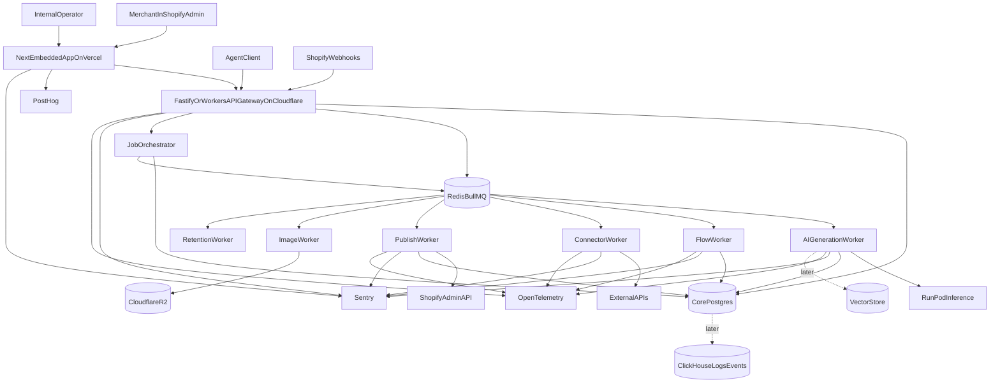

# Platform V2 Migration Plan

This is the final V2 architecture plan for moving the current Remix-based Shopify app into a production-grade AI-native commerce platform.

The target is not a bigger Remix app and not a full-stack Next.js monolith. The target is a separated platform:

- Next.js embedded Shopify app on Cloudflare Pages (preview shell; Remix merchant UI until cutover).
- Fastify API gateway locally; Cloudflare Workers in production.
- BullMQ workers locally; Cloudflare Workers + Queues in production.
- Redis for queues, cache, locks, streaming coordination, and short-lived state.
- PostgreSQL as the core source of truth.
- RunPod for GPU and AI inference workloads.
- Cloudflare R2 for generated assets and preview artifacts.
- Sentry, OpenTelemetry, and PostHog for production visibility.

## 1. Current Baseline

The current app is centered on `apps/web`, a Remix app that owns too many responsibilities:

- Merchant embedded UI.
- Internal admin.
- API routes.
- Webhooks.
- Cron.
- AI generation and routing.
- Recipe compiler orchestration.
- Connector execution.
- Flow engine.
- Publish operations.
- Observability.
- Prisma access.
- Operational scripts.

The current `Job` model is a job ledger, not a real queue. Many routes create a job row, execute work synchronously, then mark success or failure. That makes AI generation, webhook handling, flow execution, connector calls, and publishing vulnerable to request timeouts, duplicated retries, and scaling problems.

The baseline must be treated as the source system during migration. It should remain runnable until V2 reaches parity and critical traffic is cut over.

## 2. Final V2 Architecture

## 3. Framework Decisions

### 3.1 Frontend

Use Next.js for:

- Shopify embedded merchant app.
- Internal admin.
- Streaming AI job progress UI.
- Preview rendering shell.
- Workflow UI.
- AI console UI.
- Typed API client to Fastify.
- Browser-safe analytics.

Do not use Next.js as the full backend platform.

Next.js must not own:

- Webhook ingestion.
- Queue workers.
- Long-running AI generation.
- Publish execution.
- Connector execution.
- Flow execution.
- Durable job lifecycle transitions.
- Permanent Shopify session or token storage.

### 3.2 Backend

Use Fastify for:

- API gateway.
- Shopify OAuth and session validation.
- Billing APIs.
- Webhook HMAC verification.
- App proxy verification.
- Admin API client creation.
- Job orchestration.
- Internal admin APIs.
- SSE progress endpoints.

Fastify is the default choice over NestJS for V2 because it is lighter, faster to modularize, and a good fit for queues, webhooks, SSE, and service boundaries. NestJS remains a future option if team size and enterprise conventions become more important than speed.

### 3.3 Workers

Use Node workers for BullMQ consumers:

- AI generation worker.
- Flow worker.
- Connector worker.
- Publish worker.
- Webhook processing worker.
- Image worker.
- Retention worker.

AI-specific services can use Python only when the workload genuinely benefits from Python tooling, model runtimes, or GPU libraries.

## 4. Embedded Shopify App Strategy

Next.js can be the fully embedded Shopify app. Shopify Admin embeds the Next app, and the Next app uses App Bridge plus Polaris for a native Shopify admin experience.

### 4.1 Next.js Responsibilities

Next.js owns:

- Embedded shell.
- App Bridge setup.
- Polaris UI.
- Navigation and layout.
- Merchant dashboards.
- Internal dashboards.
- Streaming progress panels.
- Preview shell.
- Typed API client.
- Frontend error boundaries.

### 4.2 Fastify Shopify Responsibilities

Fastify owns:

- OAuth start and callback if backend-owned auth is selected.
- Embedded session token validation.
- Offline token lookup.
- Shopify Admin API access.
- Billing checks and confirmation flows.
- Webhook HMAC verification.
- GDPR webhook handling.
- App proxy verification.
- Job enqueueing.

### 4.3 Session Strategy

Use Postgres as the durable source of truth for Shopify sessions and tokens.

Use Redis only for:

- Short-lived session cache.
- Token lookup cache.
- Request coordination.

Do not use Redis as permanent session storage.

## 5. Frontend UI System

The frontend uses a hybrid UI system with clear boundaries.

### 5.1 Primary UI System

Polaris remains primary for Shopify-native embedded surfaces:

- App shell.
- Settings.
- Billing.
- Account pages.
- Standard forms.
- Tables.
- Merchant onboarding.
- Empty states.
- Status banners.

This follows `DESIGN.md`, which says Polaris-first across app and admin surfaces.

### 5.2 Advanced UI System

Use Radix UI, shadcn/ui, and Tailwind for advanced custom interfaces where Polaris is not enough:

- AI chat panels.
- Command palette.
- Advanced dialogs.
- Workflow builder controls.
- Node inspector panels.
- Context menus.
- Realtime trace/log panels.
- Split panes.
- Keyboard-heavy internal admin tools.

### 5.3 Token Rules

Tailwind and shadcn must map to the same product tokens:

- Colors from `DESIGN.md`.
- 8px spacing scale.
- Radius scale: 6, 8, 12, 9999.
- Fonts: General Sans, Instrument Sans, IBM Plex Mono.
- Minimal functional motion.
- Dark mode with AA contrast.

Do not let Polaris, shadcn, and custom Tailwind styling create separate visual languages.

### 5.4 State Libraries

Use:

- TanStack Query for server state, mutations, polling, and cache invalidation.
- Zustand only for local UI state such as selected workflow node, command palette state, open inspector panels, and unsaved UI preferences.
- URL search params for shareable filters, tabs, and pagination.

Do not duplicate server state into Zustand.

## 6. Redis, BullMQ, And Events

Redis is mandatory for V2, but it is not the main database.

Use Redis for:

- BullMQ queues.
- Job retries.
- Delayed jobs.
- Cancellation signals.
- Progress streams.
- Rate limits.
- Distributed locks.
- Webhook dedupe windows.
- Session cache.
- Realtime state.
- Pub/sub fanout.
- Worker heartbeat.

Do not use Redis for:

- Core merchant data.
- Module/version source of truth.
- Durable audit logs.
- Billing records.
- Permanent Shopify sessions.
- Long-term analytics.
- Compliance records.

### 6.1 Redis Provider Path

MVP:

- External Redis (e.g. Upstash) is acceptable for local/transition BullMQ.

Scaling:

- Redis Cloud is preferred for serious production workloads.

Serverless/lightweight:

- Upstash can be considered only after BullMQ compatibility, latency, and command behavior are verified.

### 6.2 Core Queues

Create queues for:

- `ai-generation`.
- `ai-stream-events`.
- `flow-execution`.
- `webhook-processing`.
- `connector-execution`.
- `publish-execution`.
- `image-processing`.
- `retention`.
- `notifications`.
- `dead-letter`.

Every queue needs:

- Concurrency settings.
- Retry settings.
- Backoff.
- Timeout.
- Dead-letter policy.
- Idempotency strategy.
- Cancellation strategy.
- Worker heartbeat.
- Internal dashboard visibility.

### 6.3 Domain Events

Use events as facts that something happened. Jobs are commands to do work; events are immutable records.

Initial event names:

- `MODULE_GENERATION_REQUESTED`.
- `MODULE_GENERATION_STARTED`.
- `MODULE_GENERATED`.
- `MODULE_VALIDATION_FAILED`.
- `MODULE_READY_FOR_PREVIEW`.
- `MODULE_PUBLISH_REQUESTED`.
- `MODULE_PUBLISHED`.
- `MODULE_PUBLISH_FAILED`.
- `FLOW_TRIGGER_RECEIVED`.
- `FLOW_RUN_STARTED`.
- `FLOW_STEP_COMPLETED`.
- `FLOW_COMPLETED`.
- `FLOW_FAILED`.
- `CONNECTOR_TEST_STARTED`.
- `CONNECTOR_TEST_FINISHED`.
- `WEBHOOK_RECEIVED`.
- `WEBHOOK_DEDUPED`.
- `AI_PROVIDER_FAILED`.
- `JOB_DEAD_LETTERED`.

Postgres can store low-volume events first. ClickHouse can receive high-volume logs/events later.

## 7. Core Safety Rules

The platform must preserve these rules:

- AI never deploys arbitrary merchant-provided code.
- AI outputs `RecipeSpec` JSON or versioned intermediate DSL only.
- `RecipeSpec` remains the deployable trust boundary.
- Preview must not render arbitrary Liquid or untrusted scripts.
- Webhook HMAC verification must not weaken.
- GDPR webhooks must remain reliable and auditable.
- Connector calls must enforce SSRF protections.
- Secrets and PII must not appear in job payloads, logs, events, or traces.
- Postgres remains the source of truth.
- BullMQ is execution transport, not durable product history.

## 8. Migration Phases

### Phase 0: Baseline And Inventory

Goal: capture the current system before changing behavior.

Actions:

- Confirm current branch and backup commit.
- Record baseline commit SHA.
- Run baseline checks:
  - `pnpm install --frozen-lockfile`.
  - `pnpm --filter web exec prisma validate`.
  - `pnpm --filter web typecheck`.
  - `pnpm --filter web lint`.
  - `pnpm --filter web test`.
  - `pnpm --filter web build`.
  - AI evals where available.
- Document current Remix route groups.
- Document current service responsibilities.
- Document all sync job call sites.
- Document Prisma model bounded contexts.

Deliverables:

- Architecture ADR for V2.
- Route/service/model inventory.
- Risk ledger for synchronous work.

Acceptance:

- No behavior changes.
- Current app remains runnable.
- Known baseline failures are documented instead of hidden.

### Phase 1: Target Monorepo Shape

Goal: create the future boundaries before migrating behavior.

Target layout:

- `apps/frontend` for Next.js.
- `apps/api` for Fastify.
- `apps/workers` for BullMQ workers.
- `packages/core` for RecipeSpec, catalog, compiler schemas, and pure logic.
- `packages/platform-contracts` for API, queue, event, trace contracts.
- `packages/db` for Prisma client and repositories when safe.
- `packages/security` for SSRF, redaction, signing, and policy helpers.
- `packages/observability` for logging, tracing, Sentry, and sanitized metadata.

Acceptance:

- Boundaries are documented.
- `apps/web` remains the legacy source system until cutover.

### Phase 2: Shared Contracts

Goal: make Next, Fastify, workers, and legacy Remix speak the same typed contracts.

Create `packages/platform-contracts` with:

- Job type schemas.
- Job payload schemas.
- Job result schemas.
- Worker event schemas.
- Service error schemas.
- Trace context schemas.
- API request/response schemas.
- Idempotency key schema.

Initial job types:

- `AI_GENERATE`.
- `AI_HYDRATE`.
- `AI_MODIFY`.
- `PUBLISH`.
- `CONNECTOR_TEST`.
- `CONNECTOR_CALL`.
- `FLOW_RUN`.
- `WEBHOOK_RECEIVED`.
- `THEME_ANALYZE`.
- `RETENTION_RUN`.

Acceptance:

- Contract package builds and tests independently.
- Existing Remix payloads can validate against the new schemas.
- Future Next/Fastify/workers can import the same contracts.

### Phase 3: Fastify API Skeleton

Goal: introduce backend separation without moving production traffic.

Create `apps/api` with:

- Environment validation.
- Prisma plugin.
- Redis plugin.
- Observability plugin.
- Security plugin.
- Health routes.
- Jobs routes.
- AI routes.
- Module routes.
- Publish routes.
- Connector routes.
- Flow routes.
- Webhook routes.
- Internal admin routes.

Rules:

- Validate every request/response through shared schemas.
- Keep route handlers thin.
- Do not execute long-running work in route handlers.
- Do not put webhook handling in Next.js.

Acceptance:

- Fastify starts locally.
- Health/readiness checks work.
- No production behavior changes yet.

### Phase 4: Next.js Embedded Frontend Skeleton

Goal: introduce the future frontend without cutting over Shopify embedded traffic.

Create `apps/frontend` with:

- Next App Router.
- Embedded Shopify shell.
- App Bridge setup.
- Polaris setup.
- Tailwind token baseline from `DESIGN.md`.
- shadcn/Radix baseline for allowed advanced UI only.
- Typed API client to Fastify.
- Health/internal read-only screen.

Acceptance:

- Next app runs locally.
- Next app can call Fastify health endpoint.
- Embedded shell can obtain or mock session token flow.
- No backend platform logic is added to Next API routes.

### Phase 5: Job Orchestration And BullMQ

Goal: turn job rows plus sync execution into real async job orchestration.

Split current job service into:

- `JobStore`: Prisma-backed job ledger.
- `JobQueue`: BullMQ enqueue/cancel/retry/status.
- `JobOrchestrator`: validates payload, creates DB job row, enqueues work, propagates trace context.
- `JobEvents`: progress events.
- `JobReplay`: replay and retry helpers.

Add Redis/BullMQ config:

- `QUEUE_REDIS_URL`.
- `QUEUE_PROVIDER`.
- `QUEUE_PREFIX`.
- Per-queue concurrency.
- Retry/backoff settings.
- Dead-letter policy.

Support transition modes:

- `JOB_EXECUTION_MODE=inline`.
- `JOB_EXECUTION_MODE=queue`.
- `JOB_EXECUTION_MODE=disabled`.

Acceptance:

- Existing Remix behavior works in inline mode.
- Fastify can enqueue jobs in queue mode.
- Internal UI can show queue metadata.

### Phase 6: Worker App Skeleton

Goal: create deployable workers before moving execution.

Create `apps/workers` with:

- Env validation.
- Redis connection.
- Prisma connection.
- Logger.
- Sentry setup.
- OpenTelemetry setup.
- Graceful shutdown.
- Empty consumers for all future queues.

Acceptance:

- Worker app starts.
- Worker app exits cleanly.
- CI typechecks and tests worker bootstrap.

### Phase 7: AI Generation Worker

Goal: remove LLM latency and repair loops from request handlers.

Refactor AI internals:

- Provider resolver.
- Prompt builder.
- Recipe generator.
- Recipe validator.
- Recipe repair.
- Usage recorder.
- Hydrate runner.
- Modify runner.

Move to worker:

- `AI_GENERATE`.
- `AI_HYDRATE`.
- `AI_MODIFY`.

Fastify behavior:

- Validate prompt.
- Rate limit.
- Create job.
- Enqueue.
- Return `202` with job links.
- Stream progress from job events.

Acceptance:

- Existing AI evals pass.
- Merchant generation no longer depends on a long request.
- Cancellation works.
- RecipeSpec-only trust boundary remains tested.

### Phase 8: Internal Assistant Migration

Goal: keep internal assistant separate from merchant AI.

Target:

- UI moves to Next internal admin.
- API/streaming route moves to Fastify.
- Long internal tool runs can later use a separate `INTERNAL_TOOL_RUN` queue.
- Internal assistant stays isolated from merchant `AI_GENERATE`.

Acceptance:

- Internal assistant tests pass.
- Local-only model policy remains enforced.
- Merchant AI does not import internal assistant modules.

### Phase 9: Webhook And Flow Workers

Goal: acknowledge Shopify quickly and run workflows durably.

Move webhook ingress to Fastify:

- Verify HMAC.
- Extract event ID.
- Dedupe.
- Store receipt/audit.
- Enqueue webhook/flow work.
- Return quickly.

Move flow execution to worker:

- Manual flow runs.
- Scheduled flow runs.
- Webhook-triggered flow runs.
- Step logs.
- Retry/replay.

Fix schedule semantics:

- Scheduled flows use explicit `SCHEDULED` trigger, not fake `MANUAL`.

Acceptance:

- Duplicate webhooks do not duplicate work.
- Shopify webhooks return fast.
- Failed flows are replayable.
- Internal trace joins webhook, job, flow, and step logs.

### Phase 10: Connector Worker

Goal: isolate external network calls.

Keep in frontend/API:

- Connector CRUD.
- Endpoint CRUD.
- Secret setup.
- Test request initiation.

Move to worker:

- Connector test execution.
- Flow HTTP calls.
- Mapping sample refresh.
- Future connector sync jobs.

Create shared security helpers:

- SSRF protection.
- URL allowlist.
- Timeout.
- Max response size.
- Header/body redaction.

Acceptance:

- SSRF tests pass in API and worker.
- Connector tests are async and visible.
- No secrets appear in logs/events.

### Phase 11: Publish Worker

Goal: isolate Shopify deployment operations.

Keep compile pure.

Fastify route:

- Preflight if quick.
- Enqueue publish.
- Return `202`.

Worker:

- Validate payload.
- Resolve Shopify admin client.
- Compile if needed.
- Apply deploy operations.
- Update module status.
- Emit progress.
- Mark success/failure.

Acceptance:

- Publish is idempotent.
- Rollback is documented and tested.
- Missing Shopify scopes produce actionable errors.

### Phase 12: Storage And Image Worker

Goal: move generated assets and previews out of the DB.

Add storage abstraction:

- Local adapter for dev/test.
- R2 adapter for production.

Move to workers:

- Image ingestion.
- Preview export.
- Asset cleanup.

Acceptance:

- No large artifact is stored inline in Prisma.
- R2 secrets never reach client.
- Signed URL/proxy policy is documented.

### Phase 13: Preview Sandbox

Goal: let merchants preview safely before publishing.

Add preview envelope:

- `RecipeSpec`.
- Compiled render config.
- Policy metadata.
- Allowed assets.
- Theme context.
- Version.

Next.js owns preview shell.

Fastify provides preview data.

Rules:

- Strict CSP.
- Iframe sandbox.
- No arbitrary Liquid rendering.
- No untrusted scripts.

Acceptance:

- Preview works without publish.
- Preview cannot execute arbitrary AI or merchant code.
- Publish remains separate and auditable.

### Phase 14: Intent Graph And Recipe DSL

Goal: introduce the long-term AI moat.

Pipeline:

1. Natural language.
2. Classification.
3. Intent graph.
4. Recipe DSL.
5. RecipeSpec.
6. Validation.
7. Repair inside strict boundaries.
8. Preview.
9. Publish after approval.

Add:

- `packages/core/src/intent-graph.ts`.
- `packages/core/src/recipe-dsl.ts`.

Acceptance:

- Existing direct RecipeSpec generation can remain as fallback.
- DSL path is feature-flagged.
- Evals measure schema validity, compiler success, and intent match.

### Phase 15: Data Layer Productionization

Goal: reduce Prisma pressure safely.

First migrate production to Postgres using the existing runbook.

Then create repository boundaries:

- Module repository.
- Job repository.
- AI usage repository.
- Connector repository.
- Flow repository.
- Observability repository.
- Internal AI repository.

Physical splits happen later:

- ClickHouse for high-volume logs/events.
- R2 for assets and previews.
- Vector DB for embeddings.
- Separate internal admin DB only if security posture requires it.

Acceptance:

- Postgres is stable before any DB split.
- Direct Prisma usage in route handlers is reduced.
- Trace and audit paths remain complete.

### Phase 16: Observability And Product Analytics

Goal: make every request, job, worker, and external call traceable.

Add:

- Sentry across Next, Fastify, and workers.
- OpenTelemetry trace propagation across queue payloads.
- PostHog for product analytics only.
- Internal queue/job/trace dashboards.

Track:

- Queue backlog.
- Worker heartbeat.
- Retry counts.
- Dead-letter jobs.
- p95 job duration.
- AI provider health.
- Webhook lag.
- Publish failure rate.

Acceptance:

- Any failed merchant action can be traced end to end.
- No secrets or PII in logs.
- Operators get actionable remediation data.

### Phase 17: Security And Compliance

Goal: production-grade Shopify app posture.

Verify:

- Secrets are encrypted or env-only.
- Offline tokens are server-side only.
- SSRF protections cover workers.
- GDPR webhooks remain reliable.
- Webhook HMAC and replay protection are tested.
- AI cannot emit deployable raw code.
- Preview sandbox blocks unsafe scripts.
- Logs and events are redacted.

Acceptance:

- Security tests cover API and workers.
- App Store review checklist is updated.
- No PII/secrets in logs or traces.

### Phase 18: Deployment Infrastructure

Goal: deploy the target topology.

Deploy (Cloudflare-only — no Kubernetes, Fly.io, or Railway):

- `apps/frontend` to **Cloudflare Pages** (`apps/frontend/wrangler.jsonc`).
- `apps/api` to **Cloudflare Workers** (`apps/api/wrangler.jsonc`).
- `apps/workers` to **Cloudflare Workers** queue consumer (`apps/workers/wrangler.jsonc`).
- **Cloudflare Queues** (`asset-storage`) for async jobs.
- **Cloudflare R2** (`superapp-assets`, binding `ASSETS`).
- RunPod for GPU/AI inference.
- External Redis optional during BullMQ transition.
- Managed Postgres.
- Sentry, OTel backend, PostHog.

Runbook: [`v2-migration/cloudflare-deployment-runbook.md`](./v2-migration/cloudflare-deployment-runbook.md).

Add environment matrices for:

- Frontend.
- API.
- Workers.
- Legacy Remix during migration.
- AI router/GPU.
- Redis.
- DB.
- R2.
- Observability.

Acceptance:

- Next deploy works.
- Fastify deploy works.
- Worker deploy works.
- Staging environment works.
- Rollback path is documented.

### Phase 19: Async UX

Goal: merchants and operators understand queued work.

Add visible states for:

- Generation queued/running/validating/ready/failed/cancelled.
- Publish queued/applying/verifying/published/failed.
- Flow queued/running step/retrying/succeeded/failed.
- Connector test queued/connecting/succeeded/blocked/timed out/auth failed.

Acceptance:

- No long-running action leaves users staring at a frozen button.
- Retry/cancel is available where safe.

### Phase 20: Testing Matrix

Required tests:

- Contract unit tests.
- Queue adapter tests.
- Job orchestration tests.
- Worker integration tests.
- AI evals.
- Webhook duplicate tests.
- Flow replay tests.
- Connector SSRF tests.
- Publish idempotency tests.
- Preview sandbox tests.
- Next/Fastify API contract tests.
- E2E merchant generation and publish flow.
- Internal admin trace and queue visibility.

Failure tests:

- Redis unavailable.
- Worker crash mid-job.
- LLM timeout.
- Shopify 429.
- Connector timeout.
- Duplicate webhook.
- DB transient failure.
- Sentry/OTel unavailable.

Acceptance:

- Every phase ships with syntax checks and targeted tests.

### Phase 21: Rollout And Cutover

Rollout flags:

- `FRONTEND_NEXT_ENABLED`.
- `FASTIFY_API_ENABLED`.
- `SHOPIFY_EMBEDDED_NEXT_CUTOVER_ENABLED`.
- `JOB_EXECUTION_MODE`.
- `AI_GENERATION_ASYNC_ENABLED`.
- `AI_GENERATION_STREAM_VIA_QUEUE_ENABLED`.
- `FLOW_ASYNC_ENABLED`.
- `WEBHOOK_ASYNC_ENABLED`.
- `CONNECTOR_WORKER_ENABLED`.
- `PUBLISH_WORKER_ENABLED`.
- `PREVIEW_SANDBOX_ENABLED`.
- `INTENT_GRAPH_ENABLED`.

Staging rollout:

1. Remix baseline.
2. Fastify health/read-only endpoints.
3. Next read-only internal screens.
4. Queue mode with workers disabled.
5. Worker enabled for internal test shop.
6. Next merchant generate screen backed by Fastify.
7. Next publish/preview screens backed by Fastify.
8. Shopify embedded session parity.
9. Failure injection.
10. Production canary.

Production rollout:

1. Deploy contracts and queue code disabled.
2. Deploy Fastify health/read-only endpoints.
3. Deploy Next on canary domain.
4. Deploy Redis and workers.
5. Enable AI async for internal/canary shops.
6. Enable AI async globally.
7. Enable webhook/flow async.
8. Enable connector worker.
9. Enable publish worker.
10. Enable preview sandbox.
11. Switch embedded app entry to Next for canary shops.
12. Switch embedded app entry to Next for all shops.
13. Retire replaced Remix routes.
14. Enable intent graph behind eval gate.

Rollback:

- Flip feature flags back.
- Stop workers from consuming new jobs.
- Keep queued jobs visible.
- Replay failed jobs after fix.
- Keep legacy Remix route fallback until cutover is proven.

## 9. Recommended PR Sequence

1. Docs, ADR, and inventory.
2. Target monorepo skeleton documentation.
3. `packages/platform-contracts`.
4. Fastify API skeleton.
5. Next.js frontend skeleton.
6. Job store and queue interfaces.
7. BullMQ transport.
8. Worker app skeleton.
9. AI generation worker.
10. Next generate UI and queue-backed streaming.
11. Webhook and flow worker.
12. Connector worker.
13. Publish worker.
14. Next merchant and internal admin migration.
15. Storage and image worker.
16. Preview sandbox.
17. Intent graph and Recipe DSL.
18. Postgres production cutover.
19. Observability and dashboards.
20. Shopify embedded cutover and Remix retirement.
21. Production hardening and App Store readiness.

## 10. Production Readiness Definition

V2 is complete only when:

- Next frontend deploys cleanly.
- Fastify API deploys cleanly.
- Workers deploy cleanly.
- Legacy Remix is no longer on the critical production path, or every remaining route has a retirement owner and date.
- Postgres migration is proven.
- Redis queue is required and monitored.
- AI generation no longer blocks frontend/API request handlers.
- Webhooks acknowledge fast and enqueue work.
- Flow jobs are idempotent and replayable.
- Connector calls are isolated and SSRF-protected.
- Publish is idempotent, traceable, and rollbackable.
- Preview is sandboxed.
- RecipeSpec-only deployment is tested.
- GDPR webhooks pass.
- Sentry catches errors across all services.
- OTel trace context crosses queue boundaries.
- PostHog does not leak PII.
- Internal admin shows jobs, queues, traces, usage, webhook lag, failures, and worker health.
- CI includes typecheck, lint, unit tests, integration tests, evals, E2E smoke, Prisma validate, and builds.
- Runbooks exist for AI provider outage, Redis outage, worker backlog, webhook storm, publish failure, connector failure, DB migration failure, data redaction incident, and preview sandbox security issue.
