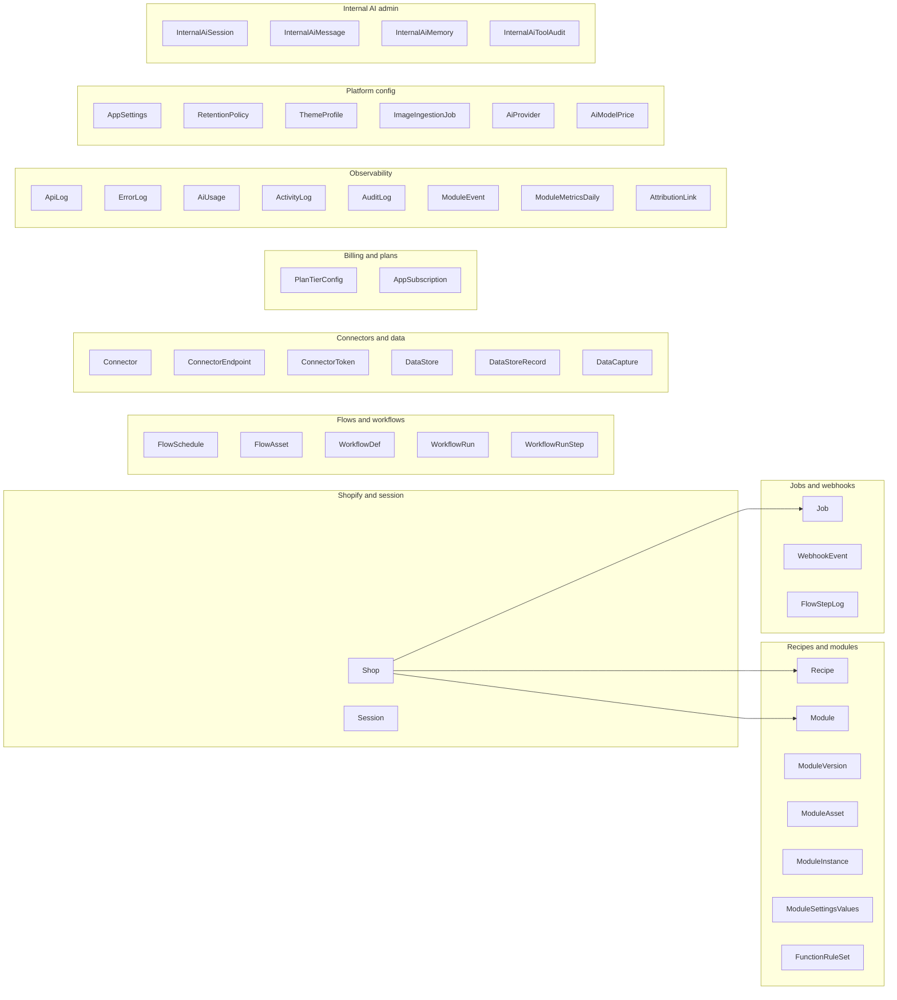

# Platform V2 — Prisma Bounded Contexts

Source: `apps/web/prisma/schema.prisma` (39 models, SQLite at baseline).

## Context map

## Bounded context detail

### Shopify / session / tenancy

| Model | Role |
|-------|------|
| `Shop` | Tenant root; access token, plan tier, retention defaults |
| `Session` | Shopify OAuth session storage (Prisma session adapter) |

**V2 note:** Postgres remains source of truth; Redis session cache only.

### Recipes / modules / deployable artifacts

| Model | Role |
|-------|------|
| `Recipe` | Goal/category grouping for modules |
| `Module` | Merchant module instance |
| `ModuleVersion` | Versioned RecipeSpec + compiled outputs |
| `ModuleAsset` | Generated assets metadata |
| `ModuleInstance` | Runtime instance binding |
| `ModuleSettingsValues` | Per-module settings JSON |
| `FunctionRuleSet` | Shopify Function rule payloads |
| `FlowAsset` | Flow-attached assets |

### Jobs / async ledger (not a queue today)

| Model | Role |
|-------|------|
| `Job` | Job ledger (QUEUED/RUNNING/SUCCESS/FAILED) |
| `WebhookEvent` | Webhook idempotency dedupe |
| `FlowStepLog` | Per-step flow execution log |

### Flows / automation

| Model | Role |
|-------|------|
| `FlowSchedule` | Cron-style scheduled triggers |
| `WorkflowDef` | Graph workflow definition |
| `WorkflowRun` | Workflow run instance |
| `WorkflowRunStep` | Step-level run state |

### Connectors / integrations / data stores

| Model | Role |
|-------|------|
| `Connector` | External integration config |
| `ConnectorEndpoint` | Saved endpoint definitions |
| `ConnectorToken` | Encrypted connector credentials |
| `DataStore` | Key-value store schema |
| `DataStoreRecord` | Store records |
| `DataCapture` | Module capture payloads |

### Billing / entitlements

| Model | Role |
|-------|------|
| `PlanTierConfig` | Plan tier definitions |
| `AppSubscription` | Shopify billing subscription state |

### Observability / audit / analytics

| Model | Role |
|-------|------|
| `ApiLog` | HTTP API request/response log |
| `ErrorLog` | Application errors |
| `AiUsage` | Token/cost usage rows |
| `ActivityLog` | User/system activity |
| `AuditLog` | Compliance audit trail |
| `ModuleEvent` | Module analytics events |
| `ModuleMetricsDaily` | Aggregated metrics |
| `AttributionLink` | Marketing attribution |

### Platform configuration

| Model | Role |
|-------|------|
| `AppSettings` | Global/shop app settings |
| `RetentionPolicy` | Data retention overrides |
| `ThemeProfile` | Theme compatibility profile |
| `ImageIngestionJob` | Design-from-image pipeline |
| `AiProvider` | AI provider configuration |
| `AiModelPrice` | Model pricing catalog |

### Internal admin (operator AI)

| Model | Role |
|-------|------|
| `InternalAiSession` | Assistant chat sessions |
| `InternalAiMessage` | Chat messages |
| `InternalAiMemory` | Session memory snippets |
| `InternalAiToolAudit` | Tool call audit (retention cron) |

## Cross-context coupling (migration risk)

- `Shop` is the hub — most contexts hang off `shopId`.
- `Job.correlationId` links to `ApiLog`, `AiUsage`, `FlowStepLog` — preserve in V2 traces.
- `Module` ↔ `ModuleVersion` ↔ compile outputs span recipes + publish contexts.
- Internal AI models are isolated but share observability patterns with merchant AI usage.

## V2 database strategy

- **Phase 0–4:** Keep SQLite/Postgres in `apps/web`; new apps use contracts only.
- **Later phase:** `packages/db` shared Prisma client; Postgres cutover per [platform-v2-migration-plan.md](../platform-v2-migration-plan.md).
