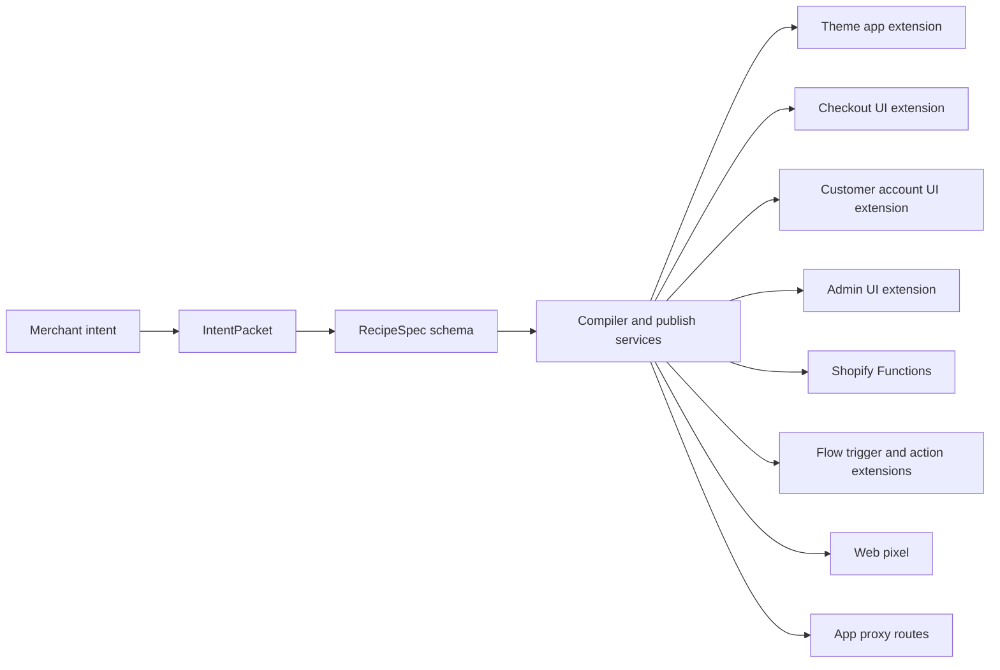

# SuperApp Surface Inventory

This document is the canonical inventory for SuperApp surfaces, capabilities, catalog generation, and practical platform boundaries.

## 1) Mental model

SuperApp has two planes:

- **Control plane**: intent classification, `IntentPacket`, `RecipeSpec` generation, validation, compilation, and publish workflows in the app.
- **Execution plane**: Shopify surfaces execute the published config (theme app extension, checkout/admin/customer-account/POS UI extensions, functions, flow triggers/actions, pixels, and app proxy endpoints).

## 2) Practical boundaries (possible vs not possible)

### Possible

- Theme storefront UI via theme app extension + app proxy + Storefront API + Ajax Cart API.
- Checkout/business logic via Shopify Functions (`discount`, `delivery_customization`, `payment_customization`, `cart_and_checkout_validation`, `cart_transform`, `fulfillment_constraints`, `order_routing_location_rule`).
- Checkout/thank-you UI blocks at supported checkout UI targets.
- Customer account blocks, admin blocks/actions, POS targets.
- Flow trigger/action/template/lifecycle integration and web pixel standard events.

### Not possible / intentionally out of scope

- Arbitrary merchant code deployment (hard rule: RecipeSpec-only outputs).
- Theme-level mutation of sealed checkout internals outside supported Checkout Extensibility and Functions surfaces.
- Declaring a surface in taxonomy without implementing a `RecipeSpec` discriminator (for example `payments`, `purchase_options`, `subscription_link` appear in high-level surface enums but are not current `RECIPE_SPEC_TYPES`).

## 3) Operational constraints

Primary limits live in [`packages/core/src/allowed-values.ts`](/Users/lavipun/Work/ai-shopify-superapp/packages/core/src/allowed-values.ts):

- `LIMITS.*` covers popup/title/body lengths, flow step counts, style max lengths, and function caps.
- `functionActivePerStoreMax = 25`
- `functionCartTransformPerStore = 1`
- Checkout UI bundle budget: `checkoutUiBundleMaxBytes = 64 * 1024`
- Catalog generator cap in [`packages/core/src/catalog.generator.ts`](/Users/lavipun/Work/ai-shopify-superapp/packages/core/src/catalog.generator.ts): `DEFAULT_MAX_ENTRIES = 12000`

## 4) Canonical RecipeSpec inventory

The source of truth is `RECIPE_SPEC_TYPES` in [`packages/core/src/allowed-values.ts`](/Users/lavipun/Work/ai-shopify-superapp/packages/core/src/allowed-values.ts) and the discriminated union in [`packages/core/src/recipe.ts`](/Users/lavipun/Work/ai-shopify-superapp/packages/core/src/recipe.ts).

Current set: **26 module types**.

| Family | Types |
|---|---|
| Theme/storefront UI | `theme.banner`, `theme.popup`, `theme.notificationBar`, `theme.contactForm`, `theme.effect`, `theme.floatingWidget`, `proxy.widget` |
| Functions | `functions.discountRules`, `functions.deliveryCustomization`, `functions.paymentCustomization`, `functions.cartAndCheckoutValidation`, `functions.cartTransform`, `functions.fulfillmentConstraints`, `functions.orderRoutingLocationRule` |
| Checkout/post-purchase UI | `checkout.upsell`, `checkout.block`, `postPurchase.offer` |
| Admin/POS/platform | `admin.block`, `admin.action`, `pos.extension`, `platform.extensionBlueprint` |
| Integration/automation/accounts | `analytics.pixel`, `integration.httpSync`, `flow.automation`, `customerAccount.blocks` |

## 5) Expanded storefront catalog

Catalog generation logic is in [`packages/core/src/catalog.generator.ts`](/Users/lavipun/Work/ai-shopify-superapp/packages/core/src/catalog.generator.ts) and snapshot is [`packages/core/src/catalog.generated.json`](/Users/lavipun/Work/ai-shopify-superapp/packages/core/src/catalog.generated.json).

Catalog families:

- `type.*`: one row per RecipeSpec module type.
- `storefront.*`: combinatorial rows for component/intent/surface plus trigger-aware variants.

Formula:

- `type`: `RECIPE_SPEC_TYPES.length = 26`
- `storefront base`: `CATALOG_SURFACES × CATALOG_COMPONENTS × CATALOG_INTENTS = 12 × 14 × 10 = 1,680`
- `storefront trigger`: `CATALOG_SURFACES × CATALOG_INTENTS × CATALOG_TRIGGERS × TRIGGER_COMPONENTS = 12 × 10 × 10 × 4 = 4,800`
- Total = `26 + 1,680 + 4,800 = 6,506`

Important: these are taxonomy/discovery rows; they do not imply 6,506 unique compiler implementations.

## 6) Naming patterns

Canonical ID formats:

- `type.<moduleType>`
- `storefront.<component>.<intent>.<surface>`
- `storefront.<component>.<intent>.<surface>.trigger.<trigger>`

Examples:

- `type.theme.popup`
- `storefront.popup.capture.product`
- `storefront.popup.capture.product.trigger.exit_intent`

## 7) Theme placement and editor mechanisms

Source of truth: [`packages/core/src/allowed-values.ts`](/Users/lavipun/Work/ai-shopify-superapp/packages/core/src/allowed-values.ts)

- Placeable templates: `THEME_PLACEABLE_TEMPLATES`
- Section groups: `THEME_SECTION_GROUPS`
- Embed targets: `THEME_EMBED_TARGETS`
- Theme setting types: `THEME_SETTING_TYPES` (32)
- Schema knobs: `THEME_SCHEMA_KNOBS`

## 8) Checkout, post-purchase, and HTTP integration

- Checkout targets: `CHECKOUT_UI_TARGETS`
- Plus-gated target prefixes: `CHECKOUT_UI_PLUS_ONLY_TARGET_PREFIXES`
- Post-purchase API targets: `POST_PURCHASE_TARGETS`
- Integration triggers: `INTEGRATION_HTTP_SYNC_TRIGGERS`
- Flow trigger/action types and steps: `FLOW_EXTENSION_KINDS`, `FLOW_AUTOMATION_TRIGGERS`, `FLOW_STEP_KINDS`

## 9) Styling tokens

Storefront style schema and enums:

- Schema: [`packages/core/src/storefront-style.ts`](/Users/lavipun/Work/ai-shopify-superapp/packages/core/src/storefront-style.ts)
- Enum sets: `STOREFRONT_LAYOUT_MODES`, `STOREFRONT_ANCHORS`, `STOREFRONT_WIDTHS`, `STOREFRONT_Z_INDEX_LEVELS`, `STOREFRONT_SPACING_OPTIONS`, typography/shape/border/shadow enums, offset min/max.

## 10) Deployed extension packages in this repo

From `extensions/**/shopify.extension.toml`:

- `extensions/theme-app-extension/shopify.extension.toml`
- `extensions/checkout-ui/shopify.extension.toml`
- `extensions/customer-account-ui/shopify.extension.toml`
- `extensions/admin-ui/shopify.extension.toml`
- `extensions/superapp-flow-trigger-module-published/shopify.extension.toml`
- `extensions/superapp-flow-trigger-connector-synced/shopify.extension.toml`
- `extensions/superapp-flow-trigger-data-record-created/shopify.extension.toml`
- `extensions/superapp-flow-trigger-workflow-completed/shopify.extension.toml`
- `extensions/superapp-flow-trigger-workflow-failed/shopify.extension.toml`
- `extensions/superapp-flow-action-send-http/shopify.extension.toml`
- `extensions/superapp-flow-action-send-notification/shopify.extension.toml`
- `extensions/superapp-flow-action-tag-order/shopify.extension.toml`
- `extensions/superapp-flow-action-write-store/shopify.extension.toml`

## 11) Intent packet and routing crosswalk

`IntentPacket` routing is intentionally different from catalog taxonomy:

- Intent schema and routing table: [`packages/core/src/intent-packet.ts`](/Users/lavipun/Work/ai-shopify-superapp/packages/core/src/intent-packet.ts)
- Catalog classification axes: [`packages/core/src/allowed-values.ts`](/Users/lavipun/Work/ai-shopify-superapp/packages/core/src/allowed-values.ts)

Interpretation:

- `CLEAN_INTENTS` + `ROUTING_TABLE` model LLM prompt-routing/use-case intent.
- `CATALOG_*` enums model discoverable storefront combinations.
- `MODULE_TYPE_TO_INTENT` is the bridge from module type to prompt-routing intent.

## 12) Combination patterns (reference examples)

Representative stacks:

1. Theme popup + discount rules function.
2. Theme contact form + app proxy endpoint.
3. Theme floating widget + app proxy HTML mode.
4. Checkout block + cart/checkout validation function.
5. Checkout upsell + cart transform function.
6. Thank-you block + analytics pixel tracking.
7. Flow trigger + send HTTP action.
8. Admin block/action + function configuration workflows.
9. Customer account blocks + support/informational content.

## 13) Audit appendix (PASS / GAP)

| Area | Result | Notes |
|---|---|---|
| Mental model + boundaries | PASS | Present across architecture docs and code contracts; consolidated here. |
| Canonical RecipeSpec parity (`allowed-values` vs `recipe`) | PASS | 26 types align. |
| Expanded storefront catalog formula/cap | PASS | Generator formula and cap confirmed; cardinality test added. |
| Naming patterns | PASS | Generator and docs use canonical formats. |
| Theme placement editor mechanisms | PASS | Finite enums present and enforced. |
| Checkout UI targets and Plus prefixes | PASS | Present in allowed values. |
| Post-purchase + HTTP integration enums | PASS | Present in allowed values and recipe. |
| Storefront styling tokens | PASS | Present in style schema and allowed values. |
| Deployed extension package list | PASS | All extension TOMLs enumerated above. |
| Intent packet completeness | PASS | Existing tests already assert `CLEAN_INTENTS` and routing invariants. |
| Templates coverage | PASS | Tests verify all `RECIPE_SPEC_TYPES` are represented. |
| AI catalog details source-of-truth | PASS | Uses core `MODULE_TYPE_TO_TEMPLATE_KIND`. |
| Non-RecipeSpec surfaces in taxonomy | GAP (documented) | `payments`/`purchase_options`/`subscription_link` are taxonomy-level only, not RecipeSpec types. |
| Catalog/docs count sync | GAP (fixed) | Stale counts in `docs/catalog.md` corrected in this work. |
