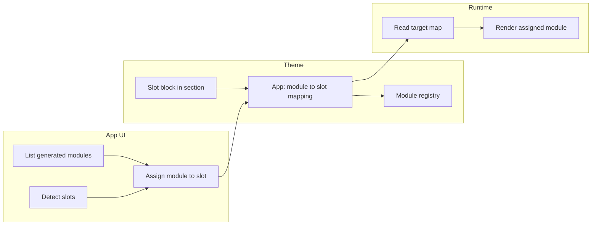

# Technical documentation — AI Shopify SuperApp

> For full implementation status see [implementation-status.md](./implementation-status.md).

## 1. Problem & approach
Merchants want *one* app that can act like many apps: banners, discounts, checkout widgets, integrations, etc.
The hard part is doing this safely and scalably.

This system uses a **Recipes architecture**:
1. Merchant describes what they want.
2. AI produces a **RecipeSpec JSON** (no raw code).
3. Server validates RecipeSpec with Zod (strict schema).
4. Compiler produces **DeployOperations** (assets/metafields/etc).
5. Merchant previews on a selected theme, then publishes.
6. Every publish creates an immutable version; rollback switches active version.

---

## 2. High-level architecture

### Admin UI (Embedded)
- Remix + React + Polaris (Vite 6, React Router v7 future flags). Polaris 12’s **Card** uses ShadowBevel (`.Polaris-ShadowBevel`); rounded corners are enforced in `apps/web/app/app.css` and an inline style in `root.tsx` so cards stay round on all viewports. See [debug.md](./debug.md) §8 and [implementation-status.md](./implementation-status.md) (Admin app — stack, tooling & UI fixes).
- Merchant can: generate module (AI or template) → preview → publish → rollback → manage connectors (with API tester) → build flows visually → manage data stores → manage billing

### API / Services
| Service | File | Responsibility |
|---|---|---|
| `RecipeService` | `services/recipes/recipe.service.ts` | Parse/validate RecipeSpec JSON |
| `Compiler` | `services/recipes/compiler/index.ts` | Recipe → DeployOperations (12 module types) |
| `PublishService` | `services/publish/publish.service.ts` | Apply operations via Shopify Admin API |
| `CapabilityService` | `services/shopify/capability.service.ts` | Plan gating (Basic vs Plus) |
| `ModuleService` | `services/modules/module.service.ts` | Versioning + rollback |
| `ConnectorService` | `services/connectors/connector.service.ts` | Third-party API connections; SSRF-protected |
| `MappingService` | `services/connectors/mapping.service.ts` | AI-assisted field mapping from sample responses |
| `FlowRunnerService` | `services/flows/flow-runner.service.ts` | Step execution; retries; per-step logs |
| `BillingService` | `services/billing/billing.service.ts` | Shopify App Subscriptions (FREE/STARTER/GROWTH/PRO/ENTERPRISE); internal plan override via `PlanTierConfig` |
| `QuotaService` | `services/billing/quota.service.ts` | Monthly quota enforcement per kind |
| `ThemeAnalyzerService` | `services/theme/theme-analyzer.service.ts` | Fetch theme assets; detect patterns; suggest mount strategy |
| Style compiler | `services/recipes/compiler/style-compiler.ts` | `compileStyleVars` / `compileStyleCss` / `compileOverlayPositionCss` / `sanitizeCustomCss` / `compileCustomCss` — storefront UI style → `--sa-*` CSS vars (theme-safe presets + scoped custom CSS) |
| `PreviewService` | `services/preview/preview.service.ts` | HTML preview for all storefront modules (banner, popup, notification bar, proxy widget); applies style vars |
| Proxy widget route | `routes/proxy.$widgetId.tsx` | App Proxy endpoint; reads `_styleCss` from metafield and renders styled HTML |
| `DataStoreService` | `services/data/data-store.service.ts` | Manage predefined/custom data stores and records |
| `AiUsageService` | `services/observability/ai-usage.service.ts` | Track tokens, cost, model per shop |

---

## 3. Module types (RecipeSpec)

| Type | Category | Capabilities required |
|---|---|---|
| `theme.banner` | STOREFRONT_UI | THEME_ASSETS |
| `theme.popup` | STOREFRONT_UI | THEME_ASSETS |
| `theme.notificationBar` | STOREFRONT_UI | THEME_ASSETS |
| `proxy.widget` | STOREFRONT_UI | APP_PROXY |
| `functions.discountRules` | FUNCTION | DISCOUNT_FUNCTION |
| `functions.deliveryCustomization` | FUNCTION | SHIPPING_FUNCTION |
| `functions.paymentCustomization` | FUNCTION | PAYMENT_CUSTOMIZATION_FUNCTION |
| `functions.cartAndCheckoutValidation` | FUNCTION | VALIDATION_FUNCTION |
| `functions.cartTransform` | FUNCTION | CART_TRANSFORM_FUNCTION_UPDATE (Plus) |
| `checkout.upsell` | STOREFRONT_UI | CHECKOUT_UI_INFO_SHIP_PAY (Plus) |
| `customerAccount.blocks` | CUSTOMER_ACCOUNT | CUSTOMER_ACCOUNT_UI |
| `integration.httpSync` | INTEGRATION | — |
| `flow.automation` | FLOW | — (13 triggers, 9 step kinds, Flow catalog, Flow extensions) |
| `platform.extensionBlueprint` | ADMIN_UI | — |

---

## 4. Capability gating

Some platform capabilities are plan-specific. The app checks the shop plan using Admin GraphQL (`shop.plan.displayName`) and blocks publish if required capabilities aren't available.

```
Gated capabilities (Shopify Plus only):
  CHECKOUT_UI_INFO_SHIP_PAY — checkout UI on Info/Shipping/Payment steps
  CART_TRANSFORM_FUNCTION_UPDATE — cart transform update operations
  CUSTOMER_ACCOUNT_B2B_PROFILE — B2B profile targets in customer account UI
```

Keep gating centralized in `packages/core/src/capabilities.ts`.

**Customer account UI extension:** The `customerAccount.blocks` module type is rendered by the extension in `extensions/customer-account-ui/`. That extension uses **Preact + Polaris web components** (2026-01) and reads config from the shop metafield via `shopify.query()`. Shopify enforces a **64 KB** compiled script limit; see [debug.md](./debug.md) and [implementation-status.md](./implementation-status.md) (Phase 6) for stack details and troubleshooting.

---

## 5. Data model (multi-tenant)

| Model | Purpose |
|---|---|
| `Shop` | One row per shop domain; holds plan tier, AI provider override |
| `Module` | Logical module (type, category, name, status) |
| `ModuleVersion` | Immutable recipe snapshots (DRAFT/PUBLISHED) |
| `Connector` | External API connection; secrets AES-256-GCM encrypted |
| `WebhookEvent` | Idempotency dedup table; unique on (shopDomain, topic, eventId) |
| `FlowStepLog` | Per-step execution record for automation runs |
| `AuditLog` | Append-only audit trail |
| `AiProvider` | LLM provider configs (key encrypted) |
| `AiUsage` | Token counts, cost, model per request |
| `AiModelPrice` | Per-model pricing for cost estimation |
| `ApiLog` | All significant API calls with requestId + duration |
| `ErrorLog` | Structured error events (auto-redacted) |
| `Job` | Long-running task lifecycle (QUEUED/RUNNING/SUCCESS/FAILED) |
| `ThemeProfile` | Theme detection results per (shop, themeId) |
| `AppSubscription` | Active billing plan per shop |
| `ConnectorEndpoint` | Saved API endpoints per connector (method, path, headers, body) |
| `DataStore` | App-owned data store definition (predefined or custom, per shop) |
| `DataStoreRecord` | Individual records within a data store (title, externalId, JSON payload) |
| `ActivityLog` | Tracks significant user/system actions (module CRUD, publish, billing, etc.) |
| `AppSettings` | Single-row app config: appearance, profile, contact, app config; `categoryOverrides` (type categories); `templateSpecOverrides` (admin-edited default template specs) |
| `PlanTierConfig` | Plan definitions (display name, price, trial days, quotas); DB overrides code defaults; Enterprise = "Contact us" (unlimited) |
| `WorkflowDef` | Versioned graph-based workflow definitions per tenant (unique: tenantId+workflowId+version) |
| `WorkflowRun` | Workflow execution records (status lifecycle, context, timing) |
| `WorkflowRunStep` | Per-step execution log (status, attempt, duration, inputs/results, errors) |
| `ConnectorToken` | Encrypted auth tokens per tenant per connector provider |
| `RetentionPolicy` | Configurable data retention per scope and kind |

---

## 6. Security model

- **No arbitrary code deployment.** Only RecipeSpec JSON is AI-generated.
- Strict Zod schema validation + `zodToJsonSchema` for provider structured output enforcement.
- Secrets encrypted at rest using AES-256-GCM (`crypto.server.ts`).
- App Proxy requests validated with Shopify HMAC via `authenticate.public.appProxy`.
- Rate limiting: `InMemoryRateLimiter` (30 req/60s default); replace with Redis (Upstash) in production.
- Monthly quota enforcement via `QuotaService` (server-side; throws `AppError(RATE_LIMITED)`).
- SSRF protections in `ConnectorService`: HTTPS-only, domain allowlist, private network range blocking.
- Log redaction in `redact.server.ts`: Shopify tokens (`shpat_*`), Bearer tokens, emails, credit cards, sensitive key names.
- Correlation IDs: every request gets a `requestId` via `AsyncLocalStorage`; propagated to `ApiLog` + response header `x-request-id`.

---

## 7. AI provider pipeline

```
generateValidatedRecipe(prompt)
  └── resolveProviderIdForShop()   — shop override → global active
  └── ConfiguredLlmClient
        └── postJsonWithRetries()  — timeout, retry 429/5xx, SHA-256 logging
              └── [OpenAI / Anthropic / Custom]
  └── RecipeSpecSchema.parse()     — Zod validation
  └── retry loop (up to maxAttempts) with previousError hint
  └── AiUsageService.record()      — tokens, cost, model
```

**Evals:** `pnpm --filter web evals` — runs 10 golden prompts against the configured provider and reports `schemaValidRate` + `compilerSuccessRate`. Exits 1 if rate < 90%.

### 7a. AI output quality — Phases 1–5 complete ✅

The AI pipeline is designed so that **any prompt** yields a valid RecipeSpec (no arbitrary code). All AI Patch Plan phases are complete. See [implementation-status.md](./implementation-status.md) § “AI Patch Plan” for full status.

**3-tier classifier:**
- **Tier A (keywords):** `classifyUserIntentKeywords()` — synchronous, zero cost.
- **Tier B (embeddings):** `findIntentByEmbedding()` in `embedding-classifier.server.ts` — cosine similarity against `intent-examples.ts` (8–10 examples per intent). Requires `OPENAI_API_KEY`; vectors cached in-process. Feeds S2 into confidence formula.
- **Tier C (cheap LLM):** `augmentWithCheapClassifier()` in `cheap-classifier.server.ts` — cheap LLM call when confidence < 0.55. Merges result back into ClassifyResult before IntentPacket is built.

**Prompt quality:**
- `getSettingsPack(moduleType)` — always injected; tells AI exactly which fields to populate per type.
- Full schema + style + catalog injected on attempt 0 when `confidenceScore < 0.8`.
- `PROFILE_GUIDANCE` map — surface-specific context (storefront/admin/workflow/support) injected from `promptProfile` (IntentPacket routing).

**New type:** `theme.floatingWidget` — OS 2.0 floating button/widget; full schema, summary, settings pack, expectations, catalog mapping.

**Drift-check CI:** `ai-drift-check.test.ts` — fails if any type missing summary/expectations/schema spec.

**Deferred:** Phase 2.3 (multi-intent), Phase 3.3 (Behavior DSL), Phase 3.2.3 (theme.composed), Phase 5.1 (doc autogeneration).

---

## 7b. Module templates

In addition to AI generation, merchants can create modules from **pre-built templates** defined in `packages/core/src/templates.ts`. Each template includes a complete `RecipeSpec` and metadata (name, description, category, tags).

```
POST /api/modules/from-template   { templateId }
  └── findTemplate(templateId)    — lookup from MODULE_TEMPLATES
  └── QuotaService.enforce(moduleCount)
  └── ModuleService.createDraft() — creates module + v1 DRAFT version
  └── ActivityLog(MODULE_CREATED_FROM_TEMPLATE)
```

Templates are curated and Zod-validated at build time. Adding a new template means appending to the `MODULE_TEMPLATES` array with a valid `RecipeSpec`. Internal admin can override default template specs via **AppSettings.templateSpecOverrides** (edited at `/internal/recipe-edit` with store "All recipes (templates)"); `from-template` uses the override when present.

---

## 7c. Connector saved endpoints + update

Each `Connector` can have multiple saved `ConnectorEndpoint` records, enabling a Postman-like workflow:

```
GET  /api/connectors/:id/endpoints         — list saved endpoints
POST /api/connectors/:id/endpoints          — create/update/delete endpoints
POST /api/connectors/:id/update            — update name, baseUrl, allowlistDomains, auth
```

The connector detail page (`/connectors/:connectorId`) provides:
- **API Tester tab**: choose method, path, headers, body → send → view response (status, headers, body)
- **Saved Endpoints tab**: list, load, delete saved requests
- **Edit connector modal**: update name + base URL (primary action on the connector detail page)

`ConnectorService.update()` validates connector ownership, sanitizes the new `baseUrl` (SSRF allowlist check), and re-encrypts auth secrets when provided. Connector full CRUD: create, read (detail + list), update (name/baseUrl/auth), delete.

---

## 7e. Agent API surface (`/api/agent/*`)

A stable, JSON-only API surface for agent/MCP callers that mirrors every UI action merchants can take. All endpoints require Shopify admin auth and return `{ error: string }` on failure with appropriate HTTP status codes.

```
# Discovery & config (READ-ONLY)
GET  /api/agent                                      — discovery index: all 23 endpoints + schemas
GET  /api/agent/config                               — classification/routing config (CLEAN_INTENTS, ROUTING_TABLE, CONFIDENCE_THRESHOLDS)

# Module lifecycle
GET  /api/agent/modules                              — list modules
POST /api/agent/modules                              — create module from RecipeSpec
GET  /api/agent/modules/:id                          — get module with all versions + parsed specs
GET  /api/agent/modules/:id/spec                     — read current active (or latest draft) spec (READ-ONLY)
POST /api/agent/modules/:id/spec                     — update spec → new DRAFT version
POST /api/agent/modules/:id/publish                  — publish (plan gate + pre-publish validation); body: { themeId?, version? }
POST /api/agent/modules/:id/rollback                 — rollback; body: { version: number }
POST /api/agent/modules/:id/delete                   — permanently delete module + all versions
POST /api/agent/modules/:id/modify                   — propose 3 AI modification options (does NOT save)
POST /api/agent/modules/:id/modify-confirm           — save selected modification as new DRAFT

# AI primitives (all READ-ONLY except generate-options which uses quota)
POST /api/agent/classify                             — classify prompt → intent/confidence/alternatives
POST /api/agent/generate-options                     — generate 3 RecipeSpec options from prompt WITHOUT saving
POST /api/agent/validate-spec                        — validate RecipeSpec (schema + plan gate + pre-publish, no save)

# Connectors
GET  /api/agent/connectors                           — list connectors
POST /api/agent/connectors                           — create connector
GET  /api/agent/connectors/:id                       — get connector with endpoints
POST /api/agent/connectors/:id                       — delete connector; body: { intent: "delete" }
POST /api/agent/connectors/:id/test                  — test connector path

# Data stores (7 intents in one POST)
GET  /api/agent/data-stores                          — list stores with record counts
POST /api/agent/data-stores                          — enable | disable | create-custom | delete-store | add-record | update-record | delete-record

# Schedules (3 intents)
GET  /api/agent/schedules                            — list schedules
POST /api/agent/schedules                            — create | toggle | delete

# Flows
GET  /api/agent/flows                                — list flow.automation modules
POST /api/agent/flows                                — { intent: "run", trigger, payload? } — trigger flows
```

**Design principles:**
- JSON only — no redirects, no form encoding.
- Same backend services as the UI (`ModuleService`, `PublishService`, `CapabilityService`, `ConnectorService`, `DataStoreService`, `ScheduleService`, `FlowRunnerService`, etc.).
- Every mutating action logged to `ActivityLog` with `actor: 'SYSTEM'` and `details.source: 'agent_api'`.
- `GET /api/agent` discovery index lists all endpoints with input/output schemas; `GET /api/agent/config` exposes classification and routing config — agents can introspect without reading source code.
- **AI primitives split from persistence:** `generate-options` generates 3 specs without saving; agent picks one then calls `POST /api/agent/modules` to save. Same split for `modify` (propose) + `modify-confirm` (save). `validate-spec` is fully read-only.

---

## 7d. Data stores

App-owned data stores allow modules and flows to persist structured data.

| Predefined store | Key |
|---|---|
| Product | `product` |
| Inventory | `inventory` |
| Order | `order` |
| Analytics | `analytics` |
| Marketing | `marketing` |
| Customer | `customer` |

Merchants can also create custom stores. `DataStoreService` in `services/data/data-store.service.ts` provides CRUD for stores and records.

```
Routes:
  POST /api/data-stores    — enable/disable/create-custom/add-record/delete-record
  GET  /data               — data stores listing page
  GET  /data/:storeKey     — records listing for a specific store
```

The `WRITE_TO_STORE` flow step kind writes event data into a data store automatically during flow execution.

---

## 8. Automation engine

```
Shopify Webhook (orders/create, products/update)
  └── authenticate.webhook()
  └── checkAndMarkWebhookEvent()   — dedup by x-shopify-webhook-id
  └── FlowRunnerService.runForTrigger()
        └── find published flow.automation modules for shop
        └── for each matching flow:
              └── JobService.create(FLOW_RUN)
              └── for each step:
                    └── executeStepWithRetry()   — up to 2 retries, exponential backoff
                    └── writeStepLog()           — status/duration/output/error
              └── JobService.succeed() or fail()
```

### Step kinds
| Kind | Description |
|---|---|
| `HTTP_REQUEST` | Call a connector API with method, path, and body mapping |
| `SEND_HTTP_REQUEST` | Direct HTTP: URL, method, headers, body, auth (none/basic/bearer/custom_header). Mirrors Shopify Flow's Send HTTP request. SSRF-protected |
| `TAG_CUSTOMER` | Apply a tag to the order's customer |
| `TAG_ORDER` | Apply tags to an order |
| `ADD_ORDER_NOTE` | Append a note to the order |
| `WRITE_TO_STORE` | Write event data to a DataStore (auto-provisions if needed) |
| `SEND_EMAIL_NOTIFICATION` | Send an email notification (to, subject, body) |
| `SEND_SLACK_MESSAGE` | Send a message to a Slack channel |
| `CONDITION` | Conditional branching: field + operator + value with then/else paths |

### Triggers (13 types)
| Trigger | Source |
|---|---|
| `MANUAL` | App (user-initiated) |
| `SHOPIFY_WEBHOOK_ORDER_CREATED` | Shopify webhook |
| `SHOPIFY_WEBHOOK_PRODUCT_UPDATED` | Shopify webhook |
| `SHOPIFY_WEBHOOK_CUSTOMER_CREATED` | Shopify webhook |
| `SHOPIFY_WEBHOOK_FULFILLMENT_CREATED` | Shopify webhook |
| `SHOPIFY_WEBHOOK_DRAFT_ORDER_CREATED` | Shopify webhook |
| `SHOPIFY_WEBHOOK_COLLECTION_CREATED` | Shopify webhook |
| `SCHEDULED` | Cron/scheduled |
| `SUPERAPP_MODULE_PUBLISHED` | SuperApp event → Flow trigger |
| `SUPERAPP_CONNECTOR_SYNCED` | SuperApp event → Flow trigger |
| `SUPERAPP_DATA_RECORD_CREATED` | SuperApp event → Flow trigger |
| `SUPERAPP_WORKFLOW_COMPLETED` | SuperApp event → Flow trigger |
| `SUPERAPP_WORKFLOW_FAILED` | SuperApp event → Flow trigger |

### Visual flow builder
Flows can be created and edited via a visual canvas at `/flows/build/:flowId`. The builder uses custom SVG rendering (no heavy external libraries) to display trigger → step chains. Changes are saved back as `flow.automation` RecipeSpec JSON.

Failed jobs stay in DB (`status=FAILED`) as the DLQ. Replay via `POST /api/flow/run` or future admin UI.

### 8b. Graph-based Workflow Engine (v2)

The app also includes a full graph-based workflow engine (`services/workflows/`) that supports Shopify Flow-compatible DAG workflows.

```
Workflow JSON (nodes + edges + trigger)
  └── WorkflowSchema.parse()          — Zod validation
  └── validateWorkflow()              — graph reachability, cycle detection, edge completeness
  └── WorkflowEngineService.startRun()
        ├── mode: 'local'             — engine executes graph directly
        │   └── for each node (BFS from start):
        │         ├── condition: evalExpression() → route true/false edge
        │         ├── action: resolve inputs → connector.invoke() → retry policy
        │         ├── transform: resolve assignments → merge into context vars
        │         ├── delay: sleep or schedule wakeup
        │         └── end: mark run SUCCEEDED
        │
        └── mode: 'shopify_flow'      — delegate to Shopify Flow
            └── emitFlowTrigger() → Shopify runs workflow
            └── Flow calls back → handleFlowAction() → connector.invoke()
```

**Connector SDK** (`packages/core/src/connector-sdk.ts`):

| Interface | Purpose |
|---|---|
| `Connector` | `manifest()` + `validate()` + `invoke()` |
| `ConnectorManifest` | Provider name, auth type, operation schemas, retry hints |
| `InvokeRequest` | runId, stepId, tenantId, operation, inputs, timeoutMs, idempotencyKey |
| `InvokeResponse` / `InvokeError` | Structured results with error codes + retryable flags |
| `AuthContext` | oauth / api_key / shopify / none |

**Built-in connectors** (`services/workflows/connectors/`):

| Provider | Operations |
|---|---|
| `shopify` | order.addTags, order.addNote, customer.addTags, metafield.set |
| `http` | request (SSRF-protected HTTPS) |
| `slack` | message.post (OAuth), webhook.send |
| `email` | send, sendInternal |
| `storage` | write, read, delete (DataStore bridge) |

### 8c. Flow Catalog (`packages/core/src/flow-catalog.ts`)

Single source of truth listing every available Shopify Flow trigger, condition operator, action, and connector.

| Category | Count | Description |
|---|---|---|
| Triggers | 50+ | Shopify native (orders, customers, fulfillment, products, collections, B2B, discounts, checkout, returns, subscriptions, scheduled) + 5 SuperApp triggers |
| Condition operators | 15 | equal_to, not_equal_to, greater_than, less_than, contains, starts_with, ends_with, is_set, at_least_one_of, none_of, etc. |
| Condition data types | 6 | string, number, boolean, date, enum, list |
| Actions | 40+ | Shopify native (tag/note/cancel/archive orders, tag customers, set metafields, send HTTP, run code, get data, wait, count, sum, for each, log) + 4 SuperApp actions + third-party connector actions |
| Connectors | 18+ | Shopify (built-in), SuperApp, Slack, Google Sheets, Klaviyo, Judge.me, Yotpo, Recharge, Gorgias, ShipStation, AfterShip, Mailchimp, HubSpot, etc. |

Helper functions: `getTriggersByCategory()`, `getTriggersBySource()`, `getActionsByCategory()`, `getActionsBySource()`, `getConnectorsBySource()`, `getTriggerCategories()`, `getActionCategories()`.

### 8d. Shopify Flow Extensions (app as connector)

The app registers as a Shopify Flow connector via extension TOMLs, enabling merchants to use SuperApp triggers and actions directly inside Shopify Flow.

**Flow Trigger extensions** (`extensions/superapp-flow-trigger-*/`):

| Extension | Handle | Payload fields |
|---|---|---|
| Module published | `superapp-module-published` | Module ID, Module Name, Module Type, Shop Domain |
| Connector synced | `superapp-connector-synced` | Connector ID, Connector Name, Sync Status, Shop Domain |
| Data record created | `superapp-data-record-created` | Store Key, Record ID, Record Title, Shop Domain |
| Workflow completed | `superapp-workflow-completed` | Workflow ID, Workflow Name, Run ID, Shop Domain |
| Workflow failed | `superapp-workflow-failed` | Workflow ID, Workflow Name, Run ID, Error Message, Shop Domain |

Emission: `emitFlowTrigger(shop, accessToken, topic, payload)` calls `flowTriggerReceive` GraphQL mutation with handle + payload (< 50 KB).

**Flow Action extensions** (`extensions/superapp-flow-action-*/`):

| Extension | Handle | Input fields |
|---|---|---|
| Tag order | `superapp-tag-order` | order_reference, Tags |
| Write to data store | `superapp-write-to-store` | Store Key, Title, Payload |
| Send HTTP request | `superapp-send-http` | URL, Method, Body |
| Send email notification | `superapp-send-notification` | To, Subject, Body |

Runtime: all actions share `POST /api/flow/action`. The route verifies HMAC (`x-shopify-hmac-sha256`), resolves handle → action ID, and delegates to `handleFlowAction()`.

```
Shopify Flow workflow step
  └── POST /api/flow/action (runtime_url)
        └── verifyFlowActionHmac()    — HMAC-SHA-256
        └── resolveFlowActionId()     — handle → actionId
        └── handleFlowAction()        — route to connector
              └── connector.invoke()  — execute
```

**Reference links**: [Triggers](https://help.shopify.com/en/manual/shopify-flow/reference/triggers), [Conditions](https://help.shopify.com/en/manual/shopify-flow/reference/conditions), [Actions](https://help.shopify.com/en/manual/shopify-flow/reference/actions), [Send HTTP request](https://help.shopify.com/en/manual/shopify-flow/reference/actions/send-http-request), [Connectors](https://help.shopify.com/en/manual/shopify-flow/reference/connectors), [Variables](https://help.shopify.com/en/manual/shopify-flow/getting-started/concepts/variables), [Admin API](https://help.shopify.com/en/manual/shopify-flow/getting-started/concepts/admin-api), [Advanced workflows](https://help.shopify.com/en/manual/shopify-flow/getting-started/concepts/advanced-workflows), [Metafields](https://help.shopify.com/en/manual/shopify-flow/getting-started/concepts/metafields), [Protected data](https://help.shopify.com/en/manual/shopify-flow/getting-started/concepts/protected-data), [Develop](https://help.shopify.com/en/manual/shopify-flow/develop).

---

## 9. Billing & quotas

Plans: FREE → STARTER ($19/mo) → GROWTH ($79/mo) → PRO ($299/mo)

All plans except FREE use Shopify App Subscriptions (recurring charges via `appSubscriptionCreate`). Merchants are redirected to a Shopify confirmation URL.

Quota enforcement runs **before** any consuming action (`aiRequest` before AI generation, etc.). Monthly usage is counted from the DB (`AiUsage.requestCount`, `Job` counts). Exceeding limits returns a `422 RATE_LIMITED` response with the current plan name and upgrade message.

---

## 10. Performance (storefront)

- Prefer Theme App Extension app blocks (config from metafields, no extra HTTP calls on storefront). For slot-based placement and extension strategy (Universal Slot, Product/Cart slots, target map, config sources), see [§15. Universal Module Slot & extension architecture](#15-universal-module-slot--extension-architecture).
- App proxy responses are small and have `cache-control: public, max-age=60`.
- No third-party JS injected by default.
- Theme asset uploads use minimal Liquid; lazy-load images.
- `ThemeAnalyzerService` recommends `APP_BLOCK` mount strategy to avoid theme patches.

---

## 10b. Storefront UI style system

All storefront UI recipes (`theme.banner`, `theme.popup`, `theme.notificationBar`, `proxy.widget`) accept an optional `style` object (validated by `StorefrontStyleSchema`). The style uses preset enums for safety — no arbitrary CSS values except `customCss` (sanitized + scoped at compile time).

**Compile pipeline:**
```
spec.style
  → normalizeStyle()          — merge with DEFAULT_STOREFRONT_STYLE
  → compileStyleVars()        — produces --sa-text, --sa-bg, --sa-pad, etc.
  → compileStyleCss()         — applies vars to root selector
  → compileOverlayPositionCss() — overlay host + panel (popup/sticky/floating)
  → compileCustomCss()        — sanitize + scope merchant free-form CSS
```

**Publish route (`/api/publish`):** Accepts both `application/json` and `application/x-www-form-urlencoded` (form posts from the module detail page). All `theme.*` modules are routed to `{ kind: 'THEME' }` deploy target.

**Proxy widget route (`/proxy/:widgetId`):** Reads the compiled `_styleCss` from the shop metafield and injects it into a `<style>` block in the returned HTML document.

**Overlay/backdrop controls:** The Style Builder shows backdrop color, backdrop opacity, anchor, and offset controls whenever the layout mode is `overlay`, `sticky`, or `floating` — not just for `theme.popup`.

---

## 11. Adding a new module type

1. Add a new union member to `RecipeSpecSchema` in `packages/core/src/recipe.ts`.
2. Implement `compileX()` in `apps/web/app/services/recipes/compiler/yourType.ts` returning `CompileResult`.
3. Register in `compiler/index.ts` switch.
4. Add capability requirements in `capabilities.ts` if needed.
5. (Optionally) add preview rendering in `PreviewService`.
6. Rebuild core: `pnpm --filter @superapp/core build`.
7. Add golden prompt to `services/ai/evals.server.ts` → `GOLDEN_PROMPTS`.
8. Add at least one curated template in `packages/core/src/templates.ts` (the templates test enforces full type coverage).
9. Add config fields for the new type in `components/ConfigEditor.tsx` (`CONFIG_FIELDS` map).
10. If the type is storefront UI with style, add a `STYLE_CONFIG` entry in `components/StyleBuilder.tsx`.

---

## 15. Universal Module Slot & extension architecture

This section describes the **Universal Module Slot** model for theme placement, Theme Editor constraints, the planned block set, and the extension strategy for Checkout UI, Cart Transform, Functions, Post-purchase, and Admin UI. Implementation order and unified data model are at the end.

### Theme – Universal Slot

One “universal section/app block” can be placed in any section; a setting or app-side mapping selects which generated module renders in that slot.

**Theme Editor limitation:** Block schema options in `` are **static**. Shopify does not allow populating select options from an API or metafield at runtime — options must be a hard-coded array. So you cannot have a Theme Editor dropdown that automatically lists “Module A, Module B, Module C” created in the app.

**Slot→module binding (three options):**

| Option | Description | Pros / cons |
|--------|-------------|-------------|
| **A** | Block setting: `module_id` (text). Merchant copies module ID from the app and pastes it in the Theme Editor. Runtime reads `block.settings.module_id` and renders that module. | Easy to build. Not a dropdown; manual. |
| **B (recommended)** | Block setting: `slot_key` (text) or use block instance ID implicitly. App detects all slots (e.g. via theme JSON from Admin API or slot_key convention). App UI shows a dropdown of generated modules; merchant assigns module → slot. Store mapping in metafields/DB. Runtime reads mapping and renders the assigned module. | Merchant gets a real dropdown in the app UI. No Theme Editor limits. Enable/disable/schedule in app without touching theme. Best for “AI-generated page builder” feel. |
| **C** | Static Theme Editor dropdown of module *types* (e.g. “Hero”, “Banner”, “FAQ”, “Upsell”, “Popup”). Runtime chooses “the active module of that type” for the store. | Easy. Not “select from generated modules”. |

**Section-with-blocks:** App blocks cannot contain Theme-Editor-managed nested blocks. Two patterns:

1. **Multiple slots in one section:** Merchant adds Slot Block #1 (e.g. Hero), Slot Block #2 (Grid), Slot Block #3 (Testimonials); reorders them in the Theme Editor. Native drag/drop.
2. **Container module:** One slot block points to a container module whose config lists children (e.g. hero, grid, faq, cta). Runtime renders it as a “section with blocks”. Reordering happens in the app UI only.

### Theme app extension block set

- **Universal Slot** — Used across templates; renders most modules.
- **Product Slot** — Restricted to product templates via `enabled_on`; has product resource setting with `autofill: true` so it tracks the product on the page (product-aware modules).
- **Cart Slot** — Restricted to cart template; cart-aware modules (shipping bars, upsells, free-gift prompts).
- **App Embed: Runtime loader** — Loads JS once; handles popups, floating widgets, analytics, global behaviors. Can be limited to pages; app embeds cannot use dynamic sources (global scope only).

Shopify allows up to 30 app blocks per theme app extension (as of Feb 2026). Keep block settings **minimal** (Theme blocks have an “interactive settings” ceiling, commonly ~25): e.g. `slot_key` or implicit, optional `mode` (published/draft), optional `variant` (presentation preset), optional toggles (hide on mobile). Everything else lives in module config managed by the app UI + AI.

### Module config location

- **Preferred:** DB + caching.
- **Alternatively:** Metaobjects (for many modules); metafields (for small configs).
- Compiler continues to write metafields where appropriate; avoid shoving huge configs into a single field.

### Checkout UI extension

- One Checkout UI extension “runtime renderer” per app; register desired checkout targets in `shopify.extension.toml`.
- **64 KB** compiled bundle limit (Shopify-enforced).
- Config via `[[extensions.metafields]]`; app-owned metafields use `$app:` namespace. Per-store target map (e.g. `superapp.checkout.targets.purchase.checkout.block.render` → enabled modules + order). Extension renders nothing if no modules enabled for that target. Optional: cart metafield updates via `applyMetafieldsChange` / `updateCartMetafield` for lightweight state (e.g. selected upsell).

### Cart Transform (Function extension)

- Cart transforms are Shopify Functions (`cart.transform.run`), not UI extensions. Keep logic deterministic and fast.
- Config via `$app:` metafields in the function input query. Store “transform rules” (bundles, add-ons, conditional expansions) in metafields; function reads and applies. If disabled, function returns no changes.

### Checkout Functions (discount, delivery, payment, validation)

- Same pattern: one Function extension per type (discount, delivery customization, payment customization, validation). Each reads config from `$app:` metafields or shop metafields (or metaobjects/DB mirrored via metafield pointers). Compiler validates AI spec → writes minimal FunctionConfig. Versioning: schemaVersion, publishedAt, enabled.

### Post-purchase

- Post-purchase extension: ShouldRender (read config → decide render or not) and Render (render the offer module). Use the same runtime-config model. **Known gotchas:** Community reports “ShouldRender not working / not called” in some contexts. Keep ShouldRender simple, add fallbacks, avoid unnecessary network in ShouldRender.

### Admin UI extension

- One Admin UI extension per app; targets registered in `shopify.extension.toml`. Config decides which module(s) are enabled per target, in what order, with what settings. Render Polaris UI (cards, sections); if disabled, render nothing or minimal placeholder. **Caveat:** Admin blocks have had “stale / alternating visibility” when navigating between orders; re-key state on context change and offer a manual refresh action.

### Unified data model

Used by Theme, Admin, Checkout, and Post-purchase:

- **Module registry:** What exists — `{ id, type, version, status, renderTree, settings, conditions }`.
- **Target map (per surface+target):** Where it shows — `enabledModules: [moduleId...]`, `order: [moduleId...]`, `rules: { schedule, segments, device }`.
- **Draft / Published:** Draft for preview; published for live rendering.

### Implementation order

1. Theme app extension: Universal slot block → Product slot block (autofill product) → Cart slot block → App embed runtime loader.
2. Admin UI extension: order-details block target(s); config-driven rendering.
3. Checkout UI extension: upsell/block targets; config via `$app:` metafields; keep under 64 KB.
4. Cart Transform Function: `cart.transform.run`; config via `$app:` metafields in input query.
5. Other Functions (discount, delivery, payment, validation): same compile → config → function reads pattern.
6. Post-purchase: ShouldRender/Render config-based.



---

## 12. Production hardening checklist

- [ ] Move to Postgres + Prisma migrations (`prisma migrate deploy`)
- [ ] Add Redis rate limiting (Upstash) to replace `InMemoryRateLimiter`
- [x] ~~Add BullMQ/Inngest for scheduled flow triggers~~ — Implemented with lightweight DB-based scheduler (`ScheduleService` + `FlowSchedule` model + `GET /api/cron`)
- [x] Sentry integration — `sentry.server.ts` provides `captureException`/`captureMessage` interface; env-gated on `SENTRY_DSN` (install `@sentry/node` to activate)
- [ ] Add CSP headers on embedded UI and app proxy HTML responses
- [ ] Implement GDPR webhooks (`customers/data_request`, `customers/redact`, `shop/redact`)
- [ ] KMS-backed envelope encryption for secrets (AWS KMS / GCP KMS)
- [x] Define SLOs and build dashboards — `docs/slos.md` (6 SLOs with SQL measurement queries + OTel panel recommendations)
- [x] Write incident runbooks — `docs/runbooks/` (4 runbooks + severity ladder + first-responder checklist)

---

## 13. Local dev

```bash
pnpm i                                       # install all deps
cd apps/web && pnpm exec prisma migrate dev  # create SQLite DB
pnpm --filter web dev                        # start dev server
pnpm test                                    # run all tests (core: 65, web: 145+)
pnpm --filter web evals                      # run AI evals harness
```

---

## 14. Observability & retention

| Signal | Table | Retention |
|---|---|---|
| API calls | `ApiLog` | Per `RetentionPolicy` (default 30 days) |
| Errors | `ErrorLog` | Per `RetentionPolicy` |
| AI token usage | `AiUsage` | Per `RetentionPolicy` |
| Jobs | `Job` + `FlowStepLog` | Per `RetentionPolicy` |

Run purge script: `pnpm --filter web retention:run`

All writes to `ErrorLog` are automatically redacted (`redact.server.ts`). `ApiLog` stores no request/response bodies — only path, status, duration, requestId, and SHA-256 hashes for AI calls.
